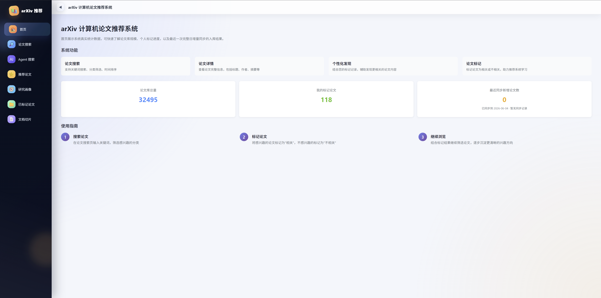

# arXiv Research Agent

一个面向学术论文发现、研读与持续研究的工程化 Research Agent。系统围绕 arXiv 场景，将受约束的任务规划、工具调用、混合检索、论文级 RAG、研究记忆、个性化推荐、人工确认与可恢复执行整合为统一工作流。

An engineering-oriented research agent for academic paper discovery, evidence-grounded question answering, personalized research assistance, and recoverable tool execution.

> 本仓库是 Zhiyuan Sun 的公开作品展示项目，重点展示 Agent Runtime、RAG 链路和大模型应用工程能力。项目已建立工程回归测试与 CI，但尚未发布系统性的 Agent/RAG 效果评测结果。

---

## 项目定位

传统论文检索通常只解决“找到论文”，但真实研究过程还需要理解用户意图、拆解任务、选择工具、处理缺失上下文、阅读论文证据、维护研究偏好，并在工具失败或高风险操作出现时安全恢复。

本项目以 Research Agent 为主线，把检索、论文问答和推荐组织为同一套可观察、可恢复的任务执行系统：

- **Agent 执行闭环**：目标建模、结构化规划、计划校验、工具执行、结果观察、失败恢复和最终响应。
- **论文级 RAG**：文档解析、切分、混合召回、结果融合、rerank、上下文预算、证据校验和答案生成。
- **研究记忆与推荐**：从用户反馈、论文证据和会话行为中构建研究画像，并将其用于检索和推荐。
- **工程可靠性**：SSE 流式事件、trace/debug、人工确认、持久化 checkpoint、自动化测试和 CI 密钥扫描。

Vue、FastAPI、Milvus 等技术组件是实现手段；项目重点是 Agent 在真实研究任务中的规划边界、失败恢复、证据约束和状态管理。

---

## Agent 执行架构

~~~mermaid
flowchart TD
    U["用户研究请求"] --> API["FastAPI / SSE 接入层"]
    API --> A["Agent Runtime"]

    A --> P["理解目标并生成执行计划"]
    P --> E["按计划调度研究工具"]

    E --> T["研究能力层"]
    T --> S1["arXiv 检索"]
    T --> S2["论文解析与 RAG 问答"]
    T --> S3["个性化推荐"]
    T --> S4["研究记忆"]

    S1 --> O["Observer"]
    S2 --> O
    S3 --> O
    S4 --> O

    O --> R["证据整理与最终回答"]
    R --> OUT["同步响应 / SSE 流式事件"]

    M[("SQLite 会话与研究记忆")] -. "支撑上下文" .-> A
    D[("Milvus / 本地索引 / 论文资产")] -. "支撑检索与问答" .-> T
    C[("checkpoint / trace / debug")] -. "支撑恢复与排查" .-> A
~~~

这张图刻意保留主链路，便于快速说明系统如何把研究请求转化为可执行计划、工具调用和证据化回答。规划校验、规则兜底、失败恢复与人工确认等工程细节在下文展开。

默认 Planner 模式为 <code>llm_preferred</code>：系统优先请求 LLM 生成结构化计划草案，但 LLM 输出不能直接驱动工具。LLM Plan Draft 当前仍按实验性能力管理；计划必须通过工具存在性、参数 Schema、步骤依赖、危险动作和最大步数校验，校验或生成失败时回退到规则型 Tool-aware Planner。

项目同时提供 <code>rule_only</code>、<code>llm_only_strict</code> 和 <code>demo_rule</code> 模式，用于稳定演示、严格实验或规划策略对比。

---

## 核心能力

### 1. 可控、可恢复的 Agent Runtime

- 将自然语言请求规范化为目标、上下文和可执行步骤。
- 通过 Tool Registry 约束 Planner 可选择的工具及其参数。
- 通过 Observer 把工具输出投影为结构化成功、低质量或失败信号。
- 通过 Replanner 对可恢复问题生成候选动作，并在安全检查后修补计划。
- 对副作用操作或需要用户判断的分支发起人工确认。
- 使用 SQLite 与 LangGraph checkpoint 保存执行现场，支持中断后恢复。
- 通过同步响应和 SSE 事件向前端暴露执行状态。

### 2. 证据驱动的论文级 RAG

- 使用 Docling、PyMuPDF 等组件加载并解析论文内容。
- 构建 chunk、Embedding、稀疏索引和论文级检索资产。
- 组合向量检索、BM25、关键词、结构化表格等召回路径。
- 通过候选融合、rerank、上下文扩展和预算控制构造最终上下文。
- 对回答使用的证据进行校验，并保留检索与生成 trace。
- 支持论文级连续问答、会话记录和索引构建状态管理。

### 3. 研究记忆与个性化推荐

- 记录 like/dislike、论文标记、问答和近期交互等行为信号。
- 从论文与用户行为中提取研究兴趣证据。
- 聚合并审查长期研究画像，避免单次行为直接覆盖长期偏好。
- 将长期画像、当前任务和负向偏好共同用于候选过滤、排序与推荐解释。

### 4. 全栈交互与可观测性

- Vue 3 前端覆盖论文检索、详情、问答、推荐、研究画像和 Agent 搜索。
- FastAPI 后端统一承载业务 API、SSE 流式事件和错误结构。
- debug/trace 记录 Planner 路径、fallback、工具执行和恢复过程。
- 调试路由默认关闭，避免普通运行环境暴露内部论文资产和诊断数据。

---

## 关键设计与取舍

### 受约束的混合规划

LLM 适合根据自然语言和上下文提出计划草案，但自由生成的工具名、参数和依赖关系不应直接进入执行层。因此系统将“生成计划”和“批准执行”拆开：

1. LLM 生成结构化 Plan Draft。
2. Plan Draft 转换为内部计划模型。
3. PlanValidator 校验工具、参数、步骤依赖、安全策略和计划长度。
4. 校验失败时回退到规则型 Tool-aware Planner。
5. 主规划路径都无法生成合法计划时，仅输出最小安全兜底。

### 失败观察与有界重规划

工具调用失败并不总意味着重新执行同一步。Observer 和 FailureClassifier 会区分缺少上下文、结果质量不足、目标解析失败、外部服务异常等情况，再由恢复策略生成候选动作。

Replanner 只负责串联失败分类、候选生成、动作选择、安全检查和计划修补。系统对单原因、单步骤和整轮重规划设置上限，使恢复机制保持有界，避免 Agent 陷入无限重试。

### 人工确认与可恢复执行

需要用户选择或可能产生副作用的动作会触发 LangGraph interrupt。恢复时同时校验：

- 业务 checkpoint 中的用户、会话、线程、待确认动作和生命周期；
- LangGraph checkpoint 中是否仍存在可以 resume 的真实图执行现场。

只有两层状态都有效时才允许继续执行；待确认动作会在恢复时被原子消费，降低重复点击造成重复执行的风险。

### 证据驱动的论文问答

论文问答不是“把若干 chunk 直接拼进 Prompt”。系统将查询规划、多路召回、候选融合、rerank、上下文预算、证据组织、答案生成和证据校验拆成独立模块，并通过 trace 记录每个阶段的输入、选择和降级路径。

这种分层让检索质量、上下文裁剪和回答证据可以分别测试和调试，也为后续建立 RAG 效果评测提供可观测基础。

---

## 核心代码导航

| 关注点 | 代码入口 |
| --- | --- |
| Agent 图与运行入口 | [graph.py](backend/agents/arxiv_search_agent/graph.py)、[service.py](backend/agents/arxiv_search_agent/service.py) |
| 规划与计划校验 | [planner.py](backend/agents/arxiv_search_agent/planner.py)、[tool_aware_planner.py](backend/agents/arxiv_search_agent/tool_aware_planner.py)、[plan_validator.py](backend/agents/arxiv_search_agent/plan_validator.py) |
| 工具执行与人工确认 | [plan_executor.py](backend/agents/arxiv_search_agent/plan_executor.py)、[tool_registry.py](backend/agents/arxiv_search_agent/tool_registry.py) |
| 失败观察与重规划 | [observer.py](backend/agents/arxiv_search_agent/observer.py)、[replanner.py](backend/agents/arxiv_search_agent/replanner.py)、[recovery_policy.py](backend/agents/arxiv_search_agent/recovery_policy.py) |
| 恢复安全与 checkpoint | [recovery_safety.py](backend/agents/arxiv_search_agent/recovery_safety.py)、[runtime_checkpoint.py](backend/agents/arxiv_search_agent/runtime_checkpoint.py) |
| 论文问答 | [paper_qa_service.py](backend/services/paper_qa/paper_qa_service.py)、[evidence_verifier.py](backend/services/paper_qa/evidence_verifier.py) |
| 混合检索 | [retrieval_pipeline.py](backend/services/retrieval/retrieval_pipeline.py)、[result_fusion_service.py](backend/services/retrieval/result_fusion_service.py)、[rerank_service.py](backend/services/retrieval/rerank_service.py) |
| 研究记忆 | [memory_service.py](backend/services/memory/memory_service.py)、[profile_aggregator.py](backend/services/memory/profile_aggregator.py)、[profile_reviewer.py](backend/services/memory/profile_reviewer.py) |
| 配置入口 | [config.py](backend/utils/config.py)、[config.example.py](backend/utils/config.example.py) |
| 统一质量门 | [check_quality.py](scripts/check_quality.py)、[doctor.py](scripts/doctor.py) |

---

## 数据与产物流水线

仓库保留运行目录骨架，用来展示论文从加载到评测的主要数据路径：

~~~text
backend/
  01-loaded-docs/          # 加载后的原始文档
  01-chunked-docs/         # 文档切分结果
  02-embedded-docs/        # Embedding 结果
  02-retrieval-indexes/    # 检索索引
  02-sparse-indexes/       # 稀疏索引
  03-vector-store/         # 向量存储相关资产
  03-docling-assets/       # Docling 解析资产
  04-search-results/       # 检索结果与 trace
  05-generation-results/   # 模型生成结果
  06-evaluation-result/    # 评测产物
  06-daily-arxiv-paper/    # arXiv 日常同步产物
~~~

这些目录只提交 <code>.gitignore</code> 占位文件。论文原文、数据库、向量索引、模型输出、用户数据和评测产物由本地运行生成，不进入 Git 历史，以控制仓库体积并降低隐私与数据泄露风险。

---

## 技术栈

| 层级 | 主要组件 |
| --- | --- |
| Agent Runtime | LangGraph、Pydantic、结构化 Tool Registry |
| 后端 | Python、FastAPI、Uvicorn |
| RAG 与文档解析 | Docling、PyMuPDF、Embedding、BM25、Rerank |
| 存储 | SQLite、Milvus、本地文件资产 |
| 前端 | Vue 3、TypeScript、Vite、Pinia、Element Plus |
| 工程质量 | pytest、Node.js 测试脚本、GitHub Actions、Gitleaks |

---

## 项目结构

~~~text
backend/
  agents/arxiv_search_agent/  # Agent 规划、执行、观察、恢复与响应组装
  routers/                     # FastAPI 路由
  services/                    # 检索、QA、记忆、推荐、存储等业务模块
  tools/                       # 后端工具与工具注册
  tests/                       # 单元、集成与启动烟测
  utils/                       # 配置、日志与通用工具

new_frontend/
  src/api/                     # API client 与流式请求
  src/views/                   # 检索、论文、推荐、画像和 Agent 页面
  src/stores/                  # Pinia 状态管理

scripts/                       # doctor、静态检查和统一质量门
docs/                          # 架构、运行时和质量门说明
.github/workflows/             # CI 与全历史密钥扫描
~~~

---

## 快速开始

### 已验证环境

当前版本主要在 Windows 环境开发和验证。GitHub Actions 使用 <code>windows-latest</code>、Python 3.12 和 Node.js 22。

- Python 3.10+
- Node.js 18+
- npm 9+

Linux 和 macOS 尚未完成完整兼容性验证，因此当前不将其列为正式支持环境。

### 1. 离线工程验证

以下流程不主动调用真实 arXiv、LLM、Embedding、Rerank 或 Milvus 写入：

~~~powershell
git clone https://github.com/PolarisSun729/arxiv-research-agent.git
cd arxiv-research-agent

python -m venv .venv
.\.venv\Scripts\Activate.ps1
python -m pip install --upgrade pip
python -m pip install -r requirements.txt

cd new_frontend
npm ci
cd ..

python scripts/check_quality.py smoke
~~~

运行完整离线质量门：

~~~powershell
python scripts/check_quality.py
~~~

完整入口会依次执行环境体检、后端静态检查、后端测试、后端启动烟测、前端测试和生产构建。

### 2. 完整功能运行

完整的论文检索、解析、问答和推荐链路需要：

- 可用的 LLM、Embedding 和 Rerank 服务凭证；
- 正在运行的 Milvus；
- 可写的 SQLite 与运行产物目录；
- arXiv 在线访问能力，或已经同步的本地 OAI 元数据；
- 需要论文问答时，在本地下载并构建对应论文索引。

使用 DashScope 默认模型链路时，可在当前 PowerShell 会话中设置：

~~~powershell
$env:ALIYUN_API_KEY = Read-Host "DashScope API Key"
$env:MILVUS_URI = "http://127.0.0.1:19530"
$env:BACKEND_SERVICE_LOAD_MODE = "lazy"

# 没有本地 OAI 数据时，可临时使用 arXiv 在线 API。
$env:ARXIV_DATA_SOURCE = "api"

# 能够直连 arXiv 时设为空；否则填写本机可用代理。
$env:ARXIV_PROXY_URL = ""
~~~

凭证只通过环境变量注入，不要写入源码或提交到 Git。OpenAI、DeepSeek 等其他服务必须显式配置各自的 API Key，不能复用阿里云凭证。

启动后端：

~~~powershell
cd backend
python main.py --load-mode lazy
~~~

在另一个终端启动前端：

~~~powershell
cd new_frontend
npm run dev
~~~

前端开发服务器会将 <code>/api</code> 请求代理到 <code>http://127.0.0.1:8001</code>。

运行真实连接体检：

~~~powershell
python scripts/doctor.py full
~~~

可能计费的模型检查默认跳过，只有明确添加 <code>--check-paid</code> 时才会发起最小真实调用。更多配置项以 [backend/utils/config.py](backend/utils/config.py) 为准。

---

## 工程质量

当前公开迁移基线（<code>28e264f</code>）已完成：

- 后端测试：<code>734 passed</code>。
- 后端静态检查：43 个关键模块成功导入。
- 前端自动化测试：全部通过。
- 前端生产构建：通过。
- 后端 lazy 启动烟测：通过。
- GitHub Actions Quality Gate：通过。
- Gitleaks 全历史密钥扫描：通过。

CI 与本地使用同一个统一入口：

~~~powershell
python scripts/check_quality.py ci
~~~

工程测试用于验证代码契约、状态流转和构建稳定性，不代表 Agent 或 RAG 的算法效果指标。

---

## 评测状态

当前仓库尚未发布系统性的 Agent/RAG 效果评测结果。后续计划至少覆盖：

- Agent 任务成功率、计划合法率、工具调用成功率和 fallback 率；
- 重规划触发率、恢复成功率和人工确认后的继续执行成功率；
- 检索 Recall、MRR/NDCG、rerank 收益和上下文命中率；
- 回答忠实度、证据覆盖率、延迟和模型调用成本。

在这些实验完成前，README 不使用工程测试数量代替算法效果结论。

---

## 当前状态与限制

- 默认 Planner 为 <code>llm_preferred</code>，LLM 计划必须经过本地校验，失败时回退到规则型 Planner。
- 完整链路依赖外部模型服务、Milvus、论文数据和 arXiv 网络条件。
- 当前只正式验证 Windows；Linux 和 macOS 支持仍待补充。
- 仓库不包含论文、索引、数据库、模型输出和用户运行数据。
- 当前没有承诺持续可用的在线演示服务。
- 项目用于研究与工程验证，尚未达到生产级 SLA。
- 当前未附带开源 License；仓库公开可见不等同于授权复制、修改或再发布。

---

## 界面概览

当前截图展示论文管理、检索、推荐和研究画像入口。后续将补充能够体现计划生成、工具执行、人工确认和恢复过程的 Agent 完整执行截图。

---

## Roadmap

1. **建立 Agent/RAG 评测体系**：补充固定任务集、检索指标、回答忠实度、恢复收益、延迟与成本报告。
2. **完善 LLM Planner 实验**：对比 <code>llm_preferred</code>、<code>rule_only</code> 和混合回退策略，评估计划合法率与实际任务成功率。
3. **提高复现与演示能力**：补充跨平台依赖、容器化运行方案、演示数据和 Agent 执行截图或视频。

---

## Maintainer

**Zhiyuan Sun** 
Tongji University 
Email: 2433274@tongji.edu.cn 
GitHub: [@PolarisSun729](https://github.com/PolarisSun729)
