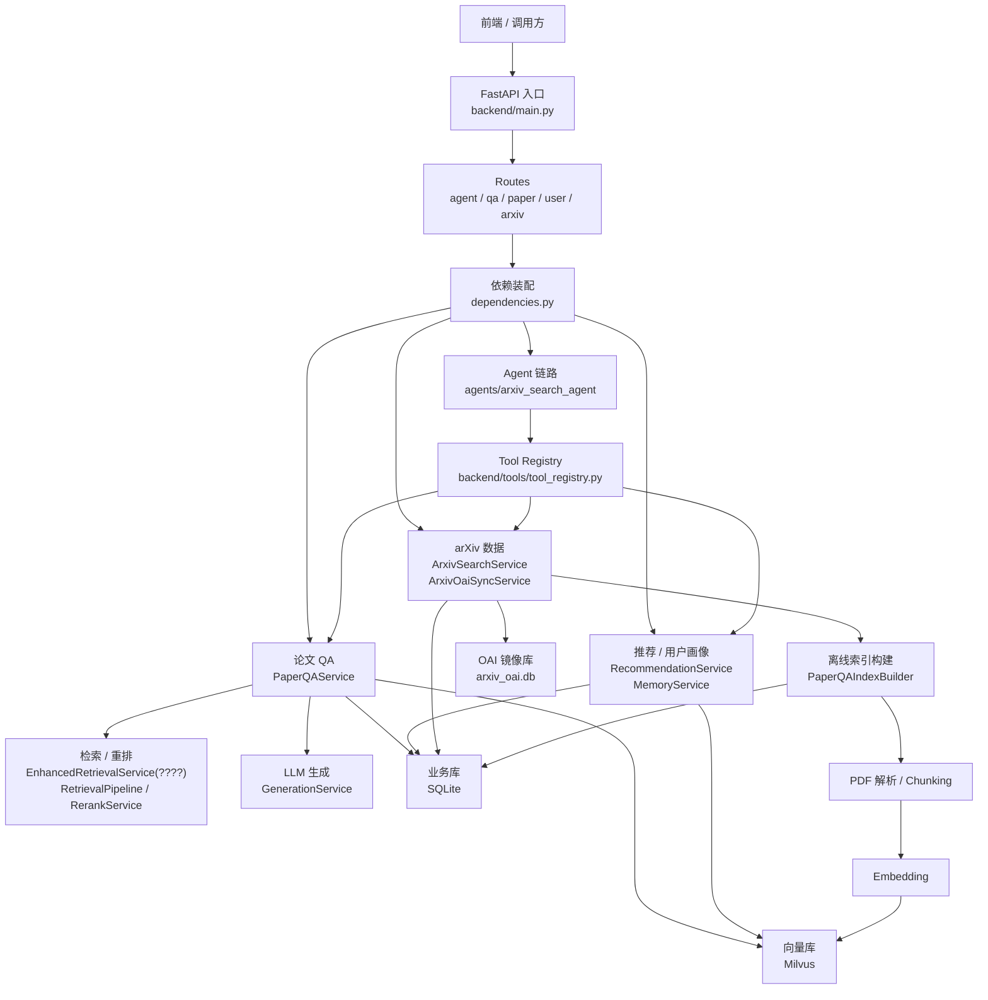

# 后端系统总览

这份文档只保留后端最核心的结构，目标是帮助你先快速建立整体认识，而不是一次看完所有细节。

## Mermaid 总览图

## 一句话理解

当前后端可以简单理解成三块：

- HTTP 入口层
  - `main.py + routers/*.py`
- 业务编排层
  - `PaperQAService`
  - `RecommendationService`
  - `agents/arxiv_search_agent`
- 存储与底层能力层
  - SQLite
  - Milvus
  - arXiv API / OAI
  - LLM / Embedding

## 核心链路

### 1. 在线请求主线

大多数请求都是这条路：

`FastAPI -> router -> dependencies -> service / agent -> SQLite / Milvus / LLM`

其中最重要的两条业务链路是：

- Agent 链路
  - `agent_router.py -> agents/arxiv_search_agent`
- 论文 QA 链路
  - `qa_router.py -> PaperQAService -> Retrieval / Rerank / LLM`

### 2. 离线索引主线

单篇论文建立 QA 索引时，主线是：

`PaperQAIndexBuilder -> 下载 PDF -> 解析 / Chunking -> Embedding -> Milvus -> 更新 SQLite 状态`

### 3. arXiv 数据主线

arXiv 数据来源有两种：

- 在线查询
  - `ArxivSearchService`
- 本地 OAI 镜像
  - `ArxivOaiSyncService`
  - `arxiv_oai.db`

## 关键模块对应文件

- 后端入口
  - `backend/main.py`
  - `backend/dependencies.py`

- 路由层
  - `backend/routers/agent_router.py`
  - `backend/routers/qa_router.py`
  - `backend/routers/paper_router.py`
  - `backend/routers/user_router.py`
  - `backend/routers/arxiv_router.py`

- Agent
  - `backend/agents/arxiv_search_agent/service.py`
  - `backend/agents/arxiv_search_agent/graph.py`
  - `backend/agents/arxiv_search_agent/planner.py`
  - `backend/agents/arxiv_search_agent/plan_executor.py`

- QA
  - `backend/services/paper_qa/paper_qa_service.py`
  - `backend/services/paper_qa/paper_qa_index_builder.py`

- 检索
  - `backend/services/retrieval/enhanced_retrieval_service.py`
  - `backend/services/retrieval/rerank_service.py`

- 记忆 / 推荐
  - `backend/services/memory/memory_service.py`
  - `backend/services/recommendation/recommendation_service.py`

- 文档处理
  - `backend/services/document/loading_service.py`
  - `backend/services/document/chunking_service.py`

- 存储
  - `backend/services/storage/database_service.py`
  - `backend/services/storage/vector_store_service.py`

- arXiv
  - `backend/services/arxiv/arxiv_search_service.py`
  - `backend/services/arxiv/arxiv_oai_service.py`

## 初步观察

这个后端整体更像“工作流系统 + 局部 Agent”：

- QA、推荐、索引构建、OAI 同步都更像稳定 workflow
- `agents/arxiv_search_agent` 才是明显的 Agent 编排层

所以如果你现在是为了梳理代码结构，优先抓住这三个问题就够了：

1. 请求先进入哪个 router
2. router 最终调用哪个 service / agent
3. 数据最后落到 SQLite、Milvus，还是走 LLM / arXiv

