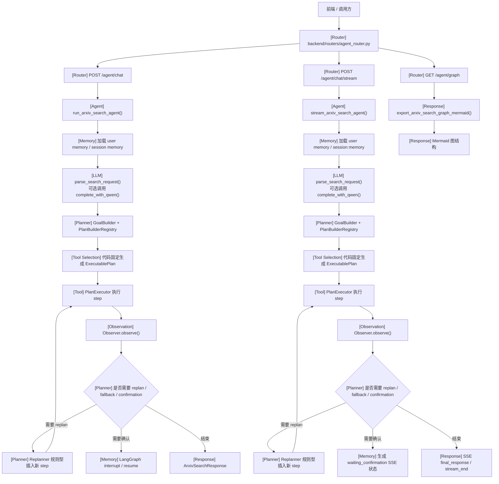
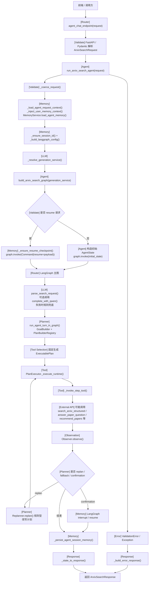
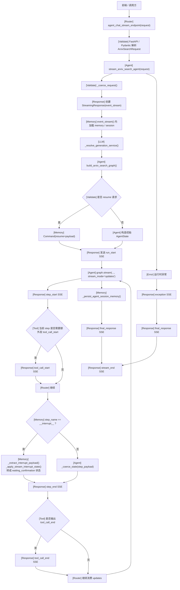
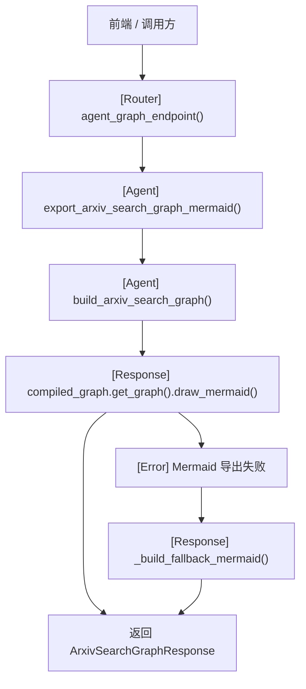

# agent_router.py 接口处理流程

## 1. Router 基本信息

| 项 | 说明 |
|---|---|
| Router 文件路径 | `backend/routers/agent_router.py` |
| Router prefix | `/agent` |
| Router tags | `["agent"]` |
| 主要职责 | 为前端提供 Agent 对话同步接口、流式接口，以及 Agent 图结构导出接口；自身不承载复杂业务编排 |
| 主要依赖的 agent / service / function | `run_arxiv_search_agent()`、`stream_arxiv_search_agent()`、`export_arxiv_search_graph_mermaid()` |
| 是否调用 LLM | 间接调用。`/agent/chat` 与 `/agent/chat/stream` 会进入 `parse_search_request()`，其中可能调用 `GenerationService.complete_with_qwen()`；如生成服务不可用则走规则兜底 |
| 是否调用 tool | 间接调用。由 `PlanExecutor` 通过 `backend/tools/tool_registry.py::invoke_tool()` 调用实际 tool |
| 是否存在 tool registry | 存在两层：`backend/agents/arxiv_search_agent/tool_registry.py`（planner 可见工具注册表），`backend/tools/tool_registry.py`（实际工具执行注册表） |
| 是否存在 planner | 存在。`GoalBuilder` + `PlanBuilderRegistry` + 各类 `*PlanBuilder` 组成代码式 planner |
| 是否存在多轮 agent loop | 存在有限循环，但不是开放式 think-act loop。`PlanExecutor._execute_runtime()` 会在 plan step 级别循环执行，并在 observation 后触发 rule-based replan；另有基于 `interrupt/resume` 的跨请求续跑 |
| 是否存在 observation | 存在。`backend/agents/arxiv_search_agent/observer.py::Observer` |
| 是否访问数据库 | Router 文件本身未直接访问；`/agent/chat` 与 `/agent/chat/stream` 通过 `MemoryService`、`DatabaseService`、`PaperQAService`、`RecommendationService` 等间接访问数据库 |
| 是否访问外部 API | 存在间接访问。LLM 调用会走 Qwen/OpenAI 类生成服务；arXiv 搜索工具会走 `get_arxiv_service()`，实际使用 API 还是本地数据源取决于配置 |
| 是否访问 memory / session | 存在。`service.py` 中会加载/保存 `MemoryService` 会话记忆，并用 `session_id -> thread_id` 复用 LangGraph checkpoint |

### 真实代码定位

- Router：`backend/routers/agent_router.py`
- Agent 包实际路径：`backend/agents/arxiv_search_agent`
- Agent 同步/流式入口：`backend/agents/arxiv_search_agent/service.py`
- LangGraph 主图：`backend/agents/arxiv_search_agent/graph.py`
- Planner：`backend/agents/arxiv_search_agent/planner.py`
- Executor：`backend/agents/arxiv_search_agent/plan_executor.py`
- Replanner：`backend/agents/arxiv_search_agent/replanner.py`
- Observer：`backend/agents/arxiv_search_agent/observer.py`
- Planner tool registry：`backend/agents/arxiv_search_agent/tool_registry.py`
- 实际 tool registry：`backend/tools/tool_registry.py`

## 2. 接口总览表

| 方法 | 路径 | 函数名 | 主要职责 | 主要调用 | 副作用 |
|---|---|---|---|---|---|
| `POST` | `/agent/chat` | `agent_chat_endpoint` | 同步执行一次完整 Agent 请求，返回聚合后的 `ArxivSearchResponse` | `run_arxiv_search_agent()` | 可能调用 LLM；可能调用多个 tool；可能访问外部 API；可能读写数据库；会读写 memory/session；会记录日志 |
| `POST` | `/agent/chat/stream` | `agent_chat_stream_endpoint` | 以 SSE 流式方式执行 Agent，并持续输出步骤事件、工具事件与最终响应 | `stream_arxiv_search_agent()` | 可能调用 LLM；可能调用多个 tool；可能访问外部 API；可能读写数据库；会读写 memory/session；会记录日志；会持续输出 SSE 事件 |
| `GET` | `/agent/graph` | `agent_graph_endpoint` | 导出当前 arXiv Agent 主图的 Mermaid 结构 | `export_arxiv_search_graph_mermaid()` | 不调用 LLM；不调用业务 tool；不访问数据库；不访问 memory/session；仅可能记录 fallback 日志 |

## 3. Router 总览流程图

## 4. 每个接口单独流程图

## 接口：POST /agent/chat

### 职责

同步执行一次 Agent 请求，返回单个 `ArxivSearchResponse`。  
该接口是前端最标准的非流式 Agent 对话入口。

### 处理流程图

### 关键调用链

`agent_chat_endpoint() -> run_arxiv_search_agent() -> _coerce_request() -> _load_agent_request_context() -> build_arxiv_search_graph() -> graph.invoke() -> parse_search_request() -> run_agent_turn_node() -> run_agent_turn_in_graph() -> GoalBuilder.from_state() -> PLAN_BUILDER_REGISTRY.get(...).build() -> PlanExecutor._execute_runtime() -> _invoke_step_tool() -> invoke_backend_tool() / GenerationService.complete_with_qwen() -> Observer.observe() -> Replanner.replan() -> _persist_agent_session_memory() -> _state_to_response()`

### 输入

- Body：`ArxivSearchRequest`
- `user_id: Optional[str]`
- `session_id: Optional[str]`
- `message: str`
- `context: Dict[str, Any] = {}`
- `resume: Optional[ResumeRequest] = None`
- `resume.decision: "approve" | "reject"`
- `resume.note: Optional[str]`
- `resume.step_id: Optional[str]`
- `resume.interrupt_id: Optional[str]`
- `resume.edited_arguments: Optional[Dict[str, Any]]`
- Query 参数：未发现
- Path 参数：未发现

### 输出

- 返回模型：`ArxivSearchResponse`
- 主要字段：
- `session_id`
- `intent`
- `intent_source`
- `fallback_reason`
- `llm_confidence`
- `answer`
- `search_spec`
- `goal`
- `execution_plan`
- `plan_runtime`
- `pending_action`
- `paper_qa_result`
- `preference_action_result`
- `plan`
- `tool_calls`
- `papers`
- `warnings`
- `next_actions`
- `steps`
- `debug`

### 副作用

- 是否调用 LLM：是，`parse_search_request()` 中可能调用 `GenerationService.complete_with_qwen()`；如果 LLM 不可用则走规则兜底
- 是否调用工具：是，由 `PlanExecutor` 间接调用 `backend/tools/tool_registry.py::invoke_tool()`
- 是否访问外部网络 API：是，至少包含两类可能
- LLM 外部调用：`GenerationService` 通过 `openai.OpenAI` / 兼容网关调用 Qwen 等模型
- arXiv 检索：`search_arxiv_structured()` 通过 `get_arxiv_service()` 调用 API 或本地数据源，取决于配置
- 是否写数据库：可能会写
- `MemoryService.save_agent_memory()`
- `build_paper_qa_index()` 相关索引构建
- `record_paper_preference()` 写入真实喜欢 / 不喜欢偏好
- 是否读数据库：会读
- `MemoryService.build_user_memory_summary()`
- `MemoryService.load_agent_memory()`
- `DatabaseService.get_user_research_profile()`
- `PaperQAService.get_qa_status()` 等
- 是否保存会话或 memory：是，`session_id` 会映射为 LangGraph `thread_id`，并在结束时保存 Agent memory
- 是否有日志或 debug 信息：有，大量 `debug/info/warning/exception` 日志，以及响应中的 `debug` 字段

### 异常 / fallback

- `message` 为空时，`ArxivSearchRequest` 校验失败
- LLM 服务不可用时，`parse_search_request()` 会回退到规则解析
- LLM 返回 JSON 结构不合法时，回退到规则解析
- `resume` 时找不到 checkpoint，会在 `_ensure_resume_checkpoint()` 抛出错误
- 加载用户 memory 失败时，仅记录 warning，并降级为不带 memory 的上下文
- 加载 session memory 失败时，仅记录 warning，并继续执行
- 工具输入缺失时，`PlanExecutor` 标记 `missing_input`
- 工具执行异常时，`PlanExecutor` 标记 `tool_execution_failed`
- 工具输出不符合声明 schema 时，`PlanExecutor` 标记输出无效
- observation 发现低质量/空结果时，会进入 `Replanner.replan()`
- `Replanner` 无规则可用或超过重规划上限时，会生成 fallback answer
- 需要用户确认的步骤会进入 `interrupt/resume` 链路
- 用户拒绝 `parse_and_index_paper` 时，会返回取消解析的最终答复

## 接口：POST /agent/chat/stream

### 职责

以 `text/event-stream` 的形式执行 Agent，并把运行过程拆成 SSE 事件实时返回给前端。

### 处理流程图

### 关键调用链

`agent_chat_stream_endpoint() -> stream_arxiv_search_agent() -> event_stream() -> _load_agent_request_context() -> build_arxiv_search_graph() -> graph.stream(..., stream_mode="updates") -> parse_search_request() / run_agent_turn_node() -> _extract_interrupt_payload() / _apply_stream_interrupt_state() -> _make_stream_event() -> _sse_event()`

### 输入

- Body：`ArxivSearchRequest`
- `user_id: Optional[str]`
- `session_id: Optional[str]`
- `message: str`
- `context: Dict[str, Any] = {}`
- `resume: Optional[ResumeRequest] = None`
- Query 参数：未发现
- Path 参数：未发现

### 输出

- 返回类型：`StreamingResponse`
- `media_type = "text/event-stream"`
- SSE 事件结构：`AgentStreamEvent`
- 代码中实际事件类型：
- `run_start`
- `step_start`
- `step_end`
- `tool_call_start`
- `tool_call_end`
- `final_response`
- `exception`
- `stream_end`
- `final_response` 事件中会携带 `ArxivSearchResponse.model_dump()`

### 副作用

- 是否调用 LLM：是，和同步接口相同
- 是否调用工具：是，和同步接口相同
- 是否访问外部网络 API：是，和同步接口相同
- 是否写数据库：可能会写，和同步接口相同
- 是否读数据库：会读，和同步接口相同
- 是否保存会话或 memory：是，结束时调用 `_persist_agent_session_memory()`
- 是否有日志或 debug 信息：有；另外会持续发出 SSE 调试/进度事件

### 异常 / fallback

- `message` 为空时，请求模型校验失败
- LLM 不可用或解析失败时，回退到规则解析
- 读取 memory/session 失败时，记录 warning 并降级
- `resume` 时 checkpoint 不存在，会抛错进入 `exception` SSE
- 遇到 `__interrupt__` 时，不视为异常，而是转换为 `waiting_confirmation` 状态返回前端
- 如果中断 payload 缺失 `confirmation request`，会抛 `ValueError`
- 任意运行时异常都会被包装成：
- `exception` SSE
- `final_response` SSE（错误响应）
- `stream_end` SSE（`status=error`）
- observation 低质量、空结果、需确认等情况，会触发 replan / fallback / waiting_confirmation 分支

## 接口：GET /agent/graph

### 职责

导出当前 arXiv Agent 主图结构，供前端或调试页面渲染 Mermaid。

### 处理流程图

### 关键调用链

`agent_graph_endpoint() -> export_arxiv_search_graph_mermaid() -> build_arxiv_search_graph() -> compiled_graph.get_graph().draw_mermaid() -> (失败时) _build_fallback_mermaid()`

### 输入

- Body：未发现
- Query 参数：未发现
- Path 参数：未发现

### 输出

- 返回模型：`ArxivSearchGraphResponse`
- 主要字段：
- `graph_name`
- `render_source`
- `node_names`
- `mermaid`
- `supports_png`

### 副作用

- 是否调用 LLM：否
- 是否调用工具：否
- 是否访问外部网络 API：否
- 是否写数据库：否
- 是否读数据库：否
- 是否保存会话或 memory：否
- 是否有日志或 debug 信息：可能有；Mermaid 原生导出失败时会记录 warning

### 异常 / fallback

- 原生 `draw_mermaid()` 失败时，不抛给上层，而是进入 `_build_fallback_mermaid()`
- 未发现其他明确异常处理

## Agent 行为分析

### 1. 这个 agent 是否真的有 planner？

有，但不是 LLM 自由规划器，而是代码式 planner。

真实实现：

- `GoalBuilder.from_state()`：从 `AgentState.intent`、`message`、`context` 生成 `Goal`
- `PlanBuilderRegistry`：按 `goal_type` 选择 `ArxivSearchPlanBuilder`、`PaperQAPlanBuilder`、`RecommendationPlanBuilder` 等
- 每个 `PlanBuilder` 直接返回固定结构的 `ExecutablePlan`
- `PlanValidator`：在执行前校验 plan 的工具名、依赖、side effect 等

结论：存在 planner，但更接近“基于意图分发的静态 plan builder”，不是开放式 LLM planner。

### 2. 是否存在 tool registry？

存在两层。

- Planner 层：`backend/agents/arxiv_search_agent/tool_registry.py`
  - 维护 `PLANNER_TOOL_REGISTRY`
  - 描述每个工具的 `capability_tags`、`input_schema`、`output_schema`、`requires_confirmation`、`side_effect_level`
  - 主要给 planner / validator / replanner 使用
- 执行层：`backend/tools/tool_registry.py`
  - 维护实际的 `TOOL_REGISTRY`
  - `invoke_tool(tool_name, **kwargs)` 负责参数校验、调用真实函数、归一化返回包

### 3. tool selection 是 LLM 决策，还是代码固定分支？

以代码固定分支为主。

- LLM 只参与 `parse_search_request()` 的意图识别与搜索条件解析
- 一旦 `intent` 确定，后续 plan 是 `PlanBuilder` 固定生成
- 工具顺序、依赖、输入绑定、确认策略都写死在代码里
- observation 后的 replan 也不是 LLM 决策，而是 `Replanner._apply_rule()` 的规则改写

结论：tool selection 不是 LLM 自主决策，而是“LLM 决定意图，代码决定工具链”。

### 4. 是否存在 observe → think → act 的循环？

存在有限的 step 级闭环，但不是开放式 agent loop。

真实执行模型：

- `PlanExecutor._execute_runtime()` 在 `while True` 中持续寻找下一个可执行 step
- 每执行一个 step，都会做：
- 输入绑定解析
- tool 调用
- output schema 校验
- `Observer.observe()`
- 如 observation 非成功，则交给 `Replanner.replan()`

因此存在：

- `act`：执行 step/tool
- `observe`：评估结果质量
- `replan`：规则型改写后继续执行

但未发现：

- 基于 LLM 的自由“思考”链
- 无上限的自主循环

### 5. observation 是否会影响下一步？

会，且影响真实执行路径。

典型例子：

- `search_arxiv` 空结果 -> 插入 `rewrite_arxiv_query -> search_arxiv -> validate_arxiv_results`
- `validate_arxiv_results` 低质量 -> 重写搜索链
- `check_paper_index` 缺失 -> 注入 `request_confirmation -> parse_and_index_paper`
- PaperQA 不再在 Agent 内展开伪检索 / rerank / evidence 校验链；Agent 只调度 `answer_paper_question`
- 真实检索、query rewrite、rerank、grounding 与 `retrieval_debug` 由 PaperQAService 及其下游服务负责

### 6. 是否有终止条件？

有，且比较明确。

- `PlanExecutor` 找不到可执行 step 时结束
- `runtime.pending_confirmation` 存在时，以 `waiting_confirmation` 结束当前轮
- 存在 failed step 且没有 final answer 时，以 `failed` 结束
- `goal_type == "unclear"` 时，以 `need_clarification` 结束
- `goal_type == "unsupported"` 或 replan fallback 时，以 `fallback` 结束
- 其余情况以 `success` 结束
- 另外 `Replanner` 还有 `MAX_REASON_REPLANS`、`MAX_STEP_REPLANS`、`MAX_PLAN_REPLANS` 上限，避免无限重规划

### 7. 是否有失败重试或 fallback？

有。

- parse 阶段：
  - LLM 不可用或输出非法 -> 规则兜底
- 执行阶段：
  - `retry_policy.max_attempts`
  - `tool.can_retry`
  - tool 执行异常/输出不合法时可重试
- 质量阶段：
  - observation 低质量 -> 进入 `Replanner.replan()`
- 失败兜底：
  - replan 无规则或超上限 -> `generate_fallback_response`
  - memory 读取失败 -> warning + 降级继续
  - Mermaid 导出失败 -> fallback mermaid

### 8. 整体更像 agent，还是固定 workflow？

整体更像“带有 planner/executor/replanner 外形的固定 workflow”。

原因：

- 主图只有两个业务节点：`parse_search_request -> run_agent_turn`
- plan 生成是固定模板，不是动态推理拼装
- tool selection 不由 LLM 决定
- replan 是规则表驱动，不是自由推理
- 但它又比纯 if/else workflow 更强，因为：
- 有显式 `Goal`
- 有 `ExecutablePlan`
- 有 step dependency
- 有 observation / replan / confirmation / resume

因此更准确的描述是：  
**“代码式 planner + 计划执行器 + 规则型 replan 的受限 Agent Workflow”**。

## 设计观察

### 1. `agent_router.py` 的职责是否清晰？

比较清晰。

- Router 只暴露 3 个 HTTP 入口
- 同步、流式、图导出职责分开
- 业务编排没有直接堆在 Router 中

### 2. Router 是否只负责接收请求和转发？

基本是。

- `POST /agent/chat` 直接转发到 `run_arxiv_search_agent()`
- `POST /agent/chat/stream` 直接转发到 `stream_arxiv_search_agent()`
- `GET /agent/graph` 直接转发到 `export_arxiv_search_graph_mermaid()`

Router 中唯一额外逻辑主要是 import fallback，用于兼容不同启动 cwd。

### 3. Agent 逻辑是否泄漏到 router 中？

未明显发现。

- planner、tool、memory、LLM、observation、replan 都在 agent/service 层
- router 不处理 intent，也不拼装响应

### 4. 当前 agent 能力边界是什么？

按真实代码，当前并不只处理 arXiv 搜索，还覆盖：

- `arxiv_search`
- `paper_summary`
- `paper_detail`
- `paper_qa`
- `recommendation`
- `preference_action`
- `unclear`
- `unsupported`

但这些能力大多通过固定 plan 实现，不是通用工具自治能力。

### 5. 对后续重构为真正 planner-agent 有什么影响？

当前 Router 基本不是阻碍，主要限制在 agent 内部实现：

- 主图节点过粗，真正的推理/执行细节都被折叠进 `run_agent_turn`
- planner 目前是按 `goal_type` 返回固定模板
- tool selection 和 replan 都是规则型，而非模型驱动

这意味着：

- Router 层后续可以基本保持不动
- 真正要演进为“更像 planner-agent”，主要会改 `planner.py`、`plan_executor.py`、`replanner.py` 和 tool 协议，而不是 `agent_router.py`

## 检查结果

- 文档文件已生成到 `docs/architecture/routers/agent_router_flow.md`
- `agent_router.py` 中 3 个接口已全部覆盖
- 每个接口都包含单独 Mermaid 流程图
- Mermaid 图均使用 `flowchart TD`
- 文中出现的文件名、函数名、类名均来自真实代码
- 对未能从代码完全确认的地方，已用“取决于配置”或“待确认”方式明确说明
