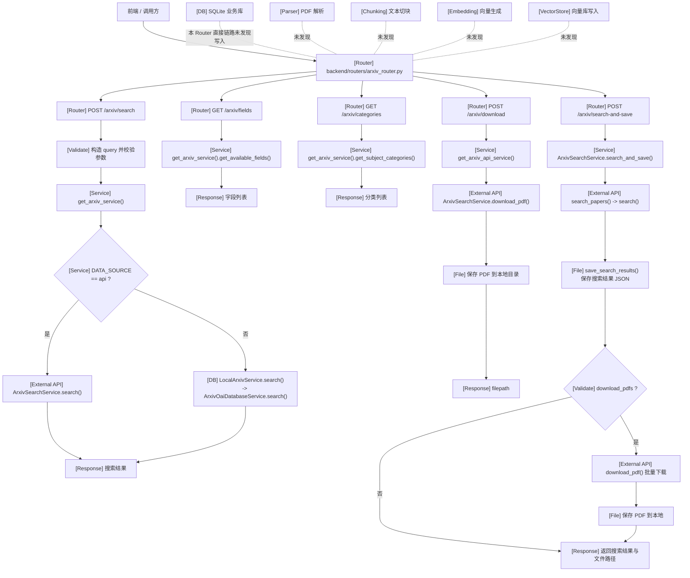
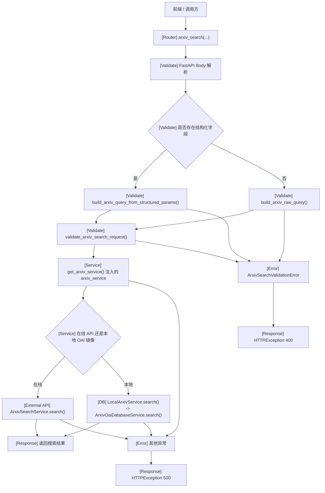
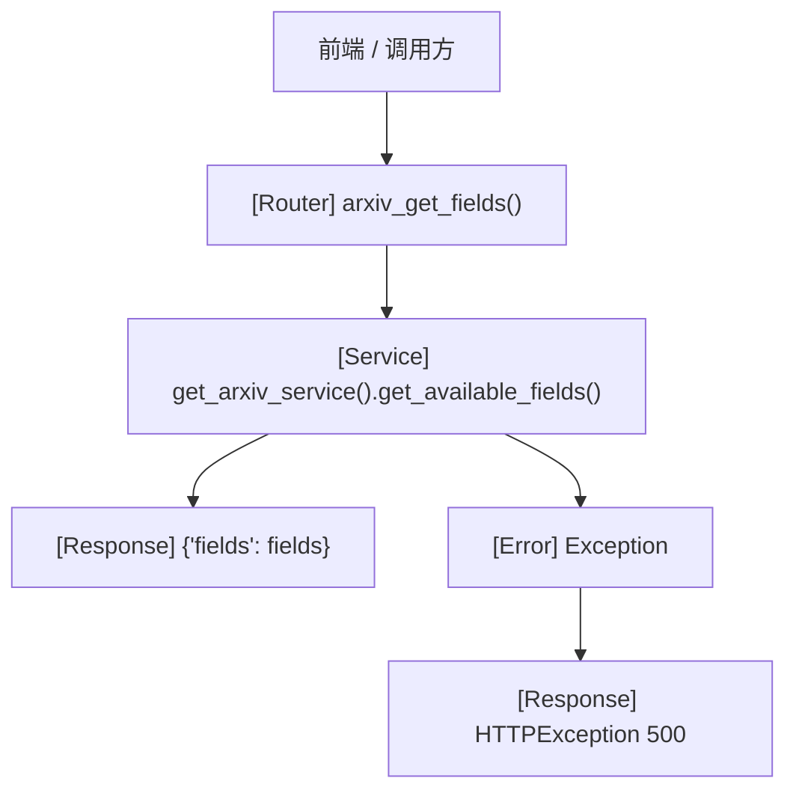
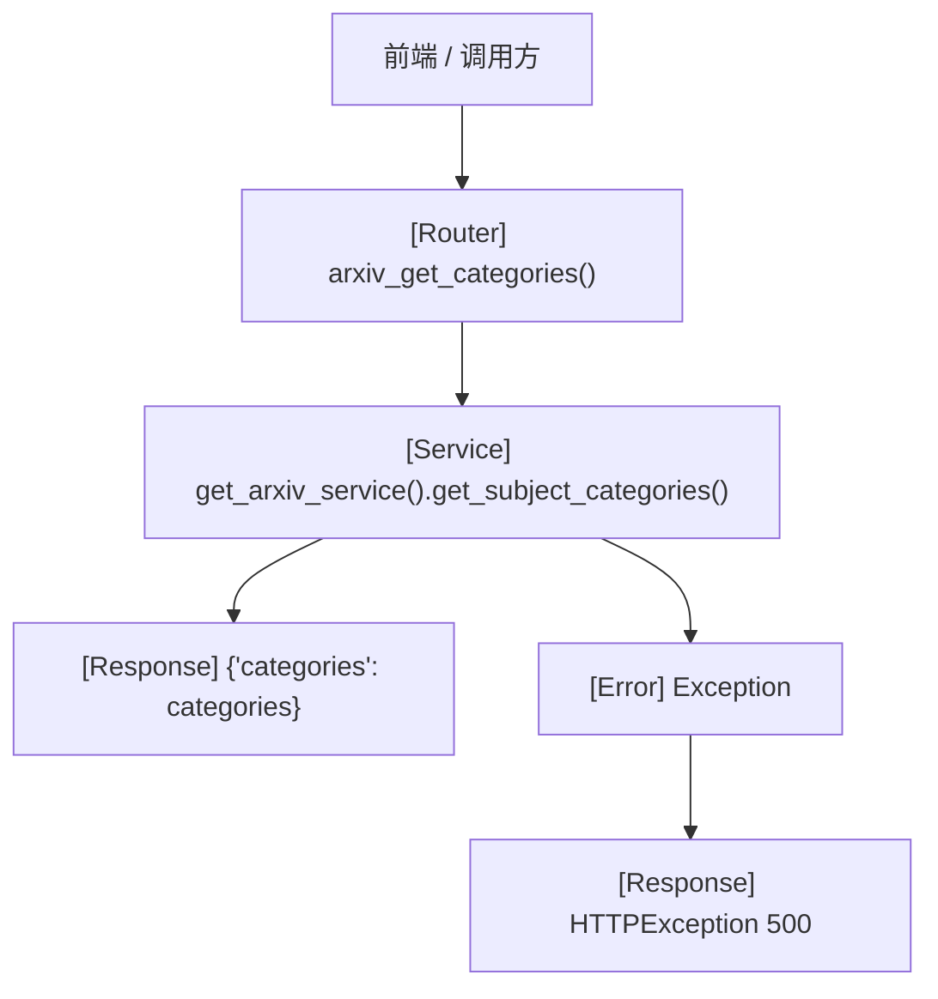
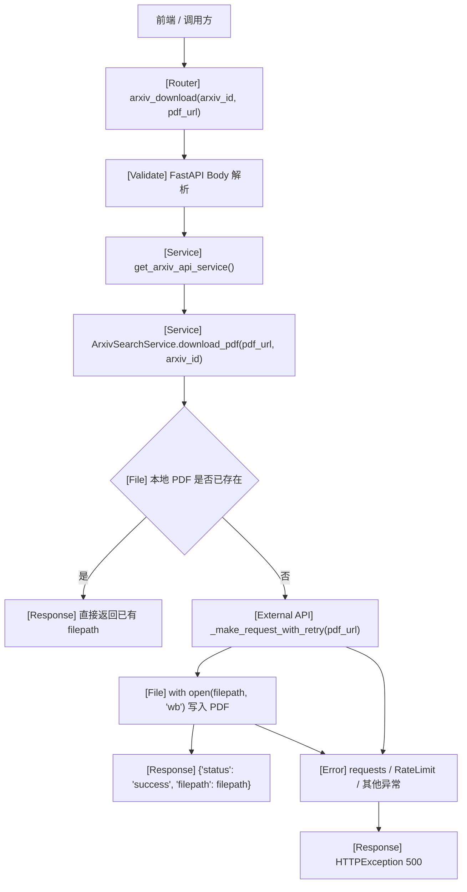
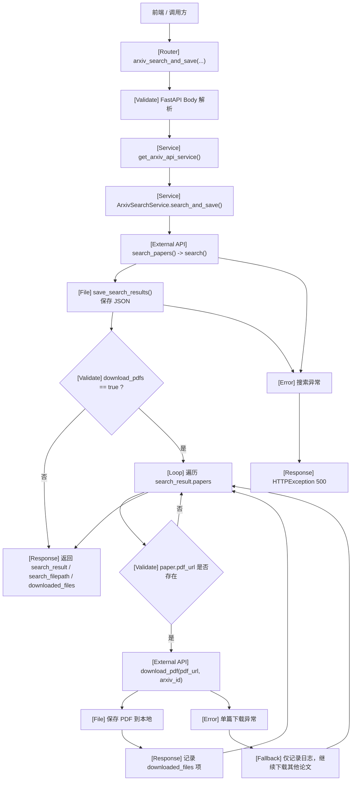

# arxiv_router.py 接口处理流程

## 1. Router 基本信息

| 项 | 说明 |
|---|---|
| Router 文件路径 | `backend/routers/arxiv_router.py` |
| Router prefix | `/arxiv` |
| Router tags | `["arxiv"]` |
| 主要职责 | 暴露 arXiv 搜索、字段/分类查询、PDF 下载、搜索结果本地保存等 HTTP 接口 |
| 主要依赖的 service / class / function | `get_arxiv_service()`、`get_arxiv_api_service()`、`ArxivSearchService.search()`、`ArxivSearchService.download_pdf()`、`ArxivSearchService.search_and_save()`、`LocalArxivService.search()`、`build_arxiv_query_from_structured_params()`、`build_arxiv_raw_query()`、`validate_arxiv_search_request()` |
| 是否调用 arXiv 外部 API | 存在，但取决于接口与配置：`/download`、`/search-and-save` 固定使用 `ArxivSearchService`；`/search`、`/fields`、`/categories` 则通过 `get_arxiv_service()` 选择在线 API 或本地 SQLite OAI 镜像 |
| 是否下载 PDF | 存在：`/download` 明确下载 PDF；`/search-and-save` 在 `download_pdfs=true` 时批量下载 |
| 是否写本地文件 | 存在：PDF 保存到 `ArxivSearchService.papers_dir`；`/search-and-save` 还会保存搜索结果 JSON 文件 |
| 是否写数据库 | `arxiv_router.py` 自身未直接写数据库；其直接调用链中 `/search`、`/fields`、`/categories` 可能读取本地 SQLite OAI 镜像；`/download` 与 `/search-and-save` 未发现自动写业务 SQLite |
| 是否触发 PDF 解析 | 未发现 |
| 是否触发 chunking | 未发现 |
| 是否触发 embedding | 未发现 |
| 是否写入向量库 | 未发现 |

### 真实代码定位

- Router：`backend/routers/arxiv_router.py`
- 在线 arXiv 服务：`backend/services/arxiv/arxiv_search_service.py`
- 本地 arXiv 兼容层：`backend/services/arxiv/local_arxiv_service.py`
- 本地 OAI SQLite 服务：`backend/services/arxiv/arxiv_oai_service.py`
- 搜索参数构建与校验：`backend/services/arxiv/arxiv_query_builder.py`
- 业务 SQLite 服务：`backend/services/storage/database_service.py`
- 论文索引链路（本 Router 未直接触发）：`backend/services/paper_qa/paper_qa_index_builder.py`

### 关键事实说明

- `get_arxiv_service()` 在 `backend/dependencies.py` 中按 `CORE_CONFIG["arxiv_data_source"]` 决定返回：
- `ArxivSearchService`：在线 arXiv API
- `LocalArxivService`：本地 SQLite OAI 镜像
- `get_arxiv_api_service()` 固定返回 `ArxivSearchService`
- 因此：
- `/download` 与 `/search-and-save` 一定走在线下载/搜索服务
- `/search`、`/fields`、`/categories` 可能走在线 API，也可能走本地镜像

## 2. 接口总览表

| 方法 | 路径 | 函数名 | 主要职责 | 主要调用 | 副作用 |
|---|---|---|---|---|---|
| `POST` | `/arxiv/search` | `arxiv_search` | 执行 arXiv 搜索，支持原始 query 与结构化字段检索 | `build_arxiv_query_from_structured_params()` / `build_arxiv_raw_query()` -> `validate_arxiv_search_request()` -> `arxiv_service.search()` | 可能调用 arXiv 外部 API；或读取本地 SQLite OAI 镜像；未发现下载 PDF、写文件、写业务 SQLite、触发解析/索引 |
| `GET` | `/arxiv/fields` | `arxiv_get_fields` | 返回支持的搜索字段列表 | `arxiv_service.get_available_fields()` | 可能仅返回静态字段；未发现外部 API、写文件、写库、索引副作用 |
| `GET` | `/arxiv/categories` | `arxiv_get_categories` | 返回支持的学科分类列表 | `arxiv_service.get_subject_categories()` | 可能仅返回静态分类；未发现外部 API、写文件、写库、索引副作用 |
| `POST` | `/arxiv/download` | `arxiv_download` | 下载指定 arXiv 论文 PDF 到本地 | `ArxivSearchService.download_pdf()` | 调用 arXiv 外部网络；下载 PDF；写本地文件；有重复文件检查；未发现写 SQLite、解析、chunk、embedding、vector store |
| `POST` | `/arxiv/search-and-save` | `arxiv_search_and_save` | 搜索论文，保存搜索结果 JSON，并按需批量下载 PDF | `ArxivSearchService.search_and_save()` -> `search_papers()` -> `search()` -> `save_search_results()` -> `download_pdf()` | 调用 arXiv 外部 API；写本地 JSON；可选下载 PDF 并写本地文件；未发现写 SQLite、解析、chunk、embedding、vector store |

## 3. Router 总览流程图

## 4. 每个接口单独流程图

## 接口：POST /arxiv/search

### 职责

执行 arXiv 搜索。  
该接口既支持直接传 `search_query` / `id_list`，也支持按标题、作者、摘要、分类等结构化字段拼接查询。

### 处理流程图

### 关键调用链

结构化搜索：

`arxiv_search() -> build_arxiv_query_from_structured_params() -> validate_arxiv_search_request() -> arxiv_service.search()`

原始搜索：

`arxiv_search() -> build_arxiv_raw_query() -> validate_arxiv_search_request() -> arxiv_service.search()`

在线模式：

`arxiv_search() -> ArxivSearchService.search() -> _make_request_with_retry() -> requests.Session.get() -> feedparser.parse()`

本地模式：

`arxiv_search() -> LocalArxivService.search() -> ArxivOaiDatabaseService.search() -> _fetch_all_searchable_papers() -> _matches_query()`

### 输入

- Body 参数：
- `search_query: Optional[str]`
- `id_list: Optional[List[str]]`
- `title: Optional[str]`
- `author: Optional[str]`
- `abstract: Optional[str]`
- `category: Optional[str]`
- `comment: Optional[str]`
- `journal_ref: Optional[str]`
- `report_number: Optional[str]`
- `operator: Optional[str] = "AND"`
- `max_results: int = 10`
- `start: int = 0`
- `sort_by: str = "relevance"`
- `sort_order: str = "descending"`
- `submitted_days_ago: Optional[int]`
- Query 参数：未发现
- Path 参数：未发现

### 输出

- 在线模式与本地模式都返回搜索结果字典
- 主要字段：
- `query`
- `id_list`
- `total_results`
- `start_index`
- `items_per_page`
- `papers`
- `timestamp`

### 副作用

- 是否调用 arXiv API：取决于 `get_arxiv_service()` 的数据源配置；在线模式会调用，OAI 本地模式不会
- 是否下载 PDF：否
- 是否保存 PDF 到本地：否
- 是否写入 SQLite：未发现业务库写入；本地模式会读取 SQLite OAI 镜像
- 是否更新已有论文记录：未发现
- 是否触发 PDF 解析：未发现
- 是否生成 chunk：未发现
- 是否生成 embedding：未发现
- 是否写入 vector store：未发现

### 异常 / fallback

- `search_query` 与 `id_list` 同时为空时，`validate_arxiv_search_request()` 抛 `ArxivSearchValidationError`
- `max_results` 越界时，抛 `ArxivSearchValidationError`
- `start < 0` 时，抛 `ArxivSearchValidationError`
- `sort_by` 非法时，抛 `ArxivSearchValidationError`
- `sort_order` 非法时，抛 `ArxivSearchValidationError`
- `field_operator` / `category_operator` 非法时，结构化 query builder 抛 `ArxivSearchValidationError`
- 结构化字段与 `id_list` 全为空时，抛 `ArxivSearchValidationError`
- 其他搜索异常统一包装成 `HTTPException(500)`
- 未发现额外 fallback；只有“结构化模式”和“原始模式”两条显式分支

## 接口：GET /arxiv/fields

### 职责

返回当前 arXiv 搜索支持的字段列表，供前端展示检索语法或高级搜索配置。

### 处理流程图

### 关键调用链

`arxiv_get_fields() -> arxiv_service.get_available_fields()`

### 输入

- Body：未发现
- Query 参数：未发现
- Path 参数：未发现

### 输出

- 返回字典：
- `fields: List[Dict[str, str]]`
- 字段项常见键：
- `prefix`
- `field`
- `description`

### 副作用

- 是否调用 arXiv API：未发现明确调用
- 是否下载 PDF：否
- 是否保存 PDF 到本地：否
- 是否写入 SQLite：否
- 是否更新已有论文记录：否
- 是否触发 PDF 解析：否
- 是否生成 chunk：否
- 是否生成 embedding：否
- 是否写入 vector store：否

### 异常 / fallback

- service 调用异常时，返回 `HTTPException(500)`
- 未发现明确 fallback

## 接口：GET /arxiv/categories

### 职责

返回当前支持的 arXiv 学科分类列表。

### 处理流程图

### 关键调用链

`arxiv_get_categories() -> arxiv_service.get_subject_categories()`

### 输入

- Body：未发现
- Query 参数：未发现
- Path 参数：未发现

### 输出

- 返回字典：
- `categories: List[Dict[str, str]]`
- 分类项常见键：
- `code`
- `name`

### 副作用

- 是否调用 arXiv API：未发现明确调用
- 是否下载 PDF：否
- 是否保存 PDF 到本地：否
- 是否写入 SQLite：否
- 是否更新已有论文记录：否
- 是否触发 PDF 解析：否
- 是否生成 chunk：否
- 是否生成 embedding：否
- 是否写入 vector store：否

### 异常 / fallback

- service 调用异常时，返回 `HTTPException(500)`
- 未发现明确 fallback

## 接口：POST /arxiv/download

### 职责

下载指定 arXiv 论文 PDF 到本地目录，并返回文件路径。

### 处理流程图

### 关键调用链

`arxiv_download() -> ArxivSearchService.download_pdf() -> _make_request_with_retry() -> requests.Session.get() -> open(filepath, "wb")`

### 输入

- Body 参数：
- `arxiv_id: str`
- `pdf_url: str`
- Query 参数：未发现
- Path 参数：未发现

### 输出

- 返回字典：
- `status`
- `filepath`

### 副作用

- 是否调用 arXiv API：是，固定使用在线 `ArxivSearchService`
- 是否下载 PDF：是
- 是否保存 PDF 到本地：是，保存到 `ArxivSearchService.papers_dir`
- 是否写入 SQLite：未发现
- 是否更新已有论文记录：未发现
- 是否触发 PDF 解析：未发现
- 是否生成 chunk：未发现
- 是否生成 embedding：未发现
- 是否写入 vector store：未发现

### 异常 / fallback

- PDF 文件已存在时，不重复下载，直接返回现有路径
- 下载请求失败时，记录 error 并抛 `HTTPException(500)`
- 文件写入失败时，记录 error 并抛 `HTTPException(500)`
- `_make_request_with_retry()` 对 `RateLimitError` 有最多 5 次指数退避重试
- 未发现下载后自动入库或自动索引的 fallback 分支

## 接口：POST /arxiv/search-and-save

### 职责

执行论文搜索，先把搜索结果保存为本地 JSON 文件，再根据 `download_pdfs` 决定是否批量下载 PDF。

### 处理流程图

### 关键调用链

`arxiv_search_and_save() -> ArxivSearchService.search_and_save() -> search_papers() -> search() -> _make_request_with_retry() -> feedparser.parse() -> save_search_results() -> (可选) download_pdf()`

### 输入

- Body 参数：
- `search_query: str = ""`
- `id_list: Optional[List[str]]`
- `max_results: int = 10`
- `download_pdfs: bool = False`
- 额外 `**kwargs` 会继续透传到 `search_papers()`
- Query 参数：未发现
- Path 参数：未发现

### 输出

- 返回字典：
- `search_result`
- `search_filepath`
- `downloaded_files`
- `downloaded_files` 项主要字段：
- `arxiv_id`
- `title`
- `filepath`

### 副作用

- 是否调用 arXiv API：是，固定使用在线 `ArxivSearchService`
- 是否下载 PDF：可选，`download_pdfs=true` 时下载
- 是否保存 PDF 到本地：是，下载时保存
- 是否写入 SQLite：未发现
- 是否更新已有论文记录：未发现
- 是否触发 PDF 解析：未发现
- 是否生成 chunk：未发现
- 是否生成 embedding：未发现
- 是否写入 vector store：未发现
- 额外副作用：一定会写本地搜索结果 JSON 文件

### 异常 / fallback

- 搜索异常时，整体返回 `HTTPException(500)`
- 保存搜索结果 JSON 失败时，整体返回 `HTTPException(500)`
- 单篇 PDF 下载失败时，不中断整个批量流程，只记录日志并继续处理剩余论文
- 已存在的 PDF 会在 `download_pdf()` 内直接复用已有文件路径
- 未发现自动入库、自动解析、自动向量化等 fallback

## arXiv 下载链路特别分析

### 1. 搜索和下载是否是两个独立接口？

是。

- 搜索接口：`POST /arxiv/search`
- 下载接口：`POST /arxiv/download`
- 另外还有组合型接口：`POST /arxiv/search-and-save`，它会先搜索，再按需下载

### 2. 下载后是否自动保存到本地？

是。

- `ArxivSearchService.download_pdf()` 会把 PDF 写入 `self.papers_dir`
- 默认文件名为 `{arxiv_id}.pdf`

### 3. 下载后是否自动写数据库？

未发现。

- `arxiv_router.py` 的下载链路只调用 `download_pdf()`
- `download_pdf()` 只做网络请求和文件写入
- 未调用 `DatabaseService.add_paper()` 或其他写库方法

### 4. 下载后是否自动解析 PDF？

未发现。

- 虽然仓库中存在 `LoadingService`、`PaperQAIndexBuilder`、`ChunkingService`
- 但 `arxiv_router.py -> ArxivSearchService.download_pdf()` 这条链路没有触发这些组件

### 5. 下载后是否自动生成 chunk？

未发现。

### 6. 下载后是否自动 embedding？

未发现。

### 7. 下载后是否自动写入 vector store？

未发现。

### 8. 是否存在重复下载检查？

存在。

- `ArxivSearchService.download_pdf()` 在写文件前会检查：
- `if os.path.exists(filepath): return filepath`

因此同名 PDF 已存在时不会重复下载。

### 9. 是否存在失败重试？

存在，但只体现在网络请求层。

- `ArxivSearchService._make_request_with_retry()` 使用 `tenacity.retry`
- 对 `RateLimitError` 最多重试 5 次
- 指数退避：`wait_exponential(multiplier=2, min=5, max=30)`
- 普通 `requests` 异常会直接向上抛出，没有额外业务级重试
- `search-and-save` 中单篇下载失败时会继续后续论文，这是“批处理容错”，不是同一篇的再次重试

## 设计观察

### 1. `arxiv_router.py` 的职责是否清晰？

整体比较清晰。

- Router 层只做参数接收、query builder 调用、service 转发和异常包装
- 搜索、下载、保存文件三个职责分层明显

### 2. 搜索、下载、入库、索引是否耦合在一起？

当前并没有完全耦合在一起，反而是相对分开的。

- 搜索：`/search`
- 下载：`/download`
- 搜索并保存本地文件：`/search-and-save`
- 入库、解析、索引、embedding、vector store：不在当前 Router 直接链路里

这意味着当前 `arxiv_router.py` 更像“检索与落盘入口”，不是完整 RAG 建库入口。

### 3. 是否存在副作用不明显的问题？

存在一定程度的不明显。

- `/search` 会不会走在线 API，不是从 Router 路径本身决定，而是取决于 `CORE_CONFIG["arxiv_data_source"]`
- `/search-and-save` 名字容易让人误以为会“保存到数据库”，但真实代码只保存本地 JSON，并可选下载 PDF

### 4. 是否存在异常处理缺失？

存在一些轻微缺口，但整体基础异常处理是有的。

- 优点：
- 参数校验错误会返回 400
- 统一异常会返回 500
- 下载有重复文件检查
- arXiv API 限流有重试
- 单篇批量下载失败不会拖垮整批任务
- 缺口：
- `/search-and-save` 对单篇下载失败只记日志，不把失败列表结构化返回
- 没有显式区分“网络错误 / 文件写入错误 / 解析错误”等细粒度错误码

### 5. 对后续 arXiv 推荐系统和 RAG 索引流程有什么影响？

影响主要体现在边界清晰但链路割裂。

- 好处：
- 检索与下载入口简单，适合前端直接调用
- 不会在普通检索时意外触发重型索引副作用
- 代价：
- 如果后续要做“搜索后自动入库、自动建索引、自动向量化”的一体化流程，需要额外编排层
- 当前 `search-and-save` 只做文件落盘，离真正的 RAG 建库链路还有明显距离

## 检查结果

- 文档文件已生成到 `docs/architecture/routers/arxiv_router_flow.md`
- `arxiv_router.py` 中 5 个接口已全部覆盖
- 每个接口都有单独 Mermaid 流程图
- Mermaid 图均使用 `flowchart TD`
- 文中出现的文件名、函数名、类名均来自真实代码
- 未把 PDF 解析、chunking、embedding、vector store 流程编造成当前 Router 的直接副作用
- 未确认或取决于配置的地方，已明确标注“取决于配置”或“未发现”
