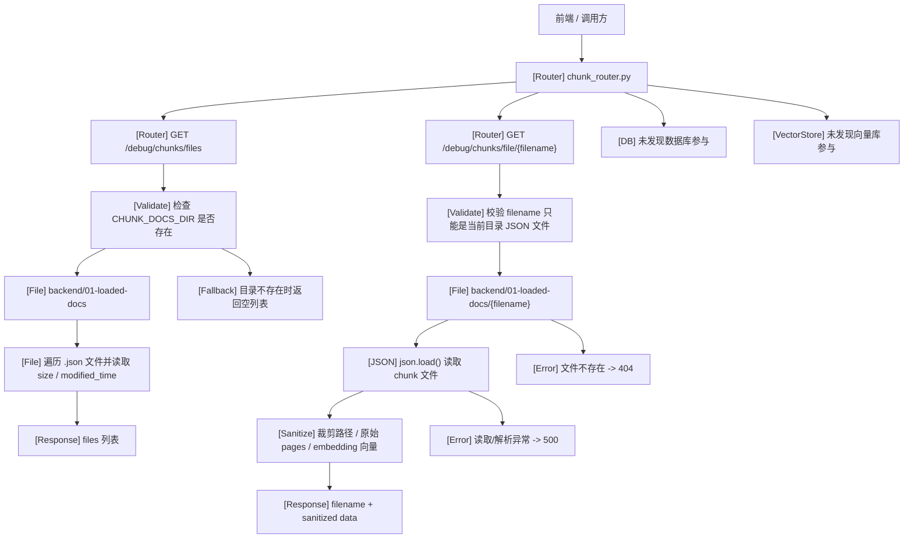
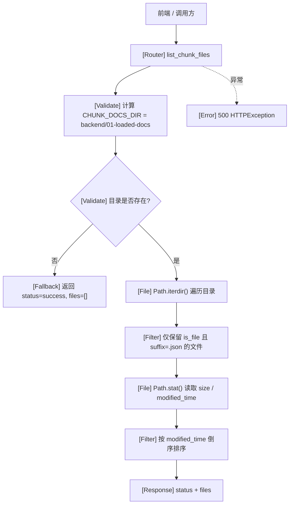
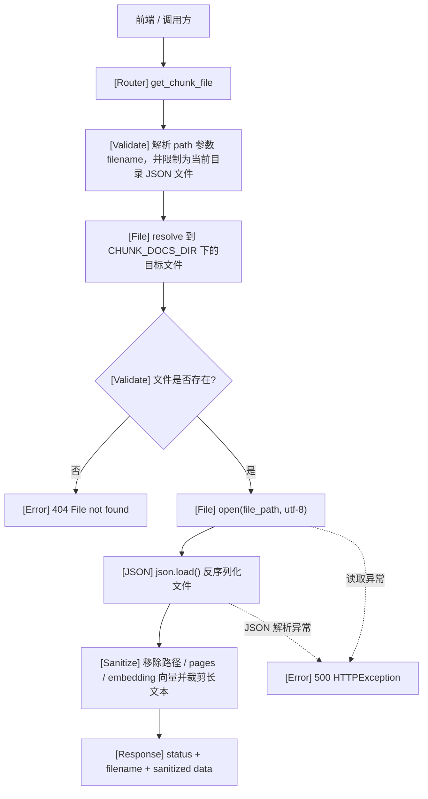

# `chunk_router.py` 调试接口处理流程

本文仅分析当前仓库中的 `backend/routers/chunk_router.py` 及其实际调用到的本地 chunk 文件读取、chunk 调试查看、metadata 展示相关逻辑，不覆盖其他 router。该 router 已从默认正式 API 中剥离，只在 `ENABLE_DEBUG_ROUTES=true` 时注册。

## 1. Router 基本信息

- Router 文件路径：`backend/routers/chunk_router.py`
- Router prefix：`/debug/chunks`
- Router tags：`["debug-chunks"]`
- 注册条件：`ENABLE_DEBUG_ROUTES=true`
- 主要职责：暴露本地 chunk JSON 调试产物的受控视图，支持列出 chunk 文件列表、读取指定 chunk 文件的裁剪调试内容，主要用于调试文档切分结果、查看页结构、chunk 内容和元数据。
- 主要依赖的 service / function：
  - `pathlib.Path`
  - `json.load()`
  - `logging`
  - `CHUNK_DOCS_DIR = BASE_DIR / "01-loaded-docs"`
- 是否访问本地 chunk 文件：是
- 是否访问数据库：未发现
- 是否访问向量库：未发现
- 是否支持分页：未发现
- 是否支持过滤：未发现
- 是否返回 `rerank_text`：是，前提是目标 JSON 文件中的 chunk 结构本身包含该字段；长文本会按 `DEBUG_CHUNK_CONTENT_PREVIEW_CHARS` 裁剪
- 是否返回 `metadata`：是
- 是否返回 `section_path`：是，前提是目标 JSON 文件中的 chunk metadata 包含该字段；本地路径字段会只保留 basename
- 是否返回 `page` 信息：chunk metadata 中的页码会保留；原始 `pages/raw_pages` 全文会被移除，避免暴露完整解析产物

### 依赖边界说明

- `chunk_router.py` 本身没有接入 `DatabaseService`、`VectorStoreService` 或其他业务 service，属于直接面向本地文件系统的轻量调试 router。
- `chunk_router.py` 默认不注册到 FastAPI；本地开发需要设置 `ENABLE_DEBUG_ROUTES=true` 后才会挂到 `/api/debug/chunks/*`。
- chunk 文件目录通过 `BASE_DIR = Path(__file__).resolve().parents[1]` 计算到 `backend` 目录，再拼接为 `backend/01-loaded-docs`。
- 该 router 不负责根据 `paper_id` 检索数据库、定位向量库记录或反查 chunk；它直接接收文件名并读取对应本地 JSON。
- 从真实保存逻辑看，chunk 文件由 `LoadingService.save_document()` 落盘到 `01-loaded-docs`，文件名通常形如：
  - `"{base_name}_{loading_method}_{timestamp}.json"`
  - 当 `loading_method == "unstructured"` 且有 `strategy` 时：`"{base_name}_{loading_method}_{strategy}_{chunking_strategy}_{timestamp}.json"`
- 其中 `base_name = filename.replace(".pdf", "").split("_")[0]`，因此文件名前缀常常近似论文主标识或原始 PDF 文件名前缀，但 `chunk_router.py` 本身未实现 `paper_id -> chunk 文件路径` 映射逻辑。

## 2. 接口总览表

| 方法 | 路径 | 函数名 | 主要职责 | 主要调用 | 副作用 |
|---|---|---|---|---|---|
| GET | `/debug/chunks/files` | `list_chunk_files` | 列出本地 chunk 目录中的 JSON 文件，并返回文件名、大小、修改时间 | `CHUNK_DOCS_DIR.exists()`、`CHUNK_DOCS_DIR.iterdir()`、`Path.stat()` | 读取本地目录与文件元数据；不访问数据库；不访问向量库；只读 |
| GET | `/debug/chunks/file/{filename}` | `get_chunk_file` | 读取指定 chunk JSON 文件的裁剪调试视图 | `_resolve_chunk_debug_file()`、`json.load()`、`_sanitize_debug_payload()` | 读取本地 JSON 文件；不访问数据库；不访问向量库；只读 |

## 3. Router 总览流程图

## 4. 每个接口单独流程图

## 接口：GET `/debug/chunks/files`

### 职责

列出 `backend/01-loaded-docs` 目录下所有 `.json` chunk 文件，并返回前端展示所需的文件名、文件大小和最后修改时间。该接口更偏向调试入口，用于判断本地是否已经生成切分产物以及最新产物是哪一个。

### 处理流程图

### 关键调用链

`list_chunk_files() -> CHUNK_DOCS_DIR.exists() -> CHUNK_DOCS_DIR.iterdir() -> Path.stat() -> sort()`

### 输入

- 无 body
- 无 query 参数
- 无 path 参数

### 输出

- `status`
- `files`
  - `filename`
  - `size`
  - `modified_time`

### 副作用

- 是否读取本地 chunk 文件：是，但只读取目录项和文件元数据，不读取 JSON 正文
- 是否读取数据库：否
- 是否访问向量库：否
- 是否只读：是
- 是否返回 chunk 原文：否
- 是否返回 `metadata`：否
- 是否返回 `rerank_text`：否
- 是否返回 `section_path`：否
- 是否返回 `page` 信息：否

### 异常 / fallback

- `CHUNK_DOCS_DIR` 不存在时，不报错，直接返回空列表
- 遍历目录或读取文件属性异常时，记录日志并返回 `500`
- 未发现分页参数校验逻辑
- 未发现过滤条件逻辑

## 接口：GET `/debug/chunks/file/{filename}`

### 职责

读取指定文件名对应的 chunk JSON，并返回裁剪后的调试视图。该接口主要用于调试查看单个切分结果文件，验证 `chunks`、`metadata`、`rerank_text`、`section_path`、页码等结构是否符合预期；本地路径、原始页面全文和 embedding 向量不会直接返回。

### 处理流程图

### 关键调用链

`get_chunk_file(filename) -> _resolve_chunk_debug_file() -> open(..., encoding="utf-8") -> json.load() -> _sanitize_debug_payload()`

### 输入

- Path 参数：
  - `filename`
- 无 body
- 无 query 参数

### 输出

- `status`
- `debug`
- `filename`
- `sanitized`
- `data`
  - 真实文件中的顶层字段会被 router 裁剪。基于样例文件，可能包括：
  - `filename`
  - `total_chunks`
  - `total_pages`
  - `loading_method`
  - `loading_strategy`
  - `chunking_strategy`
  - `chunking_method`
  - `timestamp`
  - `pages` 会以 redacted 标记替代
  - `chunks`
  - `metadata`
  - `source_path` 等路径字段只保留 basename
  - `text`
  - `document_markdown`
  - `docling_items`
  - `docling_text_items`
  - `docling_picture_items`
  - `docling_table_items`
  - `docling_asset_manifest`
  - `document_metadata`

### 副作用

- 是否读取本地 chunk 文件：是
- 是否读取数据库：否
- 是否访问向量库：否
- 是否只读：是
- 是否返回 chunk 原文：是，但长文本按 `DEBUG_CHUNK_CONTENT_PREVIEW_CHARS` 裁剪
- 是否返回 `metadata`：是，但路径字段只保留 basename
- 是否返回 `rerank_text`：是，若文件中 chunk 结构包含 `rerank_text` 字段，长文本同样会裁剪
- 是否返回 `section_path`：是，若 `chunks[].metadata.section_path` 存在，则会一并返回
- 是否返回 `page` 信息：chunk metadata 页码保留；顶层 `pages/raw_pages` 原始全文会被移除

### 异常 / fallback

- 文件不存在时返回 `404`
- 文件名不是当前目录 JSON 文件时返回 `400`
- 文件读取异常时返回 `500`
- JSON 解析失败时返回 `500`
- 未发现基于 `paper_id`、`chunk_id` 的 fallback 查询逻辑
- 未发现分页逻辑
- 未发现过滤逻辑

## 5. Chunk 数据结构分析

1. chunk 文件存在哪里？
   - `chunk_router.py` 通过 `BASE_DIR = Path(__file__).resolve().parents[1]` 计算出 `backend` 目录，再使用 `CHUNK_DOCS_DIR = BASE_DIR / "01-loaded-docs"`。
   - 因此该 router 实际读取的是 `backend/01-loaded-docs` 目录下的本地 JSON 文件。

2. chunk 文件名如何由 `paper_id` 定位？
   - `chunk_router.py` 本身未实现 `paper_id -> chunk 文件路径` 定位逻辑。
   - 它只接受 `filename` 路径参数，直接读取 `backend/01-loaded-docs/{filename}`。
   - 从 `LoadingService.save_document()` 看，保存文件名通常由原始 `filename` 的前缀生成：
   - `base_name = filename.replace(".pdf", "").split("_")[0]`
   - 最终文件名一般为 `"{base_name}_{loading_method}_{timestamp}.json"`。
   - 因此如果原始 PDF 命名规范中前缀就是 arXiv ID 或论文主标识，则 chunk 文件名前缀常可间接映射回论文，但这不是 router 内的显式能力。

3. chunk JSON 中有哪些主要字段？
   - 基于真实样例文件，顶层字段至少可见：
   - `filename`
   - `total_chunks`
   - `total_pages`
   - `loading_method`
   - `loading_strategy`
   - `chunking_strategy`
   - `chunking_method`
   - `timestamp`
   - `pages`
   - `chunks`
   - `metadata`
   - `source_path`
   - `text`
   - `document_markdown`
   - `document_markdown_length`
   - `docling_items`
   - `docling_item_count`
   - `docling_text_items`
   - `docling_text_item_count`
   - `docling_picture_items`
   - `docling_picture_item_count`
   - `docling_table_items`
   - `docling_table_item_count`
   - `docling_asset_root`
   - `docling_asset_manifest`
   - `document_metadata`

4. 是否包含 `text / content`？
   - 是。
   - 顶层通常包含 `text`。
   - `chunks[]` 中包含 `content`。

5. 是否包含 `metadata`？
   - 是。
   - 顶层可能有 `metadata` 和 `document_metadata`。
   - `chunks[]` 中包含 `metadata`。

6. 是否包含 `section_path`？
   - 是。
   - 基于真实样例，`chunks[].metadata.section_path` 存在。

7. 是否包含 `page`？
   - 是。
   - `pages[]` 中可见 `page`、`page_number`。
   - `chunks[].metadata` 中可见 `page_start`、`page_end`、`page_number`、`page_range`。

8. 是否包含 `rerank_text`？
   - 是。
   - 基于真实样例，`chunks[]` 顶层有 `rerank_text` 字段。
   - 同时 `chunks[].metadata` 也可见 `rerank_text`、`rerank_text_model`、`rerank_text_generated_at`。

9. 是否包含 `embedding id` 或 `vector id`？
   - 在 `chunk_router.py` 读取到的真实样例 chunk metadata 中未发现 `embedding_id`、`vector_id` 一类字段。
   - 当前只能确认该 router 不依赖这些字段；是否有其他保存路径会写入类似字段，基于本 router 范围内未发现。

10. `chunk_router` 返回的是完整 chunk，还是裁剪后的字段？
   - `GET /debug/chunks/file/{filename}` 返回的是裁剪后的 JSON 调试视图，放在 `data` 字段下。
   - router 会移除或裁剪本地路径、原始页面全文、embedding 向量和超长文本。
   - 因此它是受控的“调试查看工件”接口，而不是“面向正式业务的完整 chunk 查询接口”。

## 6. 设计观察

1. `chunk_router.py` 的职责比较清晰，基本就是“把本地 chunk 调试产物暴露为 HTTP 接口”。
2. 它更像调试接口，而不是正式的在线业务接口：
   - 一个接口列文件；
   - 一个接口读完整 JSON；
   - 都直接面向本地调试产物。
3. 它直接暴露了本地文件结构：
   - prefix、文件名和目录约定都比较明显；
   - 调用方需要知道具体 `filename`，而不是通过 `paper_id`、`chunk_id` 这类业务主键查询。
4. chunk 文件、数据库、向量库之间的关系在这个 router 内并不体现清楚：
   - 当前只体现“本地 JSON 文件”这一层；
   - 未发现数据库或向量库参与；
   - 与检索索引、embedding、Milvus 之间的关系需要从其他模块才能看清。
5. 对后续 RAG 检索调试有帮助：
   - 可以直接验证切分结果是否合理；
   - 可以查看 `pages`、`chunks`、`metadata`、`section_path`、`rerank_text` 等细节；
   - 对排查切分质量、页码错位、章节识别问题比较直接。
6. 存在一些异常处理和边界控制缺失：
   - 未发现 `filename` 合法性校验；
   - 未发现路径穿越防护；
   - 未发现分页、过滤、按 `chunk_id` 定位等更细粒度查询能力；
   - 读取失败统一落到 `500`，异常分类较粗。

## 7. 检查结论

- 文档文件已生成到 `docs/architecture/routers/chunk_router_flow.md`
- `chunk_router.py` 中全部 2 个接口已覆盖
- 每个接口都包含单独 Mermaid 流程图
- Mermaid 图统一使用 `flowchart TD`
- 使用的文件名、函数名、类名、目录名均来自真实代码
- 未凭空编造数据库、向量库、分页、过滤、`paper_id` 映射或 `chunk_id` 查询逻辑
- 未确认或代码中不存在的点已明确标注为“未发现”或按样例范围说明
