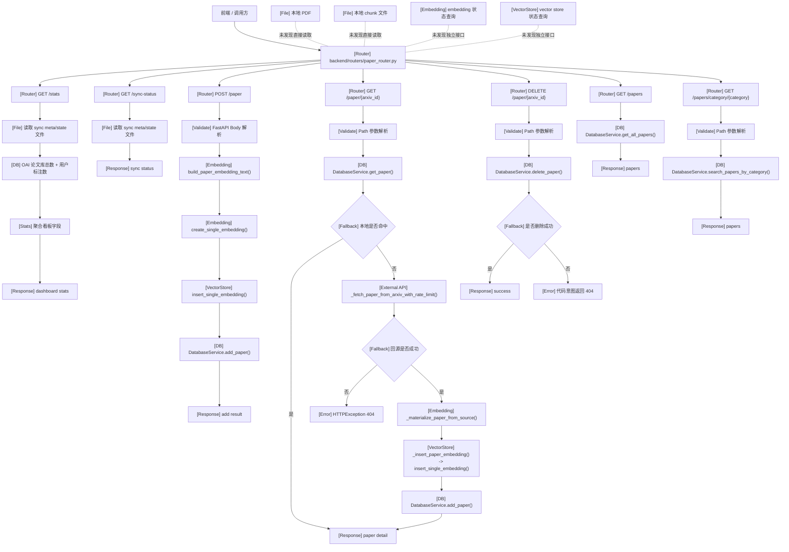
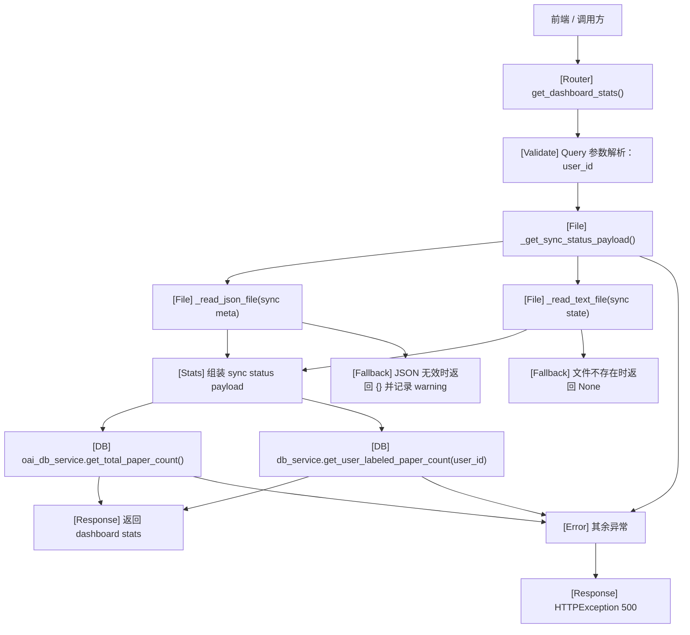
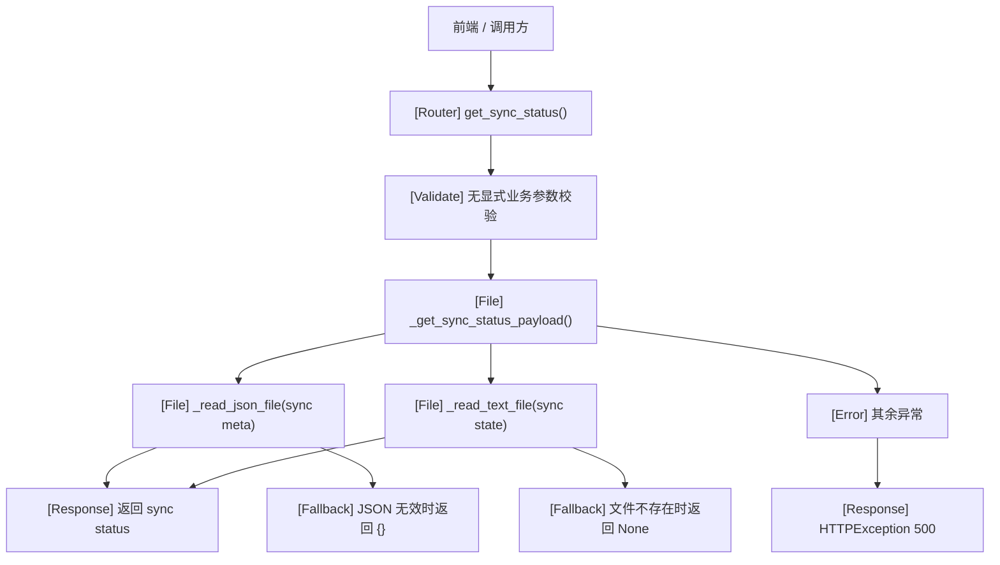
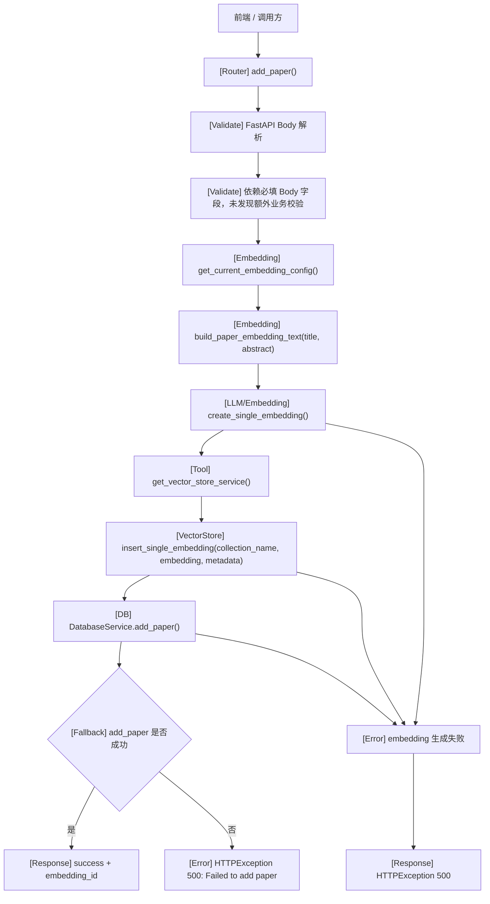
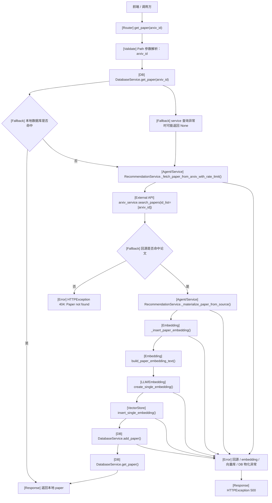
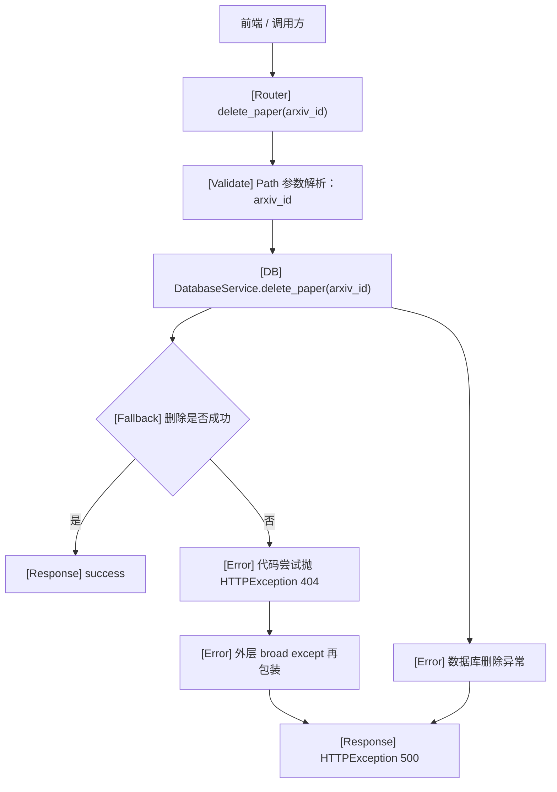
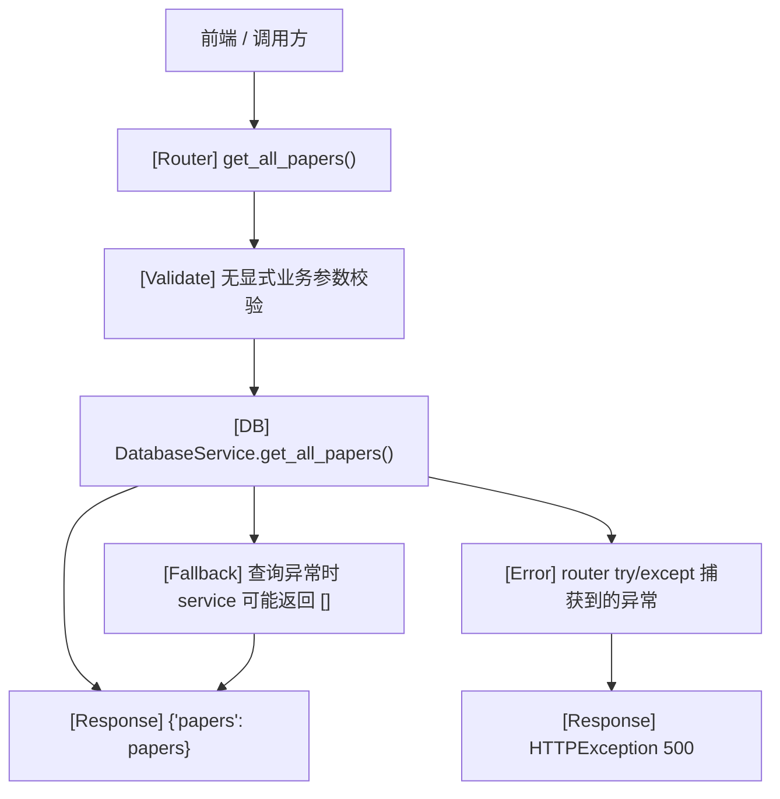
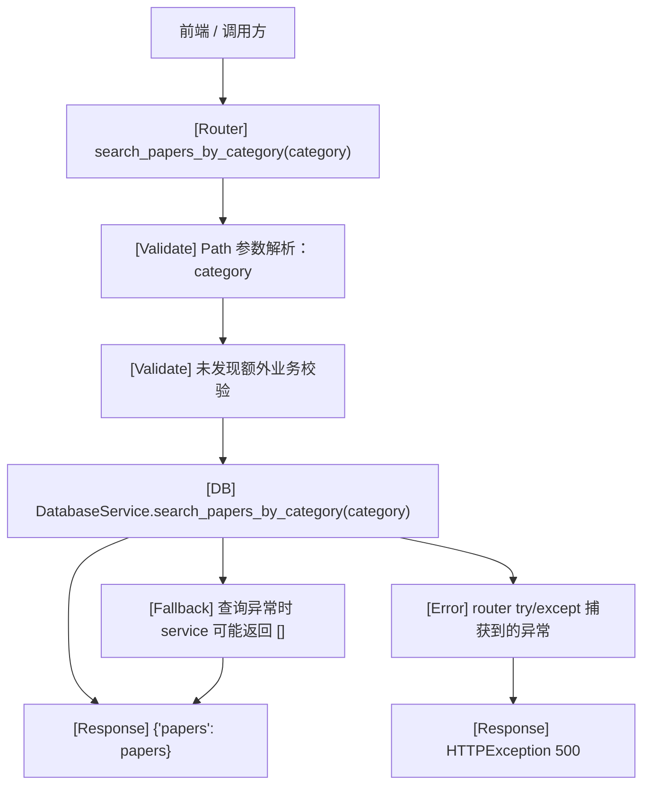

# paper_router.py 接口处理流程

## 1. Router 基本信息

| 项目 | 说明 |
|---|---|
| Router 文件路径 | `backend/routers/paper_router.py` |
| Router prefix | 无（代码中为 `APIRouter(tags=["paper"])`，未发现单独 `prefix`） |
| Router tags | `["paper"]` |
| 主要职责 | 提供论文统计、同步状态查询、论文新增、论文详情查询、论文删除、论文列表查询、按分类查询等接口 |
| 主要依赖的 service / class / function | `get_database_service()`、`get_oai_database_service()`、`get_embedding_service()`、`get_recommendation_service()`、`get_current_embedding_config()`、`get_vector_store_service()`、`_get_sync_status_payload()`、`DatabaseService.add_paper()`、`DatabaseService.get_paper()`、`DatabaseService.get_all_papers()`、`DatabaseService.search_papers_by_category()`、`DatabaseService.delete_paper()`、`DatabaseService.get_user_labeled_paper_count()`、`EmbeddingService.build_paper_embedding_text()`、`EmbeddingService.create_single_embedding()`、`VectorStoreService.insert_single_embedding()`、`RecommendationService._fetch_paper_from_arxiv_with_rate_limit()`、`RecommendationService._materialize_paper_from_source()` |
| 是否访问数据库 | 是。访问业务 SQLite `DatabaseService`，并访问 OAI 论文库 `oai_db_service` |
| 是否写数据库 | 是。`POST /paper` 会写 `arxiv_papers`；`GET /paper/{arxiv_id}` 在本地未命中且回源成功时会写 `arxiv_papers`；`DELETE /paper/{arxiv_id}` 会删库 |
| 是否访问本地 PDF 文件 | 未发现直接读取本地 PDF 文件 |
| 是否访问本地 chunk 文件 | 未发现直接读取本地 chunk 文件 |
| 是否调用 embedding | 是。`POST /paper` 会生成 embedding；`GET /paper/{arxiv_id}` 在回源物化时也会生成 embedding |
| 是否访问向量库 | 是。`POST /paper` 会写入向量库；`GET /paper/{arxiv_id}` 在回源物化时也会写入向量库 |
| 是否只提供统计和查询 | 否。除查询接口外，还包含新增、删除，以及条件性“回源后物化入库”的写入行为 |

### 真实代码定位

- Router：`backend/routers/paper_router.py`
- 业务数据库服务：`backend/services/storage/database_service.py`
- 向量库服务：`backend/services/storage/vector_store_service.py`
- Embedding 服务：`backend/services/embedding/embedding_service.py`
- 推荐服务主类：`backend/services/recommendation/recommendation_service.py`
- 回源与物化逻辑：`backend/services/recommendation/candidate_materializer.py`
- 本地同步状态文件目录：`backend/07-arxiv-tools`

### 关键事实说明

- Router 里除了数据库查询，还维护了两类额外链路：
  - 同步状态链路：读取 `sync_arxiv_oai_since_last_run.state` 和 `sync_arxiv_oai_since_last_run.meta.json`
  - 论文物化链路：为论文生成 embedding、写向量库、写业务数据库
- `GET /paper/{arxiv_id}` 不是绝对只读接口：
  - 本地数据库命中时只读返回
  - 本地数据库未命中时，会通过 `RecommendationService._fetch_paper_from_arxiv_with_rate_limit()` 远程回源 arXiv
  - 回源成功后，会通过 `RecommendationService._materialize_paper_from_source()` 生成 embedding、写向量库、写数据库，再返回结果
- Router 中未发现直接读取 PDF 文件、chunk 文件、embedding 文件或向量状态文件的逻辑
- Router 中也未发现单独的“embedding 状态查询接口”或“vector store 状态查询接口”

## 2. 接口总览表

| 方法 | 路径 | 函数名 | 主要职责 | 主要调用 | 副作用 |
|---|---|---|---|---|---|
| `GET` | `/stats` | `get_dashboard_stats` | 返回首页统计看板数据 | `_get_sync_status_payload()`、`oai_db_service.get_total_paper_count()`、`db_service.get_user_labeled_paper_count()` | 读取本地状态文件；读取 OAI 数据库与业务数据库；不写数据库；不调用 embedding；不访问向量库 |
| `GET` | `/sync-status` | `get_sync_status` | 返回最近一次增量同步状态 | `_get_sync_status_payload()` | 读取本地状态文件；不写数据库；不调用 embedding；不访问向量库 |
| `POST` | `/paper` | `add_paper` | 新增论文，并同步为摘要生成 embedding 后写入向量库与数据库 | `get_current_embedding_config()`、`EmbeddingService.build_paper_embedding_text()`、`EmbeddingService.create_single_embedding()`、`VectorStoreService.insert_single_embedding()`、`DatabaseService.add_paper()` | 调用 embedding；写向量库；写数据库；不读取 PDF/chunk |
| `GET` | `/paper/{arxiv_id}` | `get_paper` | 获取单篇论文详情，本地未命中时回源 arXiv 并物化 | `DatabaseService.get_paper()`、`RecommendationService._fetch_paper_from_arxiv_with_rate_limit()`、`RecommendationService._materialize_paper_from_source()` | 先读数据库；本地未命中时访问外部 arXiv API；回源成功后会调用 embedding、写向量库、写数据库 |
| `DELETE` | `/paper/{arxiv_id}` | `delete_paper` | 删除指定论文记录 | `DatabaseService.delete_paper()` | 写数据库；不调用 embedding；不访问向量库 |
| `GET` | `/papers` | `get_all_papers` | 返回全部论文列表 | `DatabaseService.get_all_papers()` | 只读数据库；不调用 embedding；不访问向量库 |
| `GET` | `/papers/category/{category}` | `search_papers_by_category` | 按 arXiv 分类查询论文 | `DatabaseService.search_papers_by_category()` | 只读数据库；不调用 embedding；不访问向量库 |

## 3. Router 总览流程图

## 4. 每个接口单独流程图

## 接口：GET /stats

### 职责

聚合首页看板需要的统计信息。  
这条链路会同时读取本地同步状态文件、OAI 论文库总量，以及当前用户的已标注论文数量。

### 处理流程图

### 关键调用链

`get_dashboard_stats() -> _get_sync_status_payload() -> _read_json_file() / _read_text_file() -> oai_db_service.get_total_paper_count() -> db_service.get_user_labeled_paper_count()`

### 输入

- Query 参数：
- `user_id: str = Query(default_factory=get_default_user_id)`
- Body 字段：未发现
- Path 参数：未发现

### 输出

- 返回字段：
- `totalPapers`
- `labeledPapers`
- `todayNewPapers`
- `latestSyncNewPapers`
- `lastSyncedDate`
- `lastSyncRunAt`
- `lastSyncStatus`
- `lastSyncMode`
- `latestSyncMatchedPapers`
- `syncErrors`
- `syncErrorMessage`

### 副作用

- 是否只读数据库：是
- 是否写数据库：否
- 是否读取本地文件：是，读取同步状态文件
- 是否触发 embedding：否
- 是否访问 vector store：否
- 是否更新 paper 状态：否
- 是否生成统计信息：是

### 异常 / fallback

- `sync meta` 文件不存在时，`_read_json_file()` 返回 `{}`
- `sync state` 文件不存在时，`_read_text_file()` 返回 `None`
- `sync meta` 不是合法 JSON 时，`_read_json_file()` 记录 warning 并返回 `{}`
- 其余异常由 router 统一包装为 `HTTPException(500)`

## 接口：GET /sync-status

### 职责

返回最近一次 arXiv OAI 同步任务的状态信息，供前端状态面板使用。

### 处理流程图

### 关键调用链

`get_sync_status() -> _get_sync_status_payload() -> _read_json_file() / _read_text_file()`

### 输入

- Body 字段：未发现
- Query 参数：未发现
- Path 参数：未发现

### 输出

- 返回字段：
- `status`
- `mode`
- `from_date`
- `until_date`
- `lastSyncRunAt`
- `lastSyncedDate`
- `latestSyncNewPapers`
- `latestSyncMatchedPapers`
- `syncErrors`
- `syncErrorMessage`

### 副作用

- 是否只读数据库：否
- 是否写数据库：否
- 是否读取本地文件：是
- 是否触发 embedding：否
- 是否访问 vector store：否
- 是否更新 paper 状态：否
- 是否生成统计信息：否，仅返回同步状态

### 异常 / fallback

- `sync meta` 文件不存在时返回默认空信息
- `sync state` 文件不存在时返回默认空信息
- `sync meta` 非法 JSON 时返回默认空信息并记录 warning
- 未发现更进一步的 fallback
- 其余异常统一包装为 `HTTPException(500)`

## 接口：POST /paper

### 职责

新增论文，并立即为论文标题与摘要生成 embedding，然后写入向量库和业务数据库。  
这是一条明确的“入库 + 可检索化”链路。

### 处理流程图

### 关键调用链

`add_paper() -> get_current_embedding_config() -> EmbeddingService.build_paper_embedding_text() -> EmbeddingService.create_single_embedding() -> get_vector_store_service() -> VectorStoreService.insert_single_embedding() -> DatabaseService.add_paper()`

### 输入

- Body 字段：
- `arxiv_id: str`
- `title: str`
- `authors: str`
- `abstract: str`
- `categories: str`
- `published_date: str`
- `url: str`
- `collection_name: str = "arxiv_abstracts"`
- Query 参数：未发现
- Path 参数：未发现

### 输出

- 返回字段：
- `status`
- `message`
- `arxiv_id`
- `embedding_id`
- `embedding_model`
- `vector_dimension`
- `collection_name`

### 副作用

- 是否只读数据库：否
- 是否写数据库：是，写 `arxiv_papers`
- 是否读取本地文件：否
- 是否触发 embedding：是
- 是否访问 vector store：是，写入单条论文向量
- 是否更新 paper 状态：会新增或更新论文记录
- 是否生成统计信息：否

### 异常 / fallback

- 未发现显式的业务级字段校验，主要依赖 FastAPI 必填 Body 校验
- embedding 生成失败时，统一进入 `HTTPException(500)`
- 向量库写入失败时，统一进入 `HTTPException(500)`
- 数据库写入失败时，代码会先尝试抛 `HTTPException(500, "Failed to add paper")`，随后统一异常分支仍包装为 `HTTPException(500)`
- 未发现失败重试或补偿逻辑

## 接口：GET /paper/{arxiv_id}

### 职责

获取单篇论文详情。  
优先读取本地业务数据库；若本地没有，则尝试远程回源 arXiv，并把回源结果物化为本地论文记录和论文级向量。

### 处理流程图

### 关键调用链

`get_paper() -> DatabaseService.get_paper() -> RecommendationService._fetch_paper_from_arxiv_with_rate_limit() -> arxiv_service.search_papers() -> RecommendationService._materialize_paper_from_source() -> RecommendationService._insert_paper_embedding() -> EmbeddingService.build_paper_embedding_text() -> EmbeddingService.create_single_embedding() -> VectorStoreService.insert_single_embedding() -> DatabaseService.add_paper() -> DatabaseService.get_paper()`

### 输入

- Path 参数：
- `arxiv_id: str`
- Query 参数：未发现
- Body 字段：未发现

### 输出

- 返回单篇论文对象，主要字段通常包括：
- `arxiv_id`
- `title`
- `authors`
- `abstract`
- `categories`
- `published_date`
- `url`
- `embedding_id`
- `embedding_model`
- `created_at`

### 副作用

- 是否只读数据库：否，只有本地命中时才是只读
- 是否写数据库：是，DB miss 且回源成功时会写 `arxiv_papers`
- 是否读取本地文件：否，未发现读取本地 PDF/chunk
- 是否触发 embedding：是，DB miss 且回源成功时会触发
- 是否访问 vector store：是，DB miss 且回源成功时会写向量库
- 是否更新 paper 状态：会在本地缺失时补齐论文记录
- 是否生成统计信息：否

### 异常 / fallback

- 本地 DB 命中时直接返回，这是首选分支
- 本地 DB 未命中时，会回源 arXiv，这是明确的 fallback
- 回源无结果时返回 `HTTPException(404, "Paper not found")`
- 其余异常统一包装为 `HTTPException(500)`
- 需要注意：
- `DatabaseService.get_paper()` 内部若查询异常会返回 `None`
- 因此 router 无法区分“确实没数据”和“数据库查询失败”，两种情况都会进入远程回源分支

## 接口：DELETE /paper/{arxiv_id}

### 职责

删除指定论文的业务数据库记录。

### 处理流程图

### 关键调用链

`delete_paper() -> DatabaseService.delete_paper()`

### 输入

- Path 参数：
- `arxiv_id: str`
- Query 参数：未发现
- Body 字段：未发现

### 输出

- 返回字段：
- `status`
- `message`

### 副作用

- 是否只读数据库：否
- 是否写数据库：是，删除 `arxiv_papers` 记录
- 是否读取本地文件：否
- 是否触发 embedding：否
- 是否访问 vector store：否
- 是否更新 paper 状态：是，删除论文记录
- 是否生成统计信息：否

### 异常 / fallback

- `db_service.delete_paper()` 返回 `True` 时返回成功
- 返回 `False` 时，代码意图抛出 `HTTPException(404, "Paper not found")`
- 但外层使用 `except Exception`，没有单独保留 `HTTPException`
- 因此该 404 在实际代码路径上可能再次被包装成 `HTTPException(500)`
- 未发现其他 fallback

## 接口：GET /papers

### 职责

返回当前业务数据库中的全部论文列表。

### 处理流程图

### 关键调用链

`get_all_papers() -> DatabaseService.get_all_papers()`

### 输入

- Body 字段：未发现
- Query 参数：未发现
- Path 参数：未发现

### 输出

- 返回字段：
- `papers: List[Dict[str, Any]]`

### 副作用

- 是否只读数据库：是
- 是否写数据库：否
- 是否读取本地文件：否
- 是否触发 embedding：否
- 是否访问 vector store：否
- 是否更新 paper 状态：否
- 是否生成统计信息：否

### 异常 / fallback

- `DatabaseService.get_all_papers()` 查询异常时会在 service 内记录日志并返回空列表 `[]`
- 因此“无数据”和“查询异常”在 router 返回层可能都表现为 `{"papers": []}`
- router 自身仅在 service 抛出未捕获异常时返回 `HTTPException(500)`
- 未发现更细粒度 fallback

## 接口：GET /papers/category/{category}

### 职责

按照 arXiv 分类字段筛选论文列表。

### 处理流程图

### 关键调用链

`search_papers_by_category() -> DatabaseService.search_papers_by_category()`

### 输入

- Path 参数：
- `category: str`
- Query 参数：未发现
- Body 字段：未发现

### 输出

- 返回字段：
- `papers: List[Dict[str, Any]]`

### 副作用

- 是否只读数据库：是
- 是否写数据库：否
- 是否读取本地文件：否
- 是否触发 embedding：否
- 是否访问 vector store：否
- 是否更新 paper 状态：否
- 是否生成统计信息：否

### 异常 / fallback

- 未发现 `category` 为空或格式非法的显式业务校验
- `DatabaseService.search_papers_by_category()` 查询异常时会在 service 内记录日志并返回空列表 `[]`
- 因此“没有匹配结果”和“service 查询异常”在返回层可能都表现为 `{"papers": []}`
- router 自身仅在 service 抛出未捕获异常时返回 `HTTPException(500)`

## 论文数据链路分析

### 1. 论文基础信息主要来自数据库还是本地文件？

主要来自数据库。  
具体分为两类：

- 论文详情、论文列表、分类查询、论文新增、论文删除依赖业务数据库 `arxiv_papers`
- 看板统计中的 `totalPapers` 来自 OAI 数据库 `oai_db_service`
- 同步状态来自本地状态文件，不来自 PDF 或 chunk 文件

未发现论文基础信息主要依赖本地 PDF 或 chunk 文件的代码路径。

### 2. 论文详情接口是否会读取 PDF / chunk？

未发现。  
`GET /paper/{arxiv_id}` 只会：

- 先查业务数据库
- 本地未命中时回源 arXiv
- 回源成功后生成 embedding、写向量库、写数据库

未发现读取本地 PDF、chunk 文件或解析 PDF 的逻辑。

### 3. 统计接口统计哪些内容？

`GET /stats` 统计并返回：

- `totalPapers`：来自 OAI 数据库的论文总数
- `labeledPapers`：当前用户已标注论文数
- `todayNewPapers` / `latestSyncNewPapers`：最近同步新增数
- `lastSyncedDate`
- `lastSyncRunAt`
- `lastSyncStatus`
- `lastSyncMode`
- `latestSyncMatchedPapers`
- `syncErrors`
- `syncErrorMessage`

### 4. 是否存在 embedding 状态查询？

未发现独立的 embedding 状态查询接口。

### 5. 是否存在 vector store 状态查询？

未发现独立的 vector store 状态查询接口。

### 6. 是否有接口会触发 embedding？

有：

- `POST /paper`
- `GET /paper/{arxiv_id}`，但仅在本地数据库未命中且回源成功时触发

### 7. 是否有接口会触发 vector store 写入？

有：

- `POST /paper`
- `GET /paper/{arxiv_id}`，但仅在本地数据库未命中且回源成功时触发

### 8. 哪些接口是纯只读？

明确纯只读：

- `GET /stats`
- `GET /sync-status`
- `GET /papers`
- `GET /papers/category/{category}`

条件性只读：

- `GET /paper/{arxiv_id}` 只有在本地数据库命中时才是只读

非只读：

- `POST /paper`
- `DELETE /paper/{arxiv_id}`

### 9. 哪些接口有写入副作用？

存在写入副作用的接口：

- `POST /paper`
  - 生成 embedding
  - 写入向量库
  - 写入 `arxiv_papers`
- `GET /paper/{arxiv_id}`
  - 仅在本地未命中且回源成功时：
  - 访问外部 arXiv API
  - 生成 embedding
  - 写入向量库
  - 写入 `arxiv_papers`
- `DELETE /paper/{arxiv_id}`
  - 删除 `arxiv_papers`

## 设计观察

### 1. `paper_router.py` 的职责是否清晰？

整体上可读性还可以，但职责已经不只是“论文基础查询”。  
它同时承担了：

- 论文查询
- 论文新增/删除
- 同步状态读取
- 条件性回源与物化

因此它更像“论文元数据入口 + 论文物化入口”的组合。

### 2. 论文基础查询、统计、索引状态是否耦合在一起？

部分耦合在一起。

- 统计接口与论文查询接口放在同一个 router 中
- 论文详情接口还隐含了向量化和入库动作

但“索引状态查询”本身未发现独立接口，所以当前并不是完整的索引状态管理入口。

### 3. Router 是否包含过多业务逻辑？

存在一定业务逻辑泄漏。

- `add_paper()` 中直接组织 metadata、直接调用 embedding 与向量库写入
- `get_paper()` 中直接决定是否回源，以及是否物化

虽然核心动作最终委托给 service，但 router 已经承担了明显的业务编排职责。

### 4. paper metadata、chunk、embedding、vector store 的边界是否清楚？

边界部分清楚，部分不清楚。

- 清楚的部分：
  - Router 未直接碰 PDF/chunk 文件
  - 论文 metadata 存在 `arxiv_papers`
  - 论文级向量存在向量库
- 不清楚的部分：
  - `GET /paper/{arxiv_id}` 表面是详情查询，实际在缺失时会触发 embedding 和向量入库
  - 从接口语义上看，读请求包含了写副作用，边界不完全直观

### 5. 对后续 RAG 索引和论文管理有什么影响？

影响主要体现在“便利但隐式”：

- 好处：
  - 某篇论文第一次被访问时可以自动补齐到本地存储链路
  - 前端不必显式再调一个“物化/入库”接口
- 风险：
  - 读接口存在写副作用，调用方不容易预期
  - 数据库查询异常与“本地未命中”在 `get_paper()` 中可能都走回源分支
  - 列表查询接口中，空结果和 service 内部异常都可能表现为 `[]`，排障边界较弱

## 检查结果

- 文档文件已生成到 `docs/architecture/routers/paper_router_flow.md`
- `paper_router.py` 中 7 个 FastAPI decorator 接口已全部覆盖
- 每个接口都包含单独 Mermaid 流程图
- Mermaid 图均使用 `flowchart TD`
- 文档中的文件名、函数名、类名均来自真实代码
- 未凭空编造本地 PDF、chunk、embedding 状态、vector store 状态接口
- 未确认或不存在的地方已明确标注“未发现”或按真实行为说明为“条件性存在”
