# `qa_router.py` 接口处理流程

本文仅分析当前仓库中的 `backend/routers/qa_router.py` 及其实际调用到的相关实现，不覆盖其他 router。

## 1. Router 基本信息

- Router 文件路径：`backend/routers/qa_router.py`
- Router prefix：`/paper/{arxiv_id}`
- Router tags：`["paper-qa"]`
- 主要职责：负责单篇论文 QA 索引状态与构建、检索 trace 导出、论文聊天会话管理、论文笔记管理、非流式 QA、流式 QA。
- 主要依赖的 service / class / function：
  - `PaperQAService`
  - `IndexJobManager`
  - `DatabaseService`
  - `MemoryService`
  - `EnhancedRetrievalService`
  - `GenerationService`
  - `routers.qa_utils.build_qa_diagnostic()`
  - `routers.qa_utils.get_latest_retrieval_trace()`
  - `routers.qa_utils.sanitize_trace_slug()`
- 是否访问数据库：是
- 是否访问向量库：是
- 是否访问本地 chunk 文件：是，但主要出现在 `create-qa-index` 的索引构建流程中；QA 主问答链路未发现直接读取本地 chunk 文件
- 是否调用 LLM：是
- 是否涉及会话保存：是
- 是否涉及笔记保存：是
- 是否产生 debug 信息：是

### 依赖边界说明

- 数据库访问：
  - 会话、消息、笔记、QA 索引状态、索引任务状态、论文元数据均通过 `DatabaseService` 访问。
- 向量库访问：
  - QA 诊断通过 `VectorStoreService` 查询集合状态；
  - QA 检索入口是 `EnhancedRetrievalService.enhanced_retrieve()`，真实编排由 `RetrievalPipeline -> RouteRetriever -> VectorStoreService` 完成；
  - QA 索引构建通过 `PaperQAIndexBuilder -> VectorStoreService.index_embeddings()` 写入向量库。
- 本地文件访问：
  - `qa-trace/latest` 直接读取检索 trace 文件；
  - `create-qa-index` 会下载 PDF、加载 PDF、切 chunk、保存 chunk 文件、保存 embedding 文件；
  - QA 主流程会把 `figure` 类型结果中的 `asset_abs_path` 作为多模态输入传给 LLM，但未发现直接读取本地 chunk 文件。
- LLM 调用：
  - `PaperQAService._contextualize_question()`：会话追问改写
  - `RetrievalPipeline` / `QueryPlanner` / `RouteRetriever`：query rewrite、HyDE、rerank query 构造
  - `RerankService`：可选 LLM rerank
  - `PaperQAService.answer_question()` / `qa_paper_stream()`：最终回答生成
  - `PaperQAIndexBuilder.compress_chunks_for_rerank()`：为 rerank 预压缩 chunk 文本

## 2. 接口总览表

| 方法 | 路径 | 函数名 | 主要职责 | 主要调用 | 副作用 |
|---|---|---|---|---|---|
| GET | `/paper/{arxiv_id}/qa-status` | `get_paper_qa_status` | 查询论文 QA 索引状态 | `PaperQAService.get_qa_status()` | 读数据库 |
| GET | `/paper/{arxiv_id}/qa-diagnose` | `diagnose_paper_qa` | 输出 QA 索引诊断信息 | `build_qa_diagnostic()`、`DatabaseService.get_paper_qa_index()`、`VectorStoreService.list_collections()/collection_exists()/get_collection_info()/get_all_chunks()` | 读数据库、读向量库 |
| GET | `/paper/{arxiv_id}/qa-trace/latest` | `download_latest_qa_trace` | 下载最近或指定检索 trace 文件 | `sanitize_trace_slug()`、`get_latest_retrieval_trace()` | 读本地文件 |
| POST | `/paper/{arxiv_id}/create-qa-index` | `create_paper_qa_index` | 创建 QA 索引，支持同步或异步 | `PaperQAService.build_qa_index()` 或 `IndexJobManager.submit_job()` | 同步模式：写数据库、读写本地文件、调用 LLM、写向量库；异步模式：立即写数据库并启动后台任务 |
| GET | `/paper/{arxiv_id}/qa-index-jobs/latest` | `get_latest_paper_qa_index_job` | 查询最近一次 QA 索引任务 | `DatabaseService.get_latest_paper_index_job()` | 读数据库 |
| GET | `/paper/{arxiv_id}/qa-index-jobs/{job_id}` | `get_paper_qa_index_job` | 查询指定 QA 索引任务 | `DatabaseService.get_paper_index_job()` | 读数据库 |
| GET | `/paper/{arxiv_id}/chat-sessions` | `list_paper_chat_sessions` | 列出论文聊天会话 | `DatabaseService.list_paper_chat_sessions()` | 读数据库 |
| GET | `/paper/{arxiv_id}/chat-sessions/recent` | `get_recent_paper_chat_session` | 获取最近会话 | `DatabaseService.get_recent_paper_chat_session()` | 读数据库 |
| POST | `/paper/{arxiv_id}/chat-sessions` | `create_paper_chat_session` | 创建论文聊天会话 | `DatabaseService.create_paper_chat_session()` | 写数据库 |
| GET | `/paper/{arxiv_id}/chat-sessions/{session_id}` | `get_paper_chat_session` | 获取单个会话详情 | `DatabaseService.get_paper_chat_session()` | 读数据库 |
| GET | `/paper/{arxiv_id}/chat-sessions/{session_id}/messages` | `get_paper_chat_messages` | 获取会话消息列表 | `DatabaseService.get_paper_chat_session()`、`DatabaseService.list_paper_chat_messages()` | 读数据库 |
| POST | `/paper/{arxiv_id}/chat-sessions/{session_id}/clear` | `clear_paper_chat_session` | 清空会话消息但保留会话 | `DatabaseService.get_paper_chat_session()`、`DatabaseService.clear_paper_chat_session()` | 写数据库 |
| DELETE | `/paper/{arxiv_id}/chat-sessions/{session_id}` | `delete_paper_chat_session` | 删除会话 | `DatabaseService.get_paper_chat_session()`、`DatabaseService.delete_paper_chat_session()` | 写数据库 |
| GET | `/paper/{arxiv_id}/notes` | `list_paper_notes` | 列出论文笔记 | `DatabaseService.list_paper_notes()`、`DatabaseService.get_paper_chat_message()` | 读数据库 |
| POST | `/paper/{arxiv_id}/notes` | `create_paper_note` | 创建论文笔记，并可同步用户画像 | `DatabaseService.get_paper_chat_message_by_turn()`、`DatabaseService.create_paper_note()`、`MemoryService.update_profile_from_note()` | 写数据库；可写用户画像 |
| PATCH | `/paper/{arxiv_id}/notes/{note_id}` | `update_paper_note` | 更新论文笔记，并可同步用户画像 | `DatabaseService.get_paper_note()`、`DatabaseService.update_paper_note()`、`MemoryService.update_profile_from_note()` | 写数据库；可写用户画像 |
| DELETE | `/paper/{arxiv_id}/notes/{note_id}` | `delete_paper_note` | 删除论文笔记 | `DatabaseService.get_paper_note()`、`DatabaseService.delete_paper_note()` | 写数据库 |
| GET | `/paper/{arxiv_id}/notes/export` | `export_paper_notes_markdown` | 导出笔记 Markdown | `DatabaseService.list_paper_notes()`、`DatabaseService.get_paper()`、`_build_notes_markdown()` | 读数据库，返回流式下载 |
| POST | `/paper/{arxiv_id}/qa` | `qa_paper` | 非流式论文问答 | `PaperQAService.answer_question()` | 读数据库、读向量库、可读本地图像资产、调用 LLM、保存会话消息、返回 debug 信息 |
| POST | `/paper/{arxiv_id}/qa/stream` | `qa_paper_stream` | 流式论文问答 | `PaperQAService.build_qa_context()`、`PaperQAService.build_source_payload()`、`GenerationService.stream_qwen_responses()`、`PaperQAService.persist_completed_turn()` | 读数据库、读向量库、可读本地图像资产、调用 LLM、保存会话消息、返回 SSE debug 信息 |

## 3. Router 总览流程图

```mermaid
flowchart TD
    U["前端 / 调用方"] --> R["[Router] qa_router.py"]

    R --> S1["[Service] PaperQAService.get_qa_status"]
    S1 --> DB1["[DB] paper_qa_indexes / papers"]

    R --> S2["[Function] build_qa_diagnostic"]
    S2 --> DB2["[DB] QA 索引元数据"]
    S2 --> VS2["[VectorStore] 集合/样本 chunk 检查"]

    R --> F1["[File] retrieval trace 文件"]

    R --> IDX["[Service] PaperQAService.build_qa_index / IndexJobManager.submit_job"]
    IDX --> DB3["[DB] 索引状态/任务状态"]
    IDX --> FILE1["[File] PDF / chunk 文件 / embedding 文件"]
    IDX --> LLM1["[LLM] chunk rerank_text 压缩"]
    IDX --> VS3["[VectorStore] 写入 embeddings"]

    R --> CHAT["[Service] DatabaseService 会话/消息管理"]
    CHAT --> DB4["[DB] paper_chat_sessions / paper_chat_messages"]

    R --> NOTE["[Service] DatabaseService 笔记管理"]
    NOTE --> DB5["[DB] paper_notes"]
    NOTE --> MEM1["[Service] MemoryService.update_profile_from_note"]
    MEM1 --> DB6["[DB] user_research_profile"]

    R --> QA["[Service] PaperQAService QA 主流程"]
    QA --> DB7["[DB] QA 索引 / 论文元数据 / 会话上下文"]
    QA --> MEM2["[Service] MemoryService 会话上下文加载/合并"]
    QA --> LLM2["[LLM] 问题上下文化"]
    QA --> RET["[Facade] EnhancedRetrievalService.enhanced_retrieve"]
    RET --> PIPE["[Service] RetrievalPipeline.retrieve"]
    PIPE --> VS4["[VectorStore] 向量检索 / 全量 chunk 读取"]
    PIPE --> LLM3["[LLM] Query Rewrite / HyDE / Rerank"]
    QA --> GEN["[LLM] GenerationService.generate / stream_qwen_responses"]
    GEN --> FILE2["[File] figure 资产路径作为图像输入"]
    QA --> DB8["[DB] 保存 user / assistant 消息"]
    QA --> DBG["[Response] retrieval_debug / trace_export / SSE meta"]
```

## 4. 每个接口单独流程图

## 接口：GET `/paper/{arxiv_id}/qa-status`

### 职责

查询指定论文当前是否已经构建 QA 索引，以及索引摘要信息。

### 处理流程图

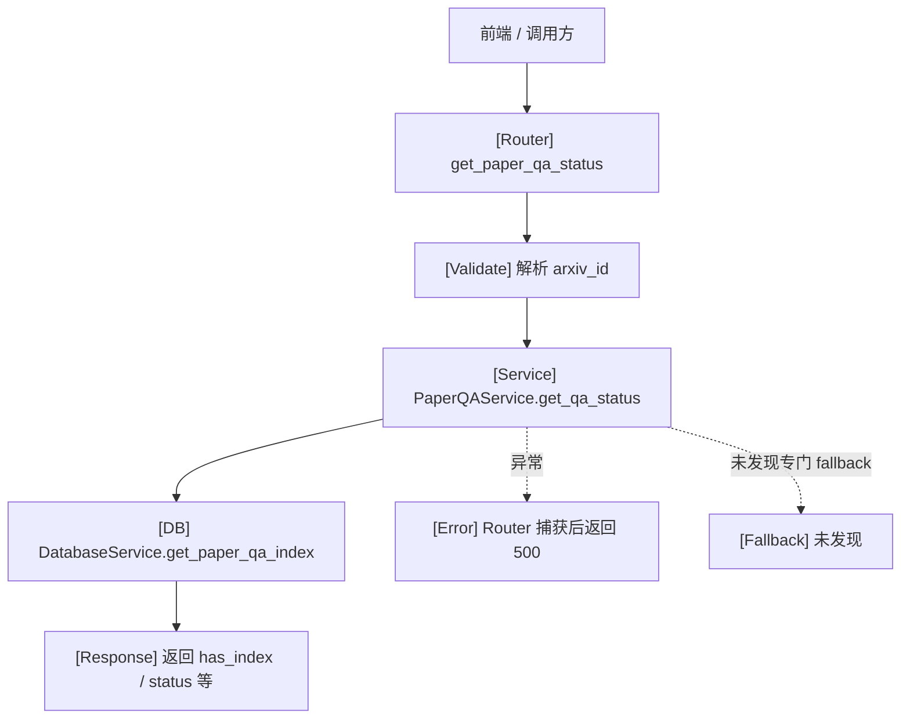
```mermaid
flowchart TD
    A["前端 / 调用方"] --> B["[Router] get_paper_qa_status"]
    B --> C["[Validate] 解析 arxiv_id"]
    C --> D["[Service] PaperQAService.get_qa_status"]
    D --> E["[DB] DatabaseService.get_paper_qa_index"]
    E --> F["[Response] 返回 has_index / status 等"]
    D -. 异常 .-> G["[Error] Router 捕获后返回 500"]
    D -. 未发现专门 fallback .-> H["[Fallback] 未发现"]
```

### 关键调用链

`get_paper_qa_status() -> PaperQAService.get_qa_status() -> DatabaseService.get_paper_qa_index()`

### 输入

- Path：
  - `arxiv_id`

### 输出

- `arxiv_id`
- `has_index`
- `status`
- `collection_name`（已建索引时）
- `chunk_count`（已建索引时）
- `embedding_model`（已建索引时）

### 副作用

- 是否读取数据库：是
- 是否写入数据库：否
- 是否读取本地 chunk 文件：否
- 是否访问向量库：否
- 是否调用 LLM：否
- 是否保存用户问题：否
- 是否保存模型回答：否
- 是否保存笔记：否
- 是否生成 debug 信息：否

### 异常 / fallback

- service 抛错时由 router 返回 `HTTPException(500)`
- 未发现明确 fallback

## 接口：GET `/paper/{arxiv_id}/qa-diagnose`

### 职责

联合数据库与向量库状态，输出 QA 索引诊断结果，帮助排查“索引元数据是否存在、Milvus 集合是否存在、实体数是否一致、能否抽样返回 chunk”。

### 处理流程图

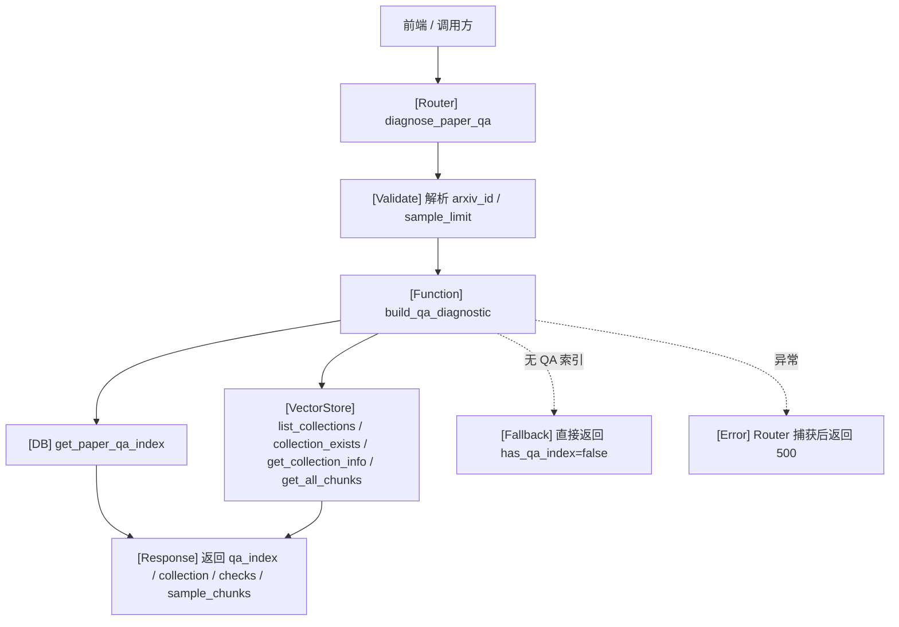
```mermaid
flowchart TD
    A["前端 / 调用方"] --> B["[Router] diagnose_paper_qa"]
    B --> C["[Validate] 解析 arxiv_id / sample_limit"]
    C --> D["[Function] build_qa_diagnostic"]
    D --> E["[DB] get_paper_qa_index"]
    D --> F["[VectorStore] list_collections / collection_exists / get_collection_info / get_all_chunks"]
    E --> G["[Response] 返回 qa_index / collection / checks / sample_chunks"]
    F --> G
    D -. 无 QA 索引 .-> H["[Fallback] 直接返回 has_qa_index=false"]
    D -. 异常 .-> I["[Error] Router 捕获后返回 500"]
```

### 关键调用链

`diagnose_paper_qa() -> build_qa_diagnostic() -> DatabaseService.get_paper_qa_index()`

`diagnose_paper_qa() -> build_qa_diagnostic() -> VectorStoreService.list_collections()/collection_exists()/get_collection_info()/get_all_chunks()`

### 输入

- Path：
  - `arxiv_id`
- Query：
  - `sample_limit`

### 输出

- `arxiv_id`
- `qa_index`
- `milvus`
- `collection`
- `sample_chunks`
- `checks`

### 副作用

- 是否读取数据库：是
- 是否写入数据库：否
- 是否读取本地 chunk 文件：否
- 是否访问向量库：是
- 是否调用 LLM：否
- 是否保存用户问题：否
- 是否保存模型回答：否
- 是否保存笔记：否
- 是否生成 debug 信息：是，接口本身就是诊断输出

### 异常 / fallback

- 数据库中无 QA 索引时，返回 `has_qa_index=false` 的诊断结果
- 向量库集合存在但读取异常时，错误会写入 `collection.error`
- router 兜底返回 `HTTPException(500)`

## 接口：GET `/paper/{arxiv_id}/qa-trace/latest`

### 职责

下载最近一次或指定名称的 retrieval trace 文件，支持 `md` 和 `json`。

### 处理流程图

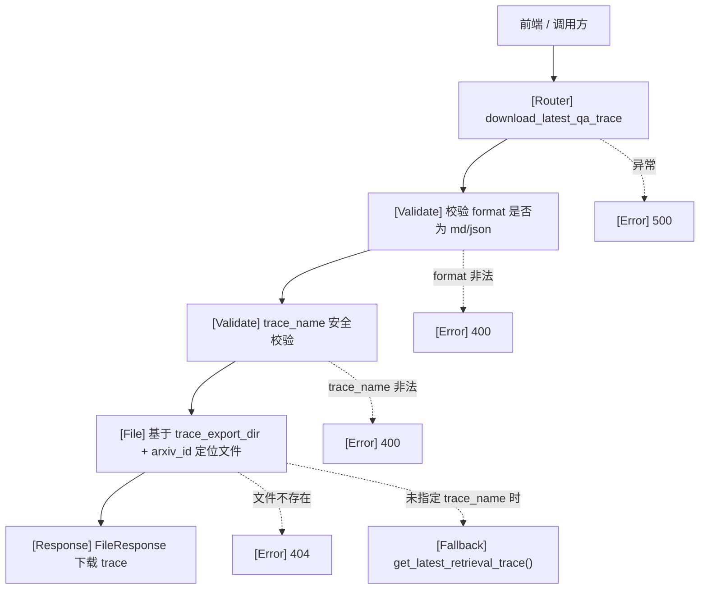
```mermaid
flowchart TD
    A["前端 / 调用方"] --> B["[Router] download_latest_qa_trace"]
    B --> C["[Validate] 校验 format 是否为 md/json"]
    C --> D["[Validate] trace_name 安全校验"]
    D --> E["[File] 基于 trace_export_dir + arxiv_id 定位文件"]
    E --> F["[Response] FileResponse 下载 trace"]
    C -. format 非法 .-> G["[Error] 400"]
    D -. trace_name 非法 .-> H["[Error] 400"]
    E -. 文件不存在 .-> I["[Error] 404"]
    E -. 未指定 trace_name 时 .-> J["[Fallback] get_latest_retrieval_trace()"]
    B -. 异常 .-> K["[Error] 500"]
```

### 关键调用链

`download_latest_qa_trace() -> sanitize_trace_slug() -> get_latest_retrieval_trace()`

### 输入

- Path：
  - `arxiv_id`
- Query：
  - `format`
  - `trace_name`

### 输出

- 文件下载响应：
  - Markdown：`text/markdown`
  - JSON：`application/json`

### 副作用

- 是否读取数据库：否
- 是否写入数据库：否
- 是否读取本地 chunk 文件：否
- 是否访问向量库：否
- 是否调用 LLM：否
- 是否保存用户问题：否
- 是否保存模型回答：否
- 是否保存笔记：否
- 是否生成 debug 信息：否，仅读取已存在 trace 文件

### 异常 / fallback

- `format` 非 `md/json` 时返回 `400`
- `trace_name` 包含目录跳转成分时返回 `400`
- 未找到 trace 文件时返回 `404`
- 未指定 `trace_name` 时，回退到“最近一次 trace 文件”
- 其他异常返回 `500`

## 接口：POST `/paper/{arxiv_id}/create-qa-index`

### 职责

为论文创建 QA 索引。`sync=true` 时同步执行完整建索引流程；否则只提交后台任务并立即返回任务信息。

### 处理流程图

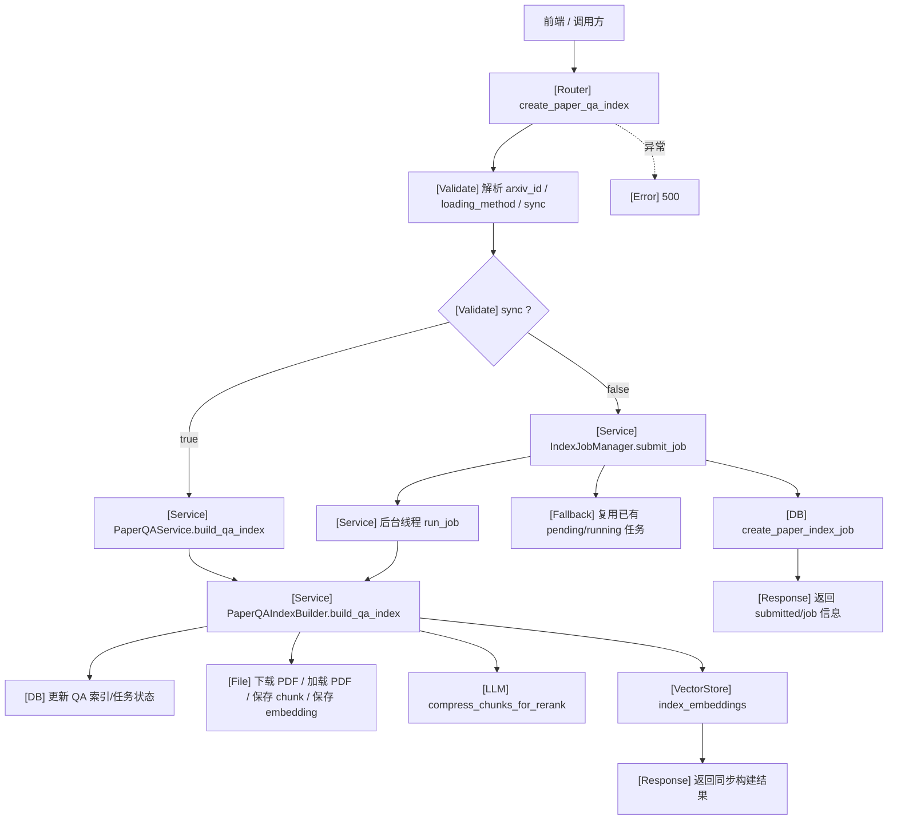
```mermaid
flowchart TD
    A["前端 / 调用方"] --> B["[Router] create_paper_qa_index"]
    B --> C["[Validate] 解析 arxiv_id / loading_method / sync"]
    C --> D{"[Validate] sync ?"}
    D -->|true| E["[Service] PaperQAService.build_qa_index"]
    E --> F["[Service] PaperQAIndexBuilder.build_qa_index"]
    F --> G["[DB] 更新 QA 索引/任务状态"]
    F --> H["[File] 下载 PDF / 加载 PDF / 保存 chunk / 保存 embedding"]
    F --> I["[LLM] compress_chunks_for_rerank"]
    F --> J["[VectorStore] index_embeddings"]
    J --> K["[Response] 返回同步构建结果"]
    D -->|false| L["[Service] IndexJobManager.submit_job"]
    L --> M["[DB] create_paper_index_job"]
    L --> N["[Fallback] 复用已有 pending/running 任务"]
    L --> O["[Service] 后台线程 run_job"]
    O --> F
    M --> P["[Response] 返回 submitted/job 信息"]
    B -. 异常 .-> Q["[Error] 500"]
```

### 关键调用链

同步模式：

`create_paper_qa_index() -> PaperQAService.build_qa_index() -> PaperQAIndexBuilder.build_qa_index() -> load_paper_metadata() -> download_pdf() -> load_pdf_document() -> chunk_document() -> save_chunk_file() -> compress_chunks_for_rerank() -> create_chunk_embeddings() -> save_embeddings() -> index_embeddings_to_vector_store()`

异步模式：

`create_paper_qa_index() -> IndexJobManager.submit_job() -> DatabaseService.create_paper_index_job() -> IndexJobManager.run_job() -> PaperQAIndexBuilder.build_qa_index()`

### 输入

- Path：
  - `arxiv_id`
- Query：
  - `loading_method`
  - `sync`

### 输出

- 异步模式：
  - `status`
  - `job_id`
  - `arxiv_id`
  - `job_status`
  - `current_stage`
  - `progress`
  - `message`
- 同步模式：
  - 返回 `PaperQAIndexBuilder.build_qa_index()` 的构建结果
  - 典型字段包括 `loading_method`、`chunk_count`、`embedding_model`、`chunk_file`、`embedding_file`、`collection_name`

### 副作用

- 是否读取数据库：是
- 是否写入数据库：是
- 是否读取本地 chunk 文件：是，同步/后台构建时会加载 PDF 并产出 chunk 文件
- 是否访问向量库：是
- 是否调用 LLM：是，`compress_chunks_for_rerank()`
- 是否保存用户问题：否
- 是否保存模型回答：否
- 是否保存笔记：否
- 是否生成 debug 信息：否

### 异常 / fallback

- `loading_method` 非法时会抛 `400`
- 异步提交时若已有活跃任务，会复用已有任务
- 后台任务执行失败会写回任务状态为 `failed`
- router 兜底返回 `500`

## 接口：GET `/paper/{arxiv_id}/qa-index-jobs/latest`

### 职责

获取某篇论文最近一次 QA 索引任务的状态。

### 处理流程图

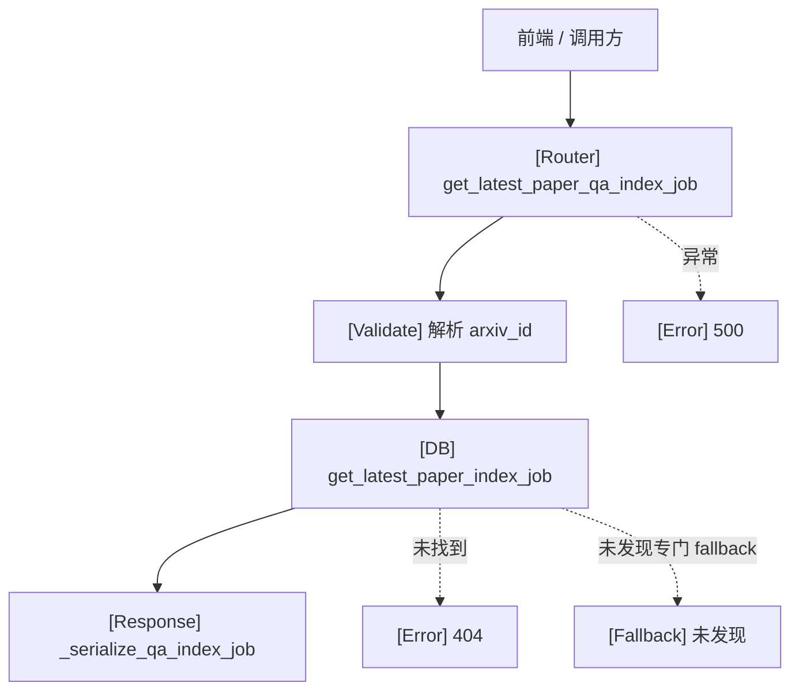
```mermaid
flowchart TD
    A["前端 / 调用方"] --> B["[Router] get_latest_paper_qa_index_job"]
    B --> C["[Validate] 解析 arxiv_id"]
    C --> D["[DB] get_latest_paper_index_job"]
    D --> E["[Response] _serialize_qa_index_job"]
    D -. 未找到 .-> F["[Error] 404"]
    B -. 异常 .-> G["[Error] 500"]
    D -. 未发现专门 fallback .-> H["[Fallback] 未发现"]
```

### 关键调用链

`get_latest_paper_qa_index_job() -> DatabaseService.get_latest_paper_index_job() -> _serialize_qa_index_job()`

### 输入

- Path：
  - `arxiv_id`

### 输出

- `job_id`
- `arxiv_id`
- `status`
- `current_stage`
- `progress`
- `error_message`
- `loading_method`
- `created_at`
- `updated_at`

### 副作用

- 是否读取数据库：是
- 是否写入数据库：否
- 是否读取本地 chunk 文件：否
- 是否访问向量库：否
- 是否调用 LLM：否
- 是否保存用户问题：否
- 是否保存模型回答：否
- 是否保存笔记：否
- 是否生成 debug 信息：否

### 异常 / fallback

- 未找到任务时返回 `404`
- 其他异常返回 `500`
- 未发现明确 fallback

## 接口：GET `/paper/{arxiv_id}/qa-index-jobs/{job_id}`

### 职责

查询指定 `job_id` 的 QA 索引任务详情，并校验该任务是否属于当前论文。

### 处理流程图

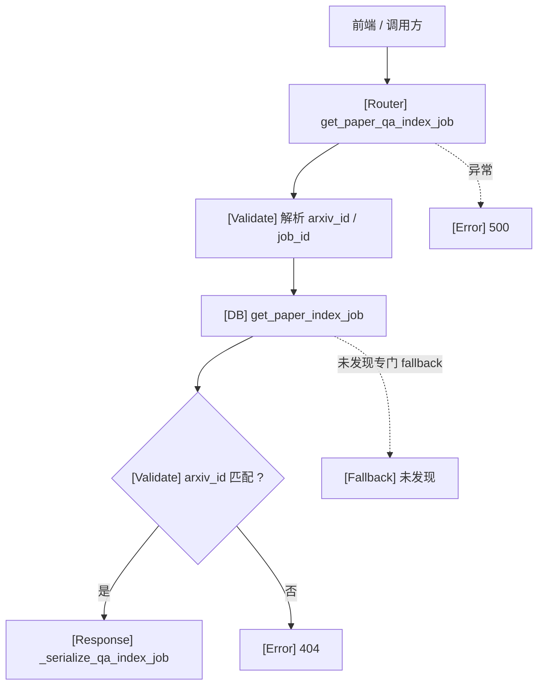
```mermaid
flowchart TD
    A["前端 / 调用方"] --> B["[Router] get_paper_qa_index_job"]
    B --> C["[Validate] 解析 arxiv_id / job_id"]
    C --> D["[DB] get_paper_index_job"]
    D --> E{"[Validate] arxiv_id 匹配 ?"}
    E -->|是| F["[Response] _serialize_qa_index_job"]
    E -->|否| G["[Error] 404"]
    B -. 异常 .-> H["[Error] 500"]
    D -. 未发现专门 fallback .-> I["[Fallback] 未发现"]
```

### 关键调用链

`get_paper_qa_index_job() -> DatabaseService.get_paper_index_job() -> _serialize_qa_index_job()`

### 输入

- Path：
  - `arxiv_id`
  - `job_id`

### 输出

- `job_id`
- `arxiv_id`
- `status`
- `current_stage`
- `progress`
- `error_message`
- `loading_method`
- `created_at`
- `updated_at`

### 副作用

- 是否读取数据库：是
- 是否写入数据库：否
- 是否读取本地 chunk 文件：否
- 是否访问向量库：否
- 是否调用 LLM：否
- 是否保存用户问题：否
- 是否保存模型回答：否
- 是否保存笔记：否
- 是否生成 debug 信息：否

### 异常 / fallback

- 任务不存在，或任务的 `arxiv_id` 与 path 不一致时返回 `404`
- 其他异常返回 `500`
- 未发现明确 fallback

## 接口：GET `/paper/{arxiv_id}/chat-sessions`

### 职责

按论文和用户列出聊天会话列表。

### 处理流程图

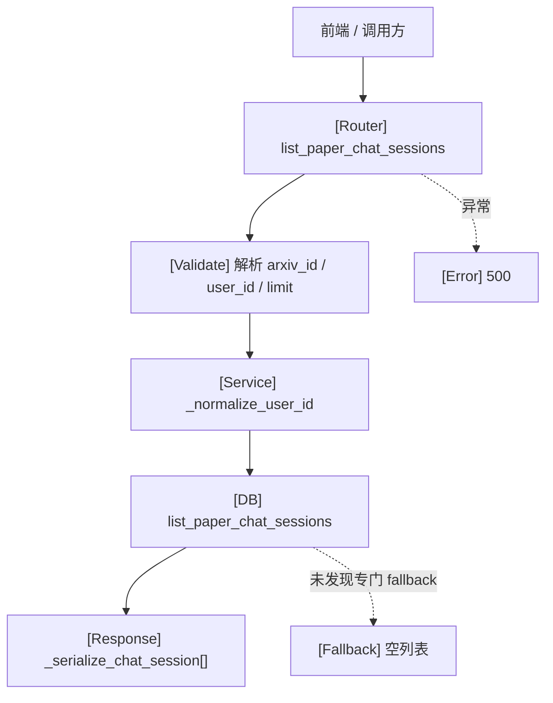
```mermaid
flowchart TD
    A["前端 / 调用方"] --> B["[Router] list_paper_chat_sessions"]
    B --> C["[Validate] 解析 arxiv_id / user_id / limit"]
    C --> D["[Service] _normalize_user_id"]
    D --> E["[DB] list_paper_chat_sessions"]
    E --> F["[Response] _serialize_chat_session[]"]
    B -. 异常 .-> G["[Error] 500"]
    E -. 未发现专门 fallback .-> H["[Fallback] 空列表"]
```

### 关键调用链

`list_paper_chat_sessions() -> _normalize_user_id() -> DatabaseService.list_paper_chat_sessions() -> _serialize_chat_session()`

### 输入

- Path：
  - `arxiv_id`
- Query：
  - `user_id`
  - `limit`

### 输出

- `items[]`
  - `session_id`
  - `user_id`
  - `arxiv_id`
  - `title`
  - `created_at`
  - `updated_at`
  - `message_count`
  - `status`

### 副作用

- 是否读取数据库：是
- 是否写入数据库：否
- 是否读取本地 chunk 文件：否
- 是否访问向量库：否
- 是否调用 LLM：否
- 是否保存用户问题：否
- 是否保存模型回答：否
- 是否保存笔记：否
- 是否生成 debug 信息：否

### 异常 / fallback

- 查询异常返回 `500`
- 未发现专门 fallback；空结果时直接返回空列表

## 接口：GET `/paper/{arxiv_id}/chat-sessions/recent`

### 职责

获取最近一次论文会话，便于前端恢复上下文。

### 处理流程图

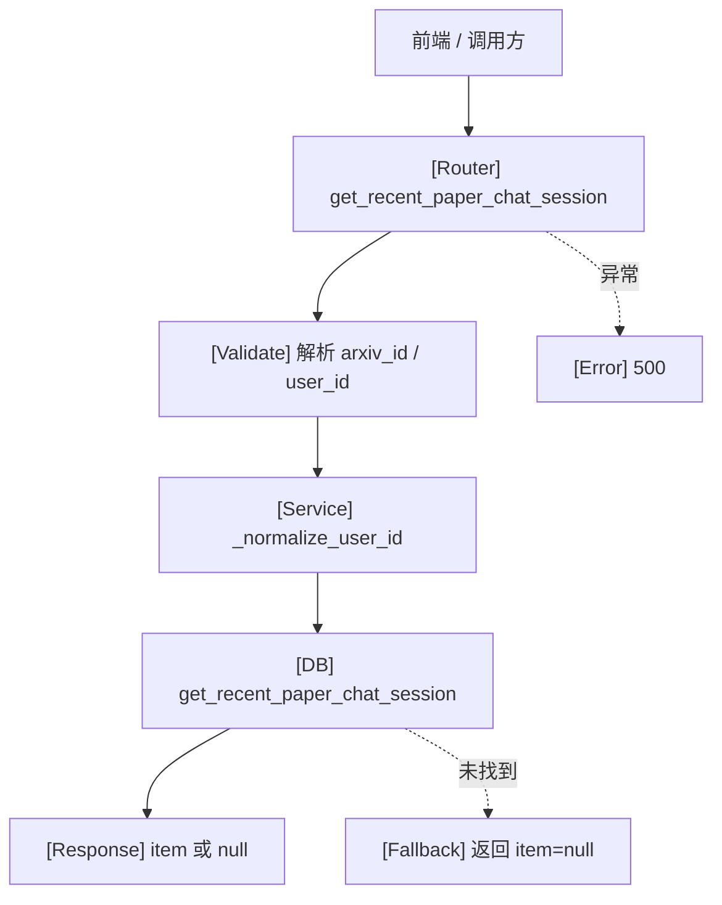
```mermaid
flowchart TD
    A["前端 / 调用方"] --> B["[Router] get_recent_paper_chat_session"]
    B --> C["[Validate] 解析 arxiv_id / user_id"]
    C --> D["[Service] _normalize_user_id"]
    D --> E["[DB] get_recent_paper_chat_session"]
    E --> F["[Response] item 或 null"]
    E -. 未找到 .-> G["[Fallback] 返回 item=null"]
    B -. 异常 .-> H["[Error] 500"]
```

### 关键调用链

`get_recent_paper_chat_session() -> _normalize_user_id() -> DatabaseService.get_recent_paper_chat_session() -> _serialize_chat_session()`

### 输入

- Path：
  - `arxiv_id`
- Query：
  - `user_id`

### 输出

- `item`
  - 会话存在时为 `_serialize_chat_session()` 结构
  - 不存在时为 `null`

### 副作用

- 是否读取数据库：是
- 是否写入数据库：否
- 是否读取本地 chunk 文件：否
- 是否访问向量库：否
- 是否调用 LLM：否
- 是否保存用户问题：否
- 是否保存模型回答：否
- 是否保存笔记：否
- 是否生成 debug 信息：否

### 异常 / fallback

- 未找到最近会话时不报错，返回 `item=null`
- 其他异常返回 `500`

## 接口：POST `/paper/{arxiv_id}/chat-sessions`

### 职责

创建新的论文聊天会话。

### 处理流程图

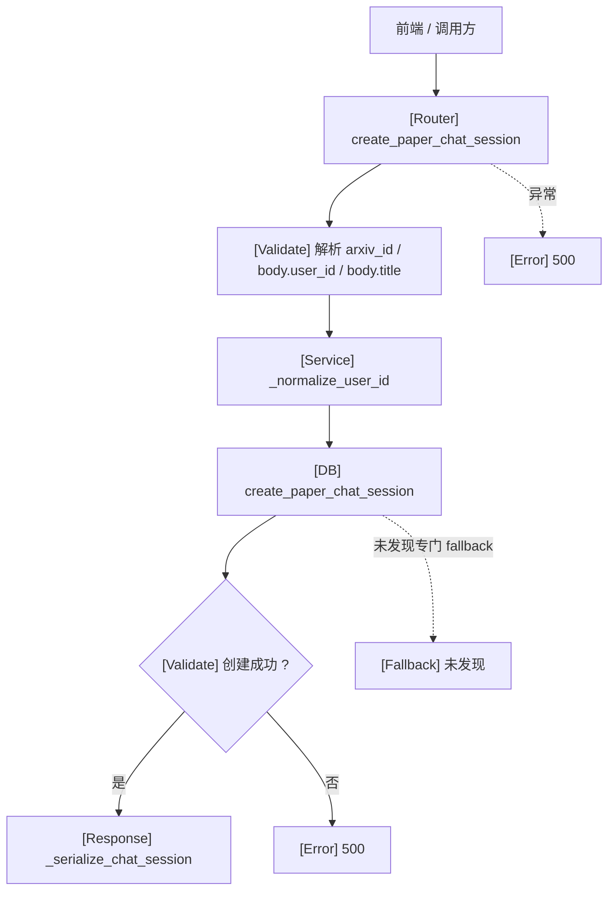
```mermaid
flowchart TD
    A["前端 / 调用方"] --> B["[Router] create_paper_chat_session"]
    B --> C["[Validate] 解析 arxiv_id / body.user_id / body.title"]
    C --> D["[Service] _normalize_user_id"]
    D --> E["[DB] create_paper_chat_session"]
    E --> F{"[Validate] 创建成功 ?"}
    F -->|是| G["[Response] _serialize_chat_session"]
    F -->|否| H["[Error] 500"]
    B -. 异常 .-> I["[Error] 500"]
    E -. 未发现专门 fallback .-> J["[Fallback] 未发现"]
```

### 关键调用链

`create_paper_chat_session() -> _normalize_user_id() -> DatabaseService.create_paper_chat_session() -> _serialize_chat_session()`

### 输入

- Path：
  - `arxiv_id`
- Body：
  - `user_id`
  - `title`

### 输出

- `item`
  - `session_id`
  - `user_id`
  - `arxiv_id`
  - `title`
  - `created_at`
  - `updated_at`
  - `message_count`
  - `status`

### 副作用

- 是否读取数据库：是，创建后会回读
- 是否写入数据库：是
- 是否读取本地 chunk 文件：否
- 是否访问向量库：否
- 是否调用 LLM：否
- 是否保存用户问题：否
- 是否保存模型回答：否
- 是否保存笔记：否
- 是否生成 debug 信息：否

### 异常 / fallback

- 创建失败时返回 `500`
- 未发现明确 fallback

## 接口：GET `/paper/{arxiv_id}/chat-sessions/{session_id}`

### 职责

获取指定论文下某个聊天会话的详情，并校验会话归属。

### 处理流程图

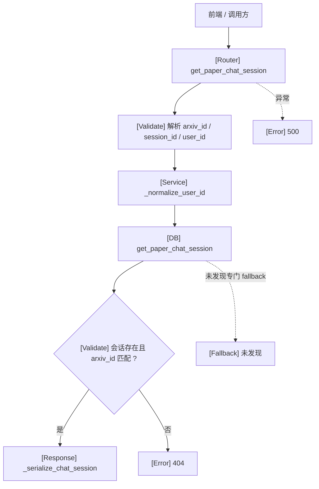
```mermaid
flowchart TD
    A["前端 / 调用方"] --> B["[Router] get_paper_chat_session"]
    B --> C["[Validate] 解析 arxiv_id / session_id / user_id"]
    C --> D["[Service] _normalize_user_id"]
    D --> E["[DB] get_paper_chat_session"]
    E --> F{"[Validate] 会话存在且 arxiv_id 匹配 ?"}
    F -->|是| G["[Response] _serialize_chat_session"]
    F -->|否| H["[Error] 404"]
    B -. 异常 .-> I["[Error] 500"]
    E -. 未发现专门 fallback .-> J["[Fallback] 未发现"]
```

### 关键调用链

`get_paper_chat_session() -> _normalize_user_id() -> DatabaseService.get_paper_chat_session() -> _serialize_chat_session()`

### 输入

- Path：
  - `arxiv_id`
  - `session_id`
- Query：
  - `user_id`

### 输出

- `item`
  - `session_id`
  - `user_id`
  - `arxiv_id`
  - `title`
  - `created_at`
  - `updated_at`
  - `message_count`
  - `status`

### 副作用

- 是否读取数据库：是
- 是否写入数据库：否
- 是否读取本地 chunk 文件：否
- 是否访问向量库：否
- 是否调用 LLM：否
- 是否保存用户问题：否
- 是否保存模型回答：否
- 是否保存笔记：否
- 是否生成 debug 信息：否

### 异常 / fallback

- 会话不存在或不属于当前论文时返回 `404`
- 其他异常返回 `500`
- 未发现明确 fallback

## 接口：GET `/paper/{arxiv_id}/chat-sessions/{session_id}/messages`

### 职责

获取指定会话下的全部消息，并返回会话概要。

### 处理流程图

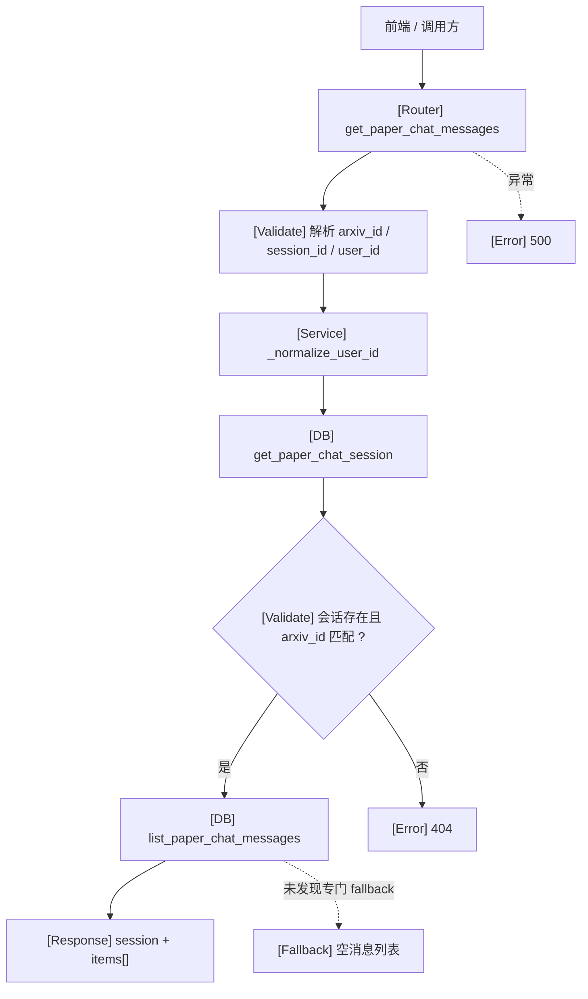
```mermaid
flowchart TD
    A["前端 / 调用方"] --> B["[Router] get_paper_chat_messages"]
    B --> C["[Validate] 解析 arxiv_id / session_id / user_id"]
    C --> D["[Service] _normalize_user_id"]
    D --> E["[DB] get_paper_chat_session"]
    E --> F{"[Validate] 会话存在且 arxiv_id 匹配 ?"}
    F -->|是| G["[DB] list_paper_chat_messages"]
    G --> H["[Response] session + items[]"]
    F -->|否| I["[Error] 404"]
    B -. 异常 .-> J["[Error] 500"]
    G -. 未发现专门 fallback .-> K["[Fallback] 空消息列表"]
```

### 关键调用链

`get_paper_chat_messages() -> DatabaseService.get_paper_chat_session() -> DatabaseService.list_paper_chat_messages() -> _serialize_chat_session()/_serialize_chat_message()`

### 输入

- Path：
  - `arxiv_id`
  - `session_id`
- Query：
  - `user_id`

### 输出

- `session`
- `items[]`
  - `message_id`
  - `turn_id`
  - `session_id`
  - `role`
  - `content`
  - `sources`
  - `retrieval_debug_snapshot`
  - `contextualized_question`
  - `question_contextualization`
  - `status`
  - `created_at`

### 副作用

- 是否读取数据库：是
- 是否写入数据库：否
- 是否读取本地 chunk 文件：否
- 是否访问向量库：否
- 是否调用 LLM：否
- 是否保存用户问题：否
- 是否保存模型回答：否
- 是否保存笔记：否
- 是否生成 debug 信息：是，返回已存档的 `retrieval_debug_snapshot`

### 异常 / fallback

- 会话不存在或归属不匹配时返回 `404`
- 其他异常返回 `500`
- 未发现明确 fallback

## 接口：POST `/paper/{arxiv_id}/chat-sessions/{session_id}/clear`

### 职责

清空会话中的消息，但保留会话记录本身。

### 处理流程图

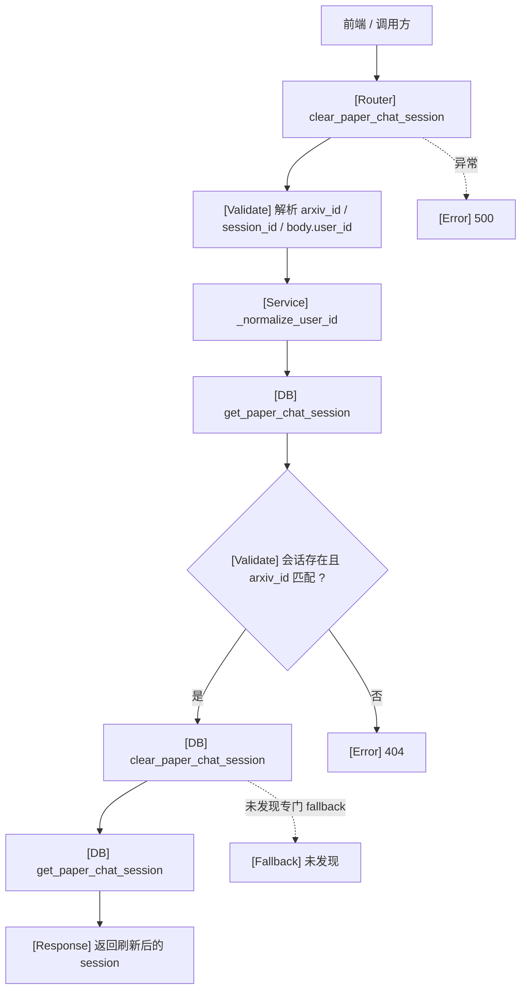
```mermaid
flowchart TD
    A["前端 / 调用方"] --> B["[Router] clear_paper_chat_session"]
    B --> C["[Validate] 解析 arxiv_id / session_id / body.user_id"]
    C --> D["[Service] _normalize_user_id"]
    D --> E["[DB] get_paper_chat_session"]
    E --> F{"[Validate] 会话存在且 arxiv_id 匹配 ?"}
    F -->|是| G["[DB] clear_paper_chat_session"]
    G --> H["[DB] get_paper_chat_session"]
    H --> I["[Response] 返回刷新后的 session"]
    F -->|否| J["[Error] 404"]
    B -. 异常 .-> K["[Error] 500"]
    G -. 未发现专门 fallback .-> L["[Fallback] 未发现"]
```

### 关键调用链

`clear_paper_chat_session() -> DatabaseService.get_paper_chat_session() -> DatabaseService.clear_paper_chat_session() -> DatabaseService.get_paper_chat_session()`

### 输入

- Path：
  - `arxiv_id`
  - `session_id`
- Body：
  - `user_id`

### 输出

- `item`
  - 清空后的会话信息

### 副作用

- 是否读取数据库：是
- 是否写入数据库：是，会删除 `paper_chat_messages`
- 是否读取本地 chunk 文件：否
- 是否访问向量库：否
- 是否调用 LLM：否
- 是否保存用户问题：否
- 是否保存模型回答：否
- 是否保存笔记：否
- 是否生成 debug 信息：否

### 异常 / fallback

- 会话不存在或归属不匹配时返回 `404`
- 其他异常返回 `500`
- 未发现明确 fallback

## 接口：DELETE `/paper/{arxiv_id}/chat-sessions/{session_id}`

### 职责

删除整个论文聊天会话。

### 处理流程图

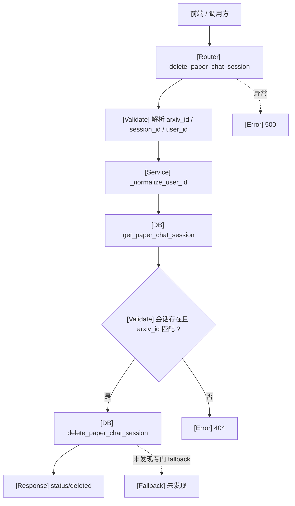
```mermaid
flowchart TD
    A["前端 / 调用方"] --> B["[Router] delete_paper_chat_session"]
    B --> C["[Validate] 解析 arxiv_id / session_id / user_id"]
    C --> D["[Service] _normalize_user_id"]
    D --> E["[DB] get_paper_chat_session"]
    E --> F{"[Validate] 会话存在且 arxiv_id 匹配 ?"}
    F -->|是| G["[DB] delete_paper_chat_session"]
    G --> H["[Response] status/deleted"]
    F -->|否| I["[Error] 404"]
    B -. 异常 .-> J["[Error] 500"]
    G -. 未发现专门 fallback .-> K["[Fallback] 未发现"]
```

### 关键调用链

`delete_paper_chat_session() -> DatabaseService.get_paper_chat_session() -> DatabaseService.delete_paper_chat_session()`

### 输入

- Path：
  - `arxiv_id`
  - `session_id`
- Query：
  - `user_id`

### 输出

- `status`
- `deleted`

### 副作用

- 是否读取数据库：是
- 是否写入数据库：是，会删除会话及其消息
- 是否读取本地 chunk 文件：否
- 是否访问向量库：否
- 是否调用 LLM：否
- 是否保存用户问题：否
- 是否保存模型回答：否
- 是否保存笔记：否
- 是否生成 debug 信息：否

### 异常 / fallback

- 会话不存在或归属不匹配时返回 `404`
- 其他异常返回 `500`
- 未发现明确 fallback

## 接口：GET `/paper/{arxiv_id}/notes`

### 职责

列出指定论文下的笔记，可按 `note_type` 过滤；序列化时会尽量补齐关联消息来源信息。

### 处理流程图

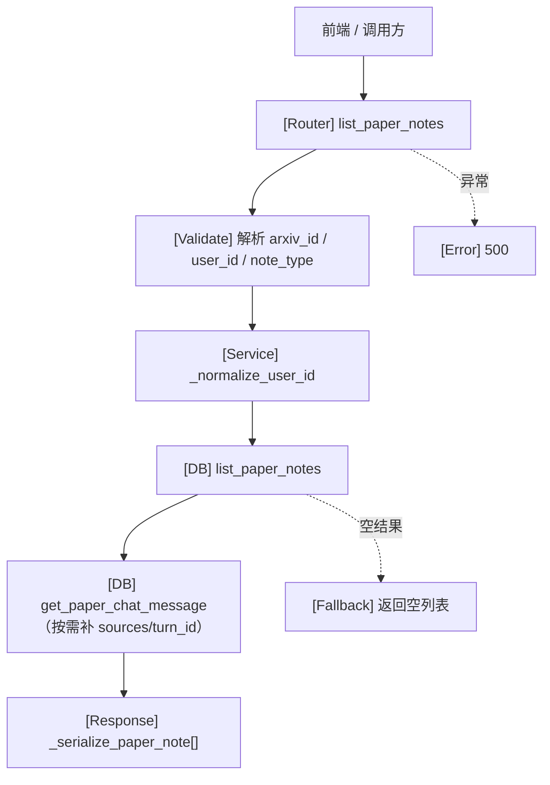
```mermaid
flowchart TD
    A["前端 / 调用方"] --> B["[Router] list_paper_notes"]
    B --> C["[Validate] 解析 arxiv_id / user_id / note_type"]
    C --> D["[Service] _normalize_user_id"]
    D --> E["[DB] list_paper_notes"]
    E --> F["[DB] get_paper_chat_message（按需补 sources/turn_id）"]
    F --> G["[Response] _serialize_paper_note[]"]
    E -. 空结果 .-> H["[Fallback] 返回空列表"]
    B -. 异常 .-> I["[Error] 500"]
```

### 关键调用链

`list_paper_notes() -> DatabaseService.list_paper_notes() -> _serialize_paper_note() -> DatabaseService.get_paper_chat_message()`

### 输入

- Path：
  - `arxiv_id`
- Query：
  - `user_id`
  - `note_type`

### 输出

- `items[]`
  - `note_id`
  - `user_id`
  - `arxiv_id`
  - `session_id`
  - `source_message_id`
  - `source_turn_id`
  - `title`
  - `content`
  - `note_type`
  - `source_chunk_ids`
  - `tags`
  - `include_in_profile`
  - `created_at`
  - `updated_at`
  - `sources`

### 副作用

- 是否读取数据库：是
- 是否写入数据库：否
- 是否读取本地 chunk 文件：否
- 是否访问向量库：否
- 是否调用 LLM：否
- 是否保存用户问题：否
- 是否保存模型回答：否
- 是否保存笔记：否
- 是否生成 debug 信息：否

### 异常 / fallback

- 空结果时直接返回空列表
- 其他异常返回 `500`

## 接口：POST `/paper/{arxiv_id}/notes`

### 职责

创建论文笔记；如果只给了 `session_id + source_turn_id`，会先回查 assistant 消息补齐 `source_message_id`；如果 `include_in_profile=true`，还会同步更新用户研究画像。

### 处理流程图

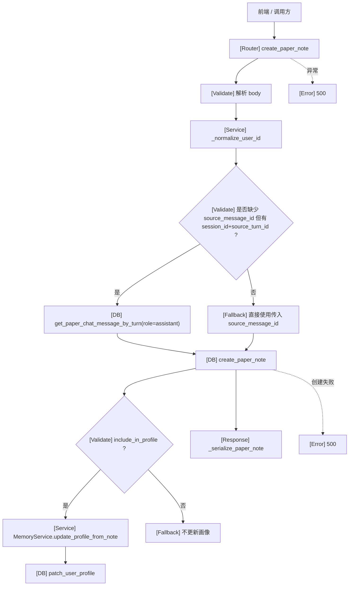
```mermaid
flowchart TD
    A["前端 / 调用方"] --> B["[Router] create_paper_note"]
    B --> C["[Validate] 解析 body"]
    C --> D["[Service] _normalize_user_id"]
    D --> E{"[Validate] 是否缺少 source_message_id 但有 session_id+source_turn_id ?"}
    E -->|是| F["[DB] get_paper_chat_message_by_turn(role=assistant)"]
    E -->|否| G["[Fallback] 直接使用传入 source_message_id"]
    F --> H["[DB] create_paper_note"]
    G --> H
    H --> I{"[Validate] include_in_profile ?"}
    I -->|是| J["[Service] MemoryService.update_profile_from_note"]
    I -->|否| K["[Fallback] 不更新画像"]
    J --> L["[DB] patch_user_profile"]
    H --> M["[Response] _serialize_paper_note"]
    H -. 创建失败 .-> N["[Error] 500"]
    B -. 异常 .-> O["[Error] 500"]
```

### 关键调用链

`create_paper_note() -> DatabaseService.get_paper_chat_message_by_turn() -> DatabaseService.create_paper_note() -> MemoryService.update_profile_from_note() -> DatabaseService.patch_user_research_profile()`

### 输入

- Path：
  - `arxiv_id`
- Body：
  - `user_id`
  - `session_id`
  - `source_message_id`
  - `source_turn_id`
  - `title`
  - `content`
  - `note_type`
  - `source_chunk_ids`
  - `tags`
  - `include_in_profile`

### 输出

- `item`
  - `note_id`
  - `user_id`
  - `arxiv_id`
  - `session_id`
  - `source_message_id`
  - `source_turn_id`
  - `title`
  - `content`
  - `note_type`
  - `source_chunk_ids`
  - `tags`
  - `include_in_profile`
  - `created_at`
  - `updated_at`
  - `sources`

### 副作用

- 是否读取数据库：是
- 是否写入数据库：是
- 是否读取本地 chunk 文件：否
- 是否访问向量库：否
- 是否调用 LLM：否
- 是否保存用户问题：否
- 是否保存模型回答：否
- 是否保存笔记：是
- 是否生成 debug 信息：否

### 异常 / fallback

- `source_message_id` 缺失时，会回退到 `session_id + source_turn_id` 查找 assistant 消息
- `include_in_profile=false` 时，不更新用户画像
- 创建失败时返回 `500`
- 其他异常返回 `500`

## 接口：PATCH `/paper/{arxiv_id}/notes/{note_id}`

### 职责

局部更新论文笔记；如果更新后的笔记仍被标记为 `include_in_profile`，则重新同步用户画像。

### 处理流程图

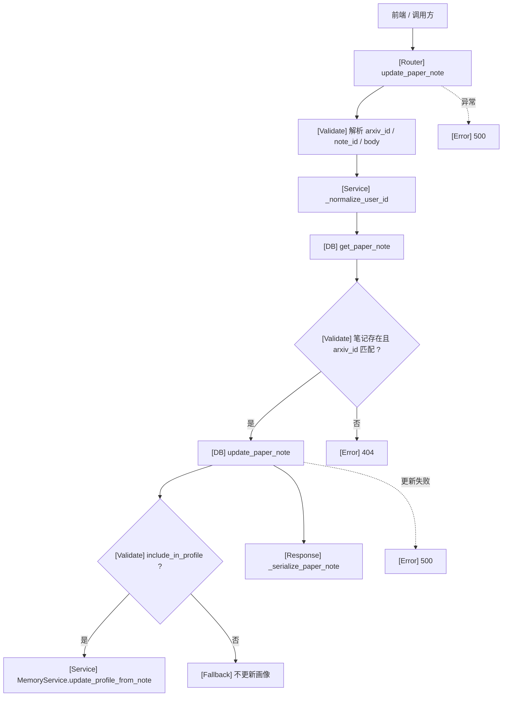
```mermaid
flowchart TD
    A["前端 / 调用方"] --> B["[Router] update_paper_note"]
    B --> C["[Validate] 解析 arxiv_id / note_id / body"]
    C --> D["[Service] _normalize_user_id"]
    D --> E["[DB] get_paper_note"]
    E --> F{"[Validate] 笔记存在且 arxiv_id 匹配 ?"}
    F -->|是| G["[DB] update_paper_note"]
    G --> H{"[Validate] include_in_profile ?"}
    H -->|是| I["[Service] MemoryService.update_profile_from_note"]
    H -->|否| J["[Fallback] 不更新画像"]
    G --> K["[Response] _serialize_paper_note"]
    F -->|否| L["[Error] 404"]
    G -. 更新失败 .-> M["[Error] 500"]
    B -. 异常 .-> N["[Error] 500"]
```

### 关键调用链

`update_paper_note() -> DatabaseService.get_paper_note() -> DatabaseService.update_paper_note() -> MemoryService.update_profile_from_note()`

### 输入

- Path：
  - `arxiv_id`
  - `note_id`
- Body：
  - `user_id`
  - `title`
  - `content`
  - `note_type`
  - `source_chunk_ids`
  - `tags`
  - `include_in_profile`

### 输出

- `item`
  - 更新后的笔记结构，同 `POST /notes`

### 副作用

- 是否读取数据库：是
- 是否写入数据库：是
- 是否读取本地 chunk 文件：否
- 是否访问向量库：否
- 是否调用 LLM：否
- 是否保存用户问题：否
- 是否保存模型回答：否
- 是否保存笔记：是
- 是否生成 debug 信息：否

### 异常 / fallback

- 笔记不存在或不属于当前论文时返回 `404`
- 更新失败时返回 `500`
- `include_in_profile` 不为真时跳过画像更新

## 接口：DELETE `/paper/{arxiv_id}/notes/{note_id}`

### 职责

删除指定论文笔记。

### 处理流程图

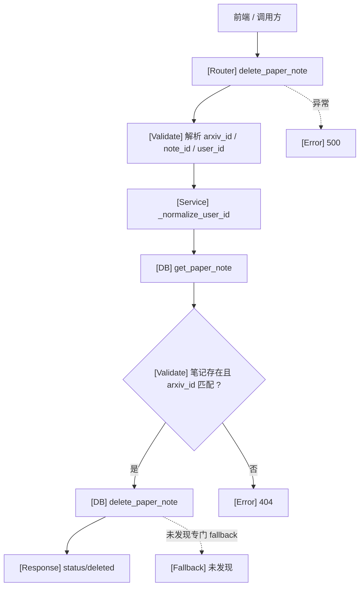
```mermaid
flowchart TD
    A["前端 / 调用方"] --> B["[Router] delete_paper_note"]
    B --> C["[Validate] 解析 arxiv_id / note_id / user_id"]
    C --> D["[Service] _normalize_user_id"]
    D --> E["[DB] get_paper_note"]
    E --> F{"[Validate] 笔记存在且 arxiv_id 匹配 ?"}
    F -->|是| G["[DB] delete_paper_note"]
    G --> H["[Response] status/deleted"]
    F -->|否| I["[Error] 404"]
    B -. 异常 .-> J["[Error] 500"]
    G -. 未发现专门 fallback .-> K["[Fallback] 未发现"]
```

### 关键调用链

`delete_paper_note() -> DatabaseService.get_paper_note() -> DatabaseService.delete_paper_note()`

### 输入

- Path：
  - `arxiv_id`
  - `note_id`
- Query：
  - `user_id`

### 输出

- `status`
- `deleted`

### 副作用

- 是否读取数据库：是
- 是否写入数据库：是
- 是否读取本地 chunk 文件：否
- 是否访问向量库：否
- 是否调用 LLM：否
- 是否保存用户问题：否
- 是否保存模型回答：否
- 是否保存笔记：是，删除属于笔记写操作
- 是否生成 debug 信息：否

### 异常 / fallback

- 笔记不存在或不属于当前论文时返回 `404`
- 其他异常返回 `500`
- 未发现明确 fallback

## 接口：GET `/paper/{arxiv_id}/notes/export`

### 职责

把某篇论文下当前用户的全部笔记导出为 Markdown 下载流。

### 处理流程图

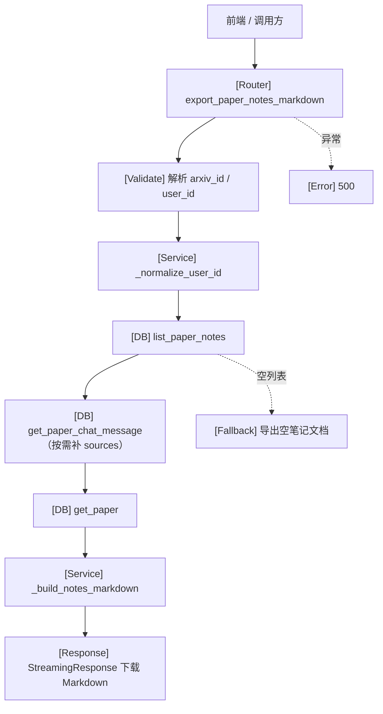
```mermaid
flowchart TD
    A["前端 / 调用方"] --> B["[Router] export_paper_notes_markdown"]
    B --> C["[Validate] 解析 arxiv_id / user_id"]
    C --> D["[Service] _normalize_user_id"]
    D --> E["[DB] list_paper_notes"]
    E --> F["[DB] get_paper_chat_message（按需补 sources）"]
    F --> G["[DB] get_paper"]
    G --> H["[Service] _build_notes_markdown"]
    H --> I["[Response] StreamingResponse 下载 Markdown"]
    E -. 空列表 .-> J["[Fallback] 导出空笔记文档"]
    B -. 异常 .-> K["[Error] 500"]
```

### 关键调用链

`export_paper_notes_markdown() -> DatabaseService.list_paper_notes() -> _serialize_paper_note() -> DatabaseService.get_paper() -> _build_notes_markdown()`

### 输入

- Path：
  - `arxiv_id`
- Query：
  - `user_id`

### 输出

- Markdown 附件流
- `Content-Disposition: attachment; filename="{arxiv_id}_notes.md"`

### 副作用

- 是否读取数据库：是
- 是否写入数据库：否
- 是否读取本地 chunk 文件：否
- 是否访问向量库：否
- 是否调用 LLM：否
- 是否保存用户问题：否
- 是否保存模型回答：否
- 是否保存笔记：否
- 是否生成 debug 信息：否

### 异常 / fallback

- 无笔记时仍可导出空文档
- 其他异常返回 `500`

## 接口：POST `/paper/{arxiv_id}/qa`

### 职责

执行一次非流式论文问答，内部会处理会话解析、短期记忆上下文化、增强检索、最终回答生成、sources 组装，以及问答消息持久化。

### 处理流程图

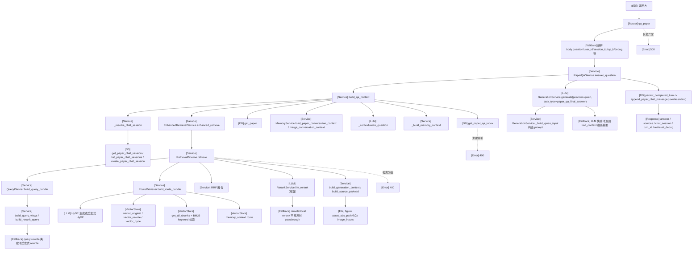
```mermaid
flowchart TD
    A["前端 / 调用方"] --> B["[Router] qa_paper"]
    B --> C["[Validate] 解析 body.question/user_id/session_id/top_k/debug 等"]
    C --> D["[Service] PaperQAService.answer_question"]
    D --> E["[Service] build_qa_context"]
    E --> E1["[DB] get_paper_qa_index"]
    E --> E2["[Service] _resolve_chat_session"]
    E2 --> E3["[DB] get_paper_chat_session / list_paper_chat_sessions / create_paper_chat_session"]
    E --> E4["[DB] get_paper"]
    E --> E5["[Service] MemoryService.load_paper_conversation_context / merge_conversation_context"]
    E --> E6["[LLM] _contextualize_question"]
    E --> E7["[Service] _build_memory_context"]
    E --> F0["[Facade] EnhancedRetrievalService.enhanced_retrieve"]
    F0 --> F["[Service] RetrievalPipeline.retrieve"]
    F --> F1["[Service] QueryPlanner.build_query_bundle"]
    F1 --> F2["[Service] build_query_views / build_rerank_query"]
    F2 --> F3["[Fallback] query rewrite 失败时启发式 rewrite"]
    F --> F4["[Service] RouteRetriever.build_route_bundle"]
    F4 --> F5["[LLM] HyDE 生成或启发式 HyDE"]
    F4 --> F6["[VectorStore] vector_original / vector_rewrite / vector_hyde"]
    F4 --> F7["[VectorStore] get_all_chunks + BM25 keyword 检索"]
    F4 --> F8["[VectorStore] memory_context route"]
    F --> F9["[Service] RRF 融合"]
    F --> F10["[LLM] RerankService.llm_rerank（可选）"]
    F10 --> F11["[Fallback] remote/local rerank 不可用时 passthrough"]
    F --> G["[Service] build_generation_context / build_source_payload"]
    G --> G1["[File] figure asset_abs_path 作为 image_inputs"]
    D --> H["[LLM] GenerationService.generate(provider=qwen, task_type=paper_qa_final_answer)"]
    H --> H1["[Service] GenerationService._build_qwen_input 构造 prompt"]
    H --> H2["[Fallback] LLM 失败时返回 text_context 截断摘要"]
    D --> I["[DB] persist_completed_turn -> append_paper_chat_message(user/assistant)"]
    I --> J["[Response] answer / sources / chat_session / turn_id / retrieval_debug"]
    E1 -. 未建索引 .-> K["[Error] 400"]
    F -. 检索为空 .-> L["[Error] 400"]
    B -. 其他异常 .-> M["[Error] 500"]
```

### 关键调用链

主调用链：

`qa_paper() -> PaperQAService.answer_question() -> PaperQAService.build_qa_context() -> EnhancedRetrievalService.enhanced_retrieve() -> RetrievalPipeline.retrieve() -> QueryPlanner.build_query_bundle() -> RouteRetriever.build_route_bundle() -> RerankService.llm_rerank() -> ContextPackBuilder.build() -> AnswerGenerator.generate() -> GenerationService.generate() -> PaperQAService.persist_completed_turn() -> DatabaseService.append_paper_chat_message()`

会话与上下文化链路：

`PaperQAService.build_qa_context() -> _resolve_chat_session() -> DatabaseService.get_paper_chat_session()/list_paper_chat_sessions()/create_paper_chat_session()`

`PaperQAService.build_qa_context() -> MemoryService.load_paper_conversation_context() -> MemoryService.merge_conversation_context() -> PaperQAService._contextualize_question()`

检索链路：

`EnhancedRetrievalService.enhanced_retrieve() -> RetrievalPipeline.retrieve()`，其中 `EnhancedRetrievalService` 只承担依赖装配和对外兼容入口职责。

`RetrievalPipeline.retrieve() -> QueryPlanner.build_query_bundle() -> QueryPlanner.build_query_views()`

`RetrievalPipeline.retrieve() -> RouteRetriever.build_route_bundle() -> RouteRetriever.vector_retrieve() -> VectorStoreService.search_similar_vectors()`

`RetrievalPipeline.retrieve() -> RouteRetriever.build_route_bundle() -> RouteRetriever.keyword_retrieve() -> VectorStoreService.get_all_chunks()`

`RetrievalPipeline.retrieve() -> RouteRetriever.build_route_bundle() -> RouteRetriever.memory_retrieve() -> VectorStoreService.get_all_chunks()`

### 输入

- Path：
  - `arxiv_id`
- Body：
  - `question`
  - `user_id`
  - `session_id`
  - `top_k`
  - `enable_query_rewrite`
  - `enable_hyde`
  - `enable_keyword_search`
  - `enable_llm_rerank`
  - `debug`
  - `conversation_context`

### 输出

- `status`
- `arxiv_id`
- `question`
- `session_id`
- `chat_session`
- `turn_id`
- `original_question`
- `contextualized_question`
- `used_short_term_memory`
- `question_contextualization`
- `answer`
- `sources`
- `image_inputs`
- `asset_metadata`
- `retrieval_debug`

### 副作用

- 是否读取数据库：是
- 是否写入数据库：是，可能创建会话并保存 user/assistant 消息
- 是否读取本地 chunk 文件：未发现直接读取本地 chunk 文件
- 是否访问向量库：是
- 是否调用 LLM：是
- 是否保存用户问题：是
- 是否保存模型回答：是
- 是否保存笔记：否
- 是否生成 debug 信息：是

### 异常 / fallback

- `Paper does not have QA index` 时返回 `400`
- 检索结果为空时返回 `400`
- `session_id` 无效、会话解析失败时，会 fallback 为无状态 QA
- 会话上下文加载/合并失败时，会 fallback 为单轮 QA
- 问题上下文化失败时：
  - 若像追问，则 fallback 到基于最近 turn 的启发式上下文化
  - 否则 fallback 为原问题
- memory context 构建失败时，会关闭 memory-aware retrieval
- query rewrite 失败时，会回退到启发式 rewrite
- HyDE 失败时，会回退到启发式 HyDE 文本
- LLM rerank 不可用时，会 passthrough 候选结果
- 最终回答生成失败时，会回退到 `text_context[:1000]` 截断摘要
- 消息持久化失败时，不中断返回，只是不写会话消息

### QA 主接口特别说明

- 接收用户问题：已实现
- 校验 `paper_id / session_id / question`：
  - `arxiv_id` 与 `session_id` 归属会被检查
  - `question` 仅做 `strip()`，未发现“非空字符串”强校验
- 加载论文 metadata：已实现，`DatabaseService.get_paper()`；未找到时会退化为 `{}`，未发现强校验
- 加载 chunk / index：
  - 已加载 QA 索引元数据
  - 实际上下文来自向量库检索结果
  - 未发现问答时直接读取本地 chunk 文件
- 问题类型识别：已实现，`QueryPlanner.build_intent_profile()`
- query rewrite：已实现
- HyDE：已实现
- keyword expansion：
  - 已发现关键词提取、`keyword_query` 构造、`selected_keywords`
  - 未发现名为 “keyword expansion” 的独立 service
- vector retrieval：已实现
- keyword retrieval：已实现
- RRF fusion：已实现，入口为 `ResultFusionService.fuse_routes()`，debug 中标记为 `pure_rrf`
- rerank：已实现，可选 LLM rerank
- context packing：已实现，`ContextPackBuilder.build()`
- prompt 构造：已实现，`GenerationService._build_qwen_input()` / `generate()` 中 context 拼接
- LLM generation：已实现
- sources 组装：已实现，`build_source_payload()`
- 保存用户消息：已实现
- 保存 assistant 回答：已实现
- 返回 `answer / sources / debug info`：已实现

## 接口：POST `/paper/{arxiv_id}/qa/stream`

### 职责

执行流式论文问答。与非流式 QA 共用上下文构建与检索链路，但回答以 SSE 形式逐段推送，最后在 `completed` 事件后持久化消息。

### 处理流程图

```mermaid
flowchart TD
    A["前端 / 调用方"] --> B["[Router] qa_paper_stream"]
    B --> C["[Validate] 解析 question 等 body 参数"]
    C --> D["[Service] PaperQAService.build_qa_context"]
    D --> E["[Service] build_source_payload"]
    E --> F["[Response] SSE meta 事件"]
    F --> G["[LLM] GenerationService.stream_qwen_responses"]
    G --> H["[Response] SSE delta 事件"]
    G --> I{"[Validate] 是否收到 completed ?"}
    I -->|是| J["[DB] persist_completed_turn"]
    J --> K["[Response] SSE done 事件"]
    I -->|否| L["[Fallback] 发送空 answer 的 done 事件"]
    G -. 异常 .-> M["[Error] SSE error 事件"]
    D -. 未建索引/检索为空 .-> N["[Error] 路由层抛错为 500 或上游 400"]
```

### 关键调用链

`qa_paper_stream() -> PaperQAService.build_qa_context() -> EnhancedRetrievalService.enhanced_retrieve() -> RetrievalPipeline.retrieve() -> PaperQAService.build_source_payload() -> GenerationService.stream_qwen_responses() -> PaperQAService.persist_completed_turn()`

### 输入

- Path：
  - `arxiv_id`
- Body：
  - `question`
  - `user_id`
  - `session_id`
  - `top_k`
  - `enable_query_rewrite`
  - `enable_hyde`
  - `enable_keyword_search`
  - `enable_llm_rerank`
  - `debug`
  - `conversation_context`

### 输出

- SSE `meta` 事件：
  - `status`
  - `arxiv_id`
  - `question`
  - `session_id`
  - `chat_session`
  - `original_question`
  - `contextualized_question`
  - `used_short_term_memory`
  - `question_contextualization`
  - `sources`
  - `image_inputs`
  - `asset_metadata`
  - `retrieval_debug`
- SSE `delta` 事件：
  - `delta`
- SSE `done` 事件：
  - `status`
  - `answer`
  - `session_id`
  - `chat_session`
  - `turn_id`
  - `original_question`
  - `contextualized_question`
  - `used_short_term_memory`
  - `question_contextualization`
  - `sources`
  - `image_inputs`
  - `asset_metadata`
  - `retrieval_debug`
  - `usage`
- SSE `error` 事件：
  - `status`
  - `detail`

### 副作用

- 是否读取数据库：是
- 是否写入数据库：是，在 `completed` 时保存 user/assistant 消息
- 是否读取本地 chunk 文件：未发现直接读取本地 chunk 文件
- 是否访问向量库：是
- 是否调用 LLM：是
- 是否保存用户问题：是
- 是否保存模型回答：是
- 是否保存笔记：否
- 是否生成 debug 信息：是，`meta/done` 中返回 `retrieval_debug`

### 异常 / fallback

- 与 `POST /qa` 共用的大部分上游异常相同
- 流式生成过程中如果没有显式 `completed` 事件，会 fallback 发送一个空 answer 的 `done` 事件
- SSE 场景下异常不会直接中断为 HTTP 错误，而是包装成 `error` 事件
- `persist_completed_turn()` 失败时，不阻断 `done` 事件返回

## 5. 设计观察

1. `qa_router.py` 的职责整体上比较清晰。会话、笔记、QA、诊断、trace 下载都归属于“单篇论文 QA 入口”这一大类，聚合方式是合理的。
2. Router 本身业务逻辑不算重，但也不是完全零逻辑。比较明显的逻辑包括：
   - `qa-trace/latest` 的文件安全校验
   - `notes` 的来源消息补齐
   - `qa/stream` 的 SSE 事件编排
   - 多个 serializer 的响应结构整理
3. QA 主流程并不只是简单转发到 `PaperQAService`。`POST /qa` 基本是转发，但 `POST /qa/stream` 明显承担了流式事件编排和最终持久化时机控制。
4. QA 主流程更像固定 workflow，而不是 agentic 流程。当前代码是比较标准的 RAG pipeline：
   - 会话解析
   - 问题上下文化
   - query planning
   - 多路召回
   - RRF 融合
   - rerank
   - context packing
   - generation
   - 持久化
   未发现“自主规划多步工具调用”的 agentic 执行形态。
5. 异常处理整体比普通 CRUD 接口更完整，尤其是 QA 主链路里有大量 fallback；但仍有一些缺口：
   - `question` 未发现严格的非空校验
   - `get_paper()` 未命中时，主 QA 流程仍继续，只是 `paper_context` 退化为空
   - `qa/stream` 在进入 `event_stream()` 之前如果 `build_qa_context()` 抛错，会直接走 HTTP 异常而不是 SSE `error`
6. 副作用在 QA 主流程里并不完全显性。单看 router 很容易低估以下行为：
   - 可能自动创建 chat session
   - 会持久化 user/assistant 两条消息
   - 会把 `retrieval_debug` 存进 assistant message
   - 流式与非流式都可能把图像资产路径传给多模态 LLM
7. 对后续 agent / RAG 重构的影响：
   - 现有 `PaperQAService` 已经把 QA 主流程沉到底层，适合作为后续拆分的核心编排层
   - 检索 workflow 已收敛到 `RetrievalPipeline`，后续若要拆成更细的 retrieval graph，应优先迁移 pipeline 与组件协作，而不是扩展 `EnhancedRetrievalService` 私有方法
   - 会话、笔记、trace、debug 都已经和 QA 主链路耦合，后续重构时需要特别注意“副作用保持一致”，否则前端会话恢复、笔记溯源和调试体验容易回退

## 6. 检查结论

- 文档文件已生成到 `docs/architecture/routers/qa_router_flow.md`
- `qa_router.py` 中全部 20 个接口已覆盖
- 每个接口都包含单独 Mermaid 流程图
- 使用的文件名、函数名、类名均来自真实代码
- 未确认或未实现的步骤已标注为“未发现”或在对应说明中明确说明
