# `user_router.py` 接口处理流程

本文仅分析当前仓库中的 `backend/routers/user_router.py` 及其实际调用到的用户、偏好、推荐、记忆相关实现，不覆盖其他 router。

## 1. Router 基本信息

- Router 文件路径：`backend/routers/user_router.py`
- Router prefix：`/user`
- Router tags：`["user"]`
- 主要职责：负责用户偏好读取、论文 like / dislike、通用 paper action、研究画像读写、兴趣向量生成与读取、个性化推荐生成。
- 主要依赖的 service / class / function：
  - `RecommendationService`
  - `MemoryService`
  - `DatabaseService`
  - `dependencies.get_recommendation_service()`
  - `dependencies.get_memory_service()`
  - `dependencies.get_database_service()`
- 是否访问数据库：是
- 是否写入用户偏好：是
- 是否读取用户喜欢的论文：是
- 是否计算推荐：是
- 是否调用 embedding：是
- 是否访问向量库：是
- 是否访问 `MemoryService`：是
- 是否有缓存或推荐结果表：未发现单独的推荐结果缓存表或推荐结果持久化表；发现 `user_interest_vectors` 表用于保存用户兴趣向量

### 依赖边界说明

- `user_router.py` 本身较薄，主要做参数接收、少量状态码转换、再转发到 service。
- 用户偏好与行为落库：
  - `DatabaseService` 负责 `user_liked_papers`、`user_disliked_papers`、`user_paper_actions`、`user_research_profiles`、`user_interest_vectors` 等表的读写。
- 研究画像：
  - `MemoryService` 负责研究画像 patch / upsert 语义，以及从偏好、行为、笔记等信号更新长期画像。
- 推荐计算：
  - `RecommendationService` 负责兴趣向量生成、候选召回、候选物化、个性化打分、多样性选择。
- embedding / vector store：
  - `RecommendationService` 通过 `EmbeddingService` 生成论文 embedding 或候选临时 embedding；
  - 通过 `VectorStoreService` 读取已存论文向量、插入论文 embedding、执行基于兴趣向量或兴趣簇的相似检索。
- 用户实体：
  - 未发现独立 `users` 表或“创建用户”流程。当前系统更像以 `user_id` 作为逻辑主键，直接写偏好/画像/行为表。

## 2. 接口总览表

| 方法 | 路径 | 函数名 | 主要职责 | 主要调用 | 副作用 |
|---|---|---|---|---|---|
| POST | `/user/preferences` | `legacy_post_user_preferences` | Deprecated 兼容读取入口 | `DatabaseService.get_user_preferences()` | 读数据库；不会 upsert；正式读取走 GET |
| GET | `/user/preferences/{user_id}` | `get_user_preferences` | 按 path 获取用户偏好 | `DatabaseService.get_user_preferences()` | 读数据库 |
| POST | `/user/like-paper` | `like_paper` | 记录喜欢论文 | `RecommendationService.record_user_paper_preference()` | 写 liked/disliked 强偏好表和 profile event，必要时物化论文并写向量库 |
| POST | `/user/dislike-paper` | `dislike_paper` | 记录不喜欢论文 | `RecommendationService.record_user_paper_preference()` | 写 disliked/liked 强偏好表和 profile event，必要时物化论文并写向量库 |
| POST | `/user/paper-action` | `record_paper_action` | 记录弱论文行为 | `RecommendationService.record_user_paper_action()` | 仅写弱行为 action；拒绝 like/dislike；必要时物化论文并写 profile event |
| DELETE | `/user/paper-action` | `remove_paper_action` | 删除一条弱论文行为 | `DatabaseService.remove_user_paper_action()` | 删除 action，并停用对应 profile event |
| GET | `/user/paper-actions/{user_id}` | `get_user_paper_actions` | 获取用户行为明细与 action_map | `DatabaseService.get_user_paper_actions()`、`DatabaseService.get_user_paper_action_map()` | 读数据库 |
| GET | `/user/research-profile/{user_id}` | `get_user_research_profile` | 获取研究画像 | `MemoryService.load_user_profile()` | 读数据库 |
| PUT | `/user/research-profile` | `upsert_user_research_profile` | 以整体更新语义写研究画像 | `MemoryService.patch_user_profile(source="manual_upsert")` | 写研究画像 |
| PATCH | `/user/research-profile` | `patch_user_research_profile` | 以局部 patch 语义写研究画像 | `MemoryService.patch_user_profile(source="manual")` | 写研究画像 |
| DELETE | `/user/like-paper` | `remove_like` | 取消喜欢 | `DatabaseService.remove_liked_paper()` | 删除 liked 记录，并停用 liked profile event |
| DELETE | `/user/dislike-paper` | `remove_dislike` | 取消不喜欢 | `DatabaseService.remove_disliked_paper()` | 删除 disliked 记录，并停用 disliked profile event |
| POST | `/user/generate-interest-vector` | `generate_user_interest_vector` | 生成或重建用户兴趣向量 | `RecommendationService.generate_user_interest_vector()` | 读 liked/disliked，读写向量库，调用 embedding，写 `user_interest_vectors` |
| GET | `/user/interest-vector` | `get_user_interest_vector` | 获取已保存兴趣向量 | `DatabaseService.get_user_interest_vector()` | 读数据库 |
| POST | `/user/recommend-papers` | `recommend_papers` | 生成个性化推荐 | `RecommendationService.recommend_papers()` | 读偏好/画像/兴趣向量/OAI 数据/向量库，可能补 embedding/补论文记录；未发现保存推荐结果 |

### 显式偏好与弱行为边界

- `like-paper` / `dislike-paper` 是显式强偏好的唯一写入口，权威状态来自 `user_liked_papers` / `user_disliked_papers`。
- `paper-action` 只记录弱行为，例如 `favorite`、`read`、`later`、`archived`、`note_saved`、`not_interested`；`like`、`liked`、`dislike`、`disliked` 以及等价点赞/点踩表达会被拒绝。
- 推荐服务读取强偏好时直接读取 liked/disliked 表，读取弱行为时才读取 `user_paper_actions`，避免同一偏好在两张表里重复表达。
- 撤销强偏好或删除弱行为时会停用对应 profile event，并写入低权重删除事件触发画像重建，避免旧事件继续作为画像证据。

## 3. Router 总览流程图

```mermaid
flowchart TD
    U["前端 / 调用方"] --> R["[Router] user_router.py"]

    R --> P1["[Service] DatabaseService.get_user_preferences"]
    P1 --> DB1["[DB] user_liked_papers / user_disliked_papers / user_paper_actions / user_research_profiles"]

    R --> A1["[Recommendation] RecommendationService.record_user_paper_preference"]
    A1 --> MAT1["[Service] CandidateMaterializer._ensure_paper_materialized"]
    MAT1 --> DB2["[DB] arxiv_papers"]
    MAT1 --> EMB1["[Embedding] create_single_embedding"]
    MAT1 --> VS1["[VectorStore] insert_single_embedding / get_paper_embeddings_by_arxiv_ids"]
    A1 --> DB3["[DB] add_liked_paper / add_disliked_paper / record_user_profile_event"]

    R --> A2["[Recommendation] RecommendationService.record_user_paper_action"]
    A2 --> MAT2["[Service] _ensure_paper_materialized"]
    A2 --> DB5["[DB] record_user_paper_action / record_user_profile_event / remove_user_paper_action"]

    R --> P2["[Service] MemoryService.load_user_profile / patch_user_profile"]
    P2 --> DB6["[DB] user_research_profiles"]

    R --> IV1["[Recommendation] generate_user_interest_vector"]
    IV1 --> DB7["[DB] get_liked_papers / get_disliked_papers / save_user_interest_vector"]
    IV1 --> VS2["[VectorStore] get_paper_embeddings_by_arxiv_ids"]
    IV1 --> EMB2["[Embedding] fallback 生成论文向量"]
    IV1 --> CLU["[Service] HDBSCAN interest clustering"]

    R --> IV2["[DB] get_user_interest_vector"]
    IV2 --> DB8["[DB] user_interest_vectors"]

    R --> REC["[Recommendation] recommend_papers"]
    REC --> DB9["[DB] get_user_preferences / get_liked_papers_with_details / get_user_research_profile / get_user_interest_vector"]
    REC --> OAI["[Service] OAI recent papers / arXiv backfill"]
    REC --> VS3["[VectorStore] search_similar_papers / get_paper_embeddings_by_arxiv_ids"]
    REC --> EMB3["[Embedding] 候选物化或候选临时向量"]
    REC --> MEM3["[Memory] 读取研究画像信号"]
    REC --> DB10["[DB] 可能补写 arxiv_papers / user_interest_vectors"]
    REC --> RT["[Response] recommendations"]

    R --> NF["[Fallback] 未发现推荐结果缓存表 / 未发现独立 users 表"]
```

## 4. 每个接口单独流程图

## 接口：POST `/user/preferences`（deprecated）

### 职责

这是短期兼容旧调用方的只读入口，已经明确标记 deprecated。它只按 `user_id` 读取用户偏好聚合结果，不创建、不更新、也不 upsert 偏好；新前端和新测试应使用 `GET /user/preferences/{user_id}`。

### 处理流程图

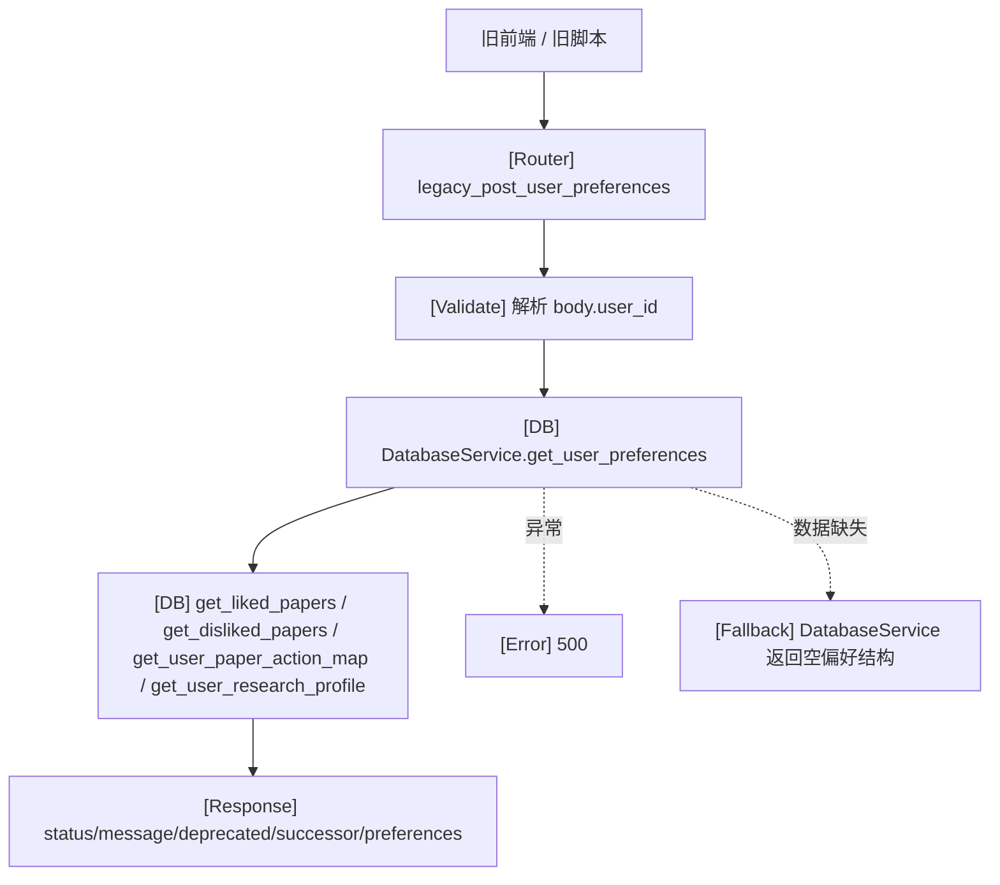
```mermaid
flowchart TD
    A["旧前端 / 旧脚本"] --> B["[Router] legacy_post_user_preferences"]
    B --> C["[Validate] 解析 body.user_id"]
    C --> D["[DB] DatabaseService.get_user_preferences"]
    D --> E["[DB] get_liked_papers / get_disliked_papers / get_user_paper_action_map / get_user_research_profile"]
    E --> F["[Response] status/message/deprecated/successor/preferences"]
    D -. 异常 .-> G["[Error] 500"]
    D -. 数据缺失 .-> H["[Fallback] DatabaseService 返回空偏好结构"]
```

### 关键调用链

`legacy_post_user_preferences() -> DatabaseService.get_user_preferences() -> get_liked_papers()/get_disliked_papers()/get_user_paper_action_map()/get_user_research_profile()`

### 输入

- Body：
  - `user_id`

### 输出

- `status`
- `message`
- `deprecated`
- `successor`
- `preferences`
  - `user_id`
  - `liked_papers`
  - `disliked_papers`
  - `paper_actions`
  - `research_profile`

### 副作用

- 是否创建用户：否，未发现
- 是否更新用户信息：否
- 是否写入 like / dislike / collect：否
- 是否更新用户兴趣画像：否
- 是否更新 memory：否
- 是否实时计算推荐：否
- 是否读取缓存推荐：否
- 是否调用 embedding：否
- 是否访问 vector store：否
- 是否写数据库：否

### 异常 / fallback

- router 捕获异常并返回 `500`
- `DatabaseService.get_user_preferences()` 内部失败时会返回空偏好结构

## 接口：GET `/user/preferences/{user_id}`

### 职责

按 path 参数读取用户偏好聚合结果。

### 处理流程图

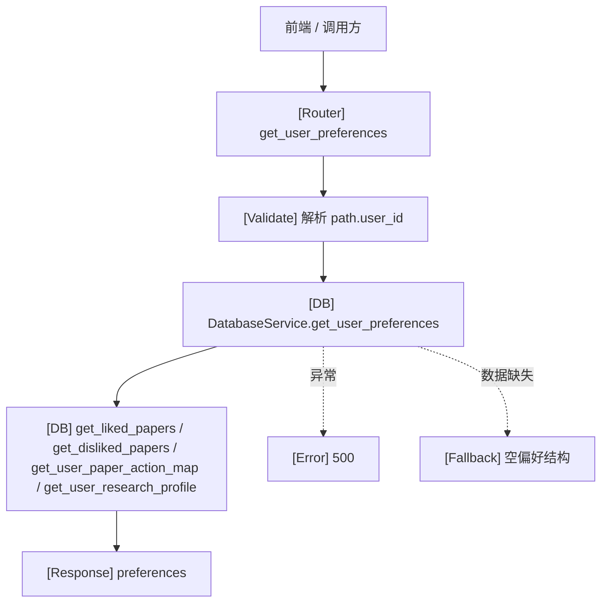
```mermaid
flowchart TD
    A["前端 / 调用方"] --> B["[Router] get_user_preferences"]
    B --> C["[Validate] 解析 path.user_id"]
    C --> D["[DB] DatabaseService.get_user_preferences"]
    D --> E["[DB] get_liked_papers / get_disliked_papers / get_user_paper_action_map / get_user_research_profile"]
    E --> F["[Response] preferences"]
    D -. 异常 .-> G["[Error] 500"]
    D -. 数据缺失 .-> H["[Fallback] 空偏好结构"]
```

### 关键调用链

`get_user_preferences() -> DatabaseService.get_user_preferences()`

### 输入

- Path：
  - `user_id`

### 输出

- `user_id`
- `liked_papers`
- `disliked_papers`
- `paper_actions`
- `research_profile`

### 副作用

- 是否创建用户：否
- 是否更新用户信息：否
- 是否写入 like / dislike / collect：否
- 是否更新用户兴趣画像：否
- 是否更新 memory：否
- 是否实时计算推荐：否
- 是否读取缓存推荐：否
- 是否调用 embedding：否
- 是否访问 vector store：否
- 是否写数据库：否

### 异常 / fallback

- router 捕获异常并返回 `500`
- service 内部失败时返回空偏好结构

## 接口：POST `/user/like-paper`

### 职责

记录“喜欢论文”的显式正反馈；必要时先把论文物化到本地论文表和向量库。喜欢状态只以 `user_liked_papers` 为权威来源，不再写入通用 `user_paper_actions`。

### 处理流程图

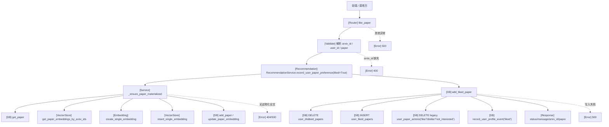
```mermaid
flowchart TD
    A["前端 / 调用方"] --> B["[Router] like_paper"]
    B --> C["[Validate] 解析 arxiv_id / user_id / paper"]
    C --> D["[Recommendation] RecommendationService.record_user_paper_preference(liked=True)"]
    D --> E["[Service] _ensure_paper_materialized"]
    E --> E1["[DB] get_paper"]
    E --> E2["[VectorStore] get_paper_embeddings_by_arxiv_ids"]
    E --> E3["[Embedding] create_single_embedding"]
    E --> E4["[VectorStore] insert_single_embedding"]
    E --> E5["[DB] add_paper / update_paper_embedding"]
    D --> F["[DB] add_liked_paper"]
    F --> F1["[DB] DELETE user_disliked_papers"]
    F --> F2["[DB] INSERT user_liked_papers"]
    F --> F3["[DB] DELETE legacy user_paper_actions('like'/'dislike'/'not_interested')"]
    F --> F4["[DB] record_user_profile_event('liked')"]
    F --> I["[Response] status/message/arxiv_id/paper"]
    C -. arxiv_id 缺失 .-> J["[Error] 400"]
    E -. 无法物化论文 .-> K["[Error] 404/500"]
    F -. 写入失败 .-> L["[Error] 500"]
    B -. 其他异常 .-> N["[Error] 500"]
```

### 关键调用链

`like_paper() -> RecommendationService.record_user_paper_preference() -> CandidateMaterializer._ensure_paper_materialized() -> DatabaseService.add_liked_paper() -> DatabaseService.record_user_profile_event('liked')`

### 输入

- Body：
  - `arxiv_id`
  - `user_id`
  - `paper`

### 输出

- `status`
- `message`
- `arxiv_id`
- `paper`

### 副作用

- 是否创建用户：否，未发现独立用户创建
- 是否更新用户信息：是，写入画像事件，等待画像重建消费
- 是否写入 like / dislike / collect：是，写 liked 强偏好表，并删除冲突 disliked 强偏好
- 是否更新用户兴趣画像：是，通过 `liked` profile event 参与后续重建
- 是否更新 memory：否，不同步直接改画像；只写 profile event
- 是否实时计算推荐：否
- 是否读取缓存推荐：否
- 是否调用 embedding：可能会调用
- 是否访问 vector store：可能会访问
- 是否写数据库：是

### 异常 / fallback

- `arxiv_id` 缺失时返回 `400`
- 论文元数据缺失且无法物化时返回 `404`
- like 写入失败时返回 `500`
- 画像生成不在同步点击链路中执行，避免点赞请求被慢速画像构建阻塞

## 接口：POST `/user/dislike-paper`

### 职责

记录“不喜欢论文”的显式负反馈；必要时先物化论文。不喜欢状态只以 `user_disliked_papers` 为权威来源，不再写入通用 `user_paper_actions`。

### 处理流程图

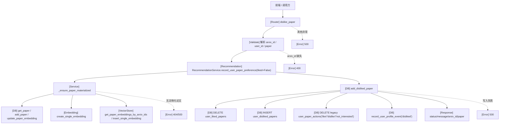
```mermaid
flowchart TD
    A["前端 / 调用方"] --> B["[Router] dislike_paper"]
    B --> C["[Validate] 解析 arxiv_id / user_id / paper"]
    C --> D["[Recommendation] RecommendationService.record_user_paper_preference(liked=False)"]
    D --> E["[Service] _ensure_paper_materialized"]
    E --> E1["[DB] get_paper / add_paper / update_paper_embedding"]
    E --> E2["[Embedding] create_single_embedding"]
    E --> E3["[VectorStore] get_paper_embeddings_by_arxiv_ids / insert_single_embedding"]
    D --> F["[DB] add_disliked_paper"]
    F --> F1["[DB] DELETE user_liked_papers"]
    F --> F2["[DB] INSERT user_disliked_papers"]
    F --> F3["[DB] DELETE legacy user_paper_actions('like'/'dislike'/'not_interested')"]
    F --> F4["[DB] record_user_profile_event('disliked')"]
    F --> I["[Response] status/message/arxiv_id/paper"]
    C -. arxiv_id 缺失 .-> J["[Error] 400"]
    E -. 无法物化论文 .-> K["[Error] 404/500"]
    F -. 写入失败 .-> L["[Error] 500"]
    B -. 其他异常 .-> N["[Error] 500"]
```

### 关键调用链

`dislike_paper() -> RecommendationService.record_user_paper_preference() -> CandidateMaterializer._ensure_paper_materialized() -> DatabaseService.add_disliked_paper() -> DatabaseService.record_user_profile_event('disliked')`

### 输入

- Body：
  - `arxiv_id`
  - `user_id`
  - `paper`

### 输出

- `status`
- `message`
- `arxiv_id`
- `paper`

### 副作用

- 是否创建用户：否
- 是否更新用户信息：是，写入画像事件，等待画像重建消费
- 是否写入 like / dislike / collect：是，写 disliked 强偏好表，并删除冲突 liked 强偏好
- 是否更新用户兴趣画像：是，通过 `disliked` profile event 参与后续重建
- 是否更新 memory：否，不同步直接改画像；只写 profile event
- 是否实时计算推荐：否
- 是否读取缓存推荐：否
- 是否调用 embedding：可能会调用
- 是否访问 vector store：可能会访问
- 是否写数据库：是

### 异常 / fallback

- `arxiv_id` 缺失时返回 `400`
- 无法物化论文时返回 `404`
- dislike 写入失败时返回 `500`
- 画像生成不在同步点击链路中执行，避免点踩请求被慢速画像构建阻塞

## 接口：POST `/user/paper-action`

### 职责

记录弱论文行为，如 `favorite`、`read`、`later`、`archived`、`note_saved`、`not_interested` 等。`like/dislike` 及其等价表达不属于 paper-action，必须使用专用强偏好接口。

### 处理流程图

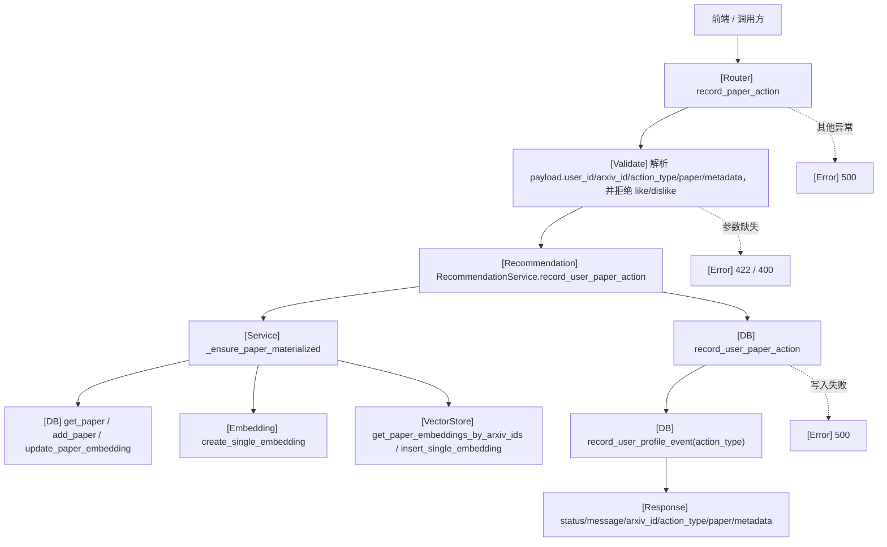
```mermaid
flowchart TD
    A["前端 / 调用方"] --> B["[Router] record_paper_action"]
    B --> C["[Validate] 解析 payload.user_id/arxiv_id/action_type/paper/metadata，并拒绝 like/dislike"]
    C --> D["[Recommendation] RecommendationService.record_user_paper_action"]
    D --> E["[Service] _ensure_paper_materialized"]
    E --> E1["[DB] get_paper / add_paper / update_paper_embedding"]
    E --> E2["[Embedding] create_single_embedding"]
    E --> E3["[VectorStore] get_paper_embeddings_by_arxiv_ids / insert_single_embedding"]
    D --> F["[DB] record_user_paper_action"]
    F --> G["[DB] record_user_profile_event(action_type)"]
    G --> J["[Response] status/message/arxiv_id/action_type/paper/metadata"]
    C -. 参数缺失 .-> K["[Error] 422 / 400"]
    F -. 写入失败 .-> L["[Error] 500"]
    B -. 其他异常 .-> N["[Error] 500"]
```

### 关键调用链

`record_paper_action() -> PaperActionRequest.validate_action_type() -> RecommendationService.record_user_paper_action() -> CandidateMaterializer._ensure_paper_materialized() -> DatabaseService.record_user_paper_action() -> DatabaseService.record_user_profile_event()`

### 输入

- Body：
  - `user_id`
  - `arxiv_id`
  - `action_type`
  - `paper`
  - `metadata`

### 输出

- `status`
- `message`
- `arxiv_id`
- `action_type`
- `paper`
- `metadata`

### 副作用

- 是否创建用户：否
- 是否更新用户信息：可能，取决于 action 类型
- 是否写入 like / dislike / collect：不会写入 like/dislike；只写弱行为 `action_type`
- 是否更新用户兴趣画像：可能
- 是否更新 memory：否，不同步直接改画像；只写 profile event，后续重建按弱行为低权重消费
- 是否实时计算推荐：否
- 是否读取缓存推荐：否
- 是否调用 embedding：可能会调用
- 是否访问 vector store：可能会访问
- 是否写数据库：是

### 异常 / fallback

- Pydantic 缺字段会返回 `422`
- `action_type` 为 `like`、`liked`、`dislike`、`disliked` 或等价点赞/点踩表达时返回校验错误；应改用 `/user/like-paper` 或 `/user/dislike-paper`
- `arxiv_id` 或 `action_type` 缺失会返回 `400`
- 不支持的弱行为类型会返回校验错误或 `400`
- 部分弱行为仅记录事件，画像聚合器可能不赋予权重

## 接口：DELETE `/user/paper-action`

### 职责

删除一条已记录的弱论文行为。该接口不负责取消喜欢/不喜欢，强偏好撤销必须使用 `DELETE /user/like-paper` 或 `DELETE /user/dislike-paper`。

### 处理流程图

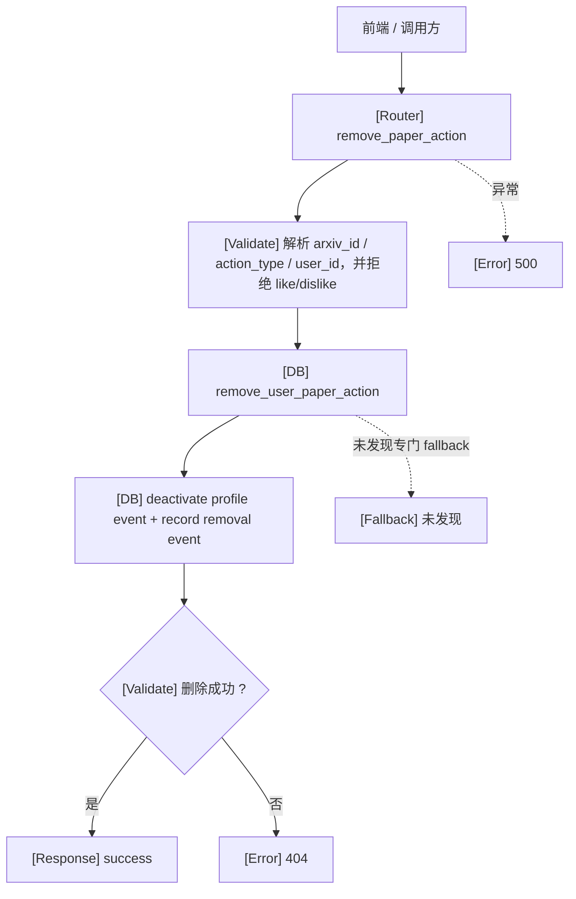
```mermaid
flowchart TD
    A["前端 / 调用方"] --> B["[Router] remove_paper_action"]
    B --> C["[Validate] 解析 arxiv_id / action_type / user_id，并拒绝 like/dislike"]
    C --> D["[DB] remove_user_paper_action"]
    D --> D1["[DB] deactivate profile event + record removal event"]
    D1 --> E{"[Validate] 删除成功 ?"}
    E -->|是| F["[Response] success"]
    E -->|否| G["[Error] 404"]
    B -. 异常 .-> H["[Error] 500"]
    D -. 未发现专门 fallback .-> I["[Fallback] 未发现"]
```

### 关键调用链

`remove_paper_action() -> DatabaseService.remove_user_paper_action()`

### 输入

- Body：
  - `arxiv_id`
  - `action_type`
  - `user_id`

### 输出

- `status`
- `message`

### 副作用

- 是否创建用户：否
- 是否更新用户信息：否
- 是否写入 like / dislike / collect：不会删除 like/dislike；只删除弱行为 action
- 是否更新用户兴趣画像：是，停用对应 profile event，等待画像重建消费
- 是否更新 memory：否，不同步直接改画像
- 是否实时计算推荐：否
- 是否读取缓存推荐：否
- 是否调用 embedding：否
- 是否访问 vector store：否
- 是否写数据库：是

### 异常 / fallback

- 删除不到记录时返回 `404`
- `action_type` 为 `like/dislike` 时返回 `400`，调用方应使用强偏好专用删除接口
- 其他异常返回 `500`
- 未发现明确 fallback

## 接口：GET `/user/paper-actions/{user_id}`

### 职责

查询用户的论文行为明细，并额外返回按 `action_type` 聚合的 `action_map`。

### 处理流程图

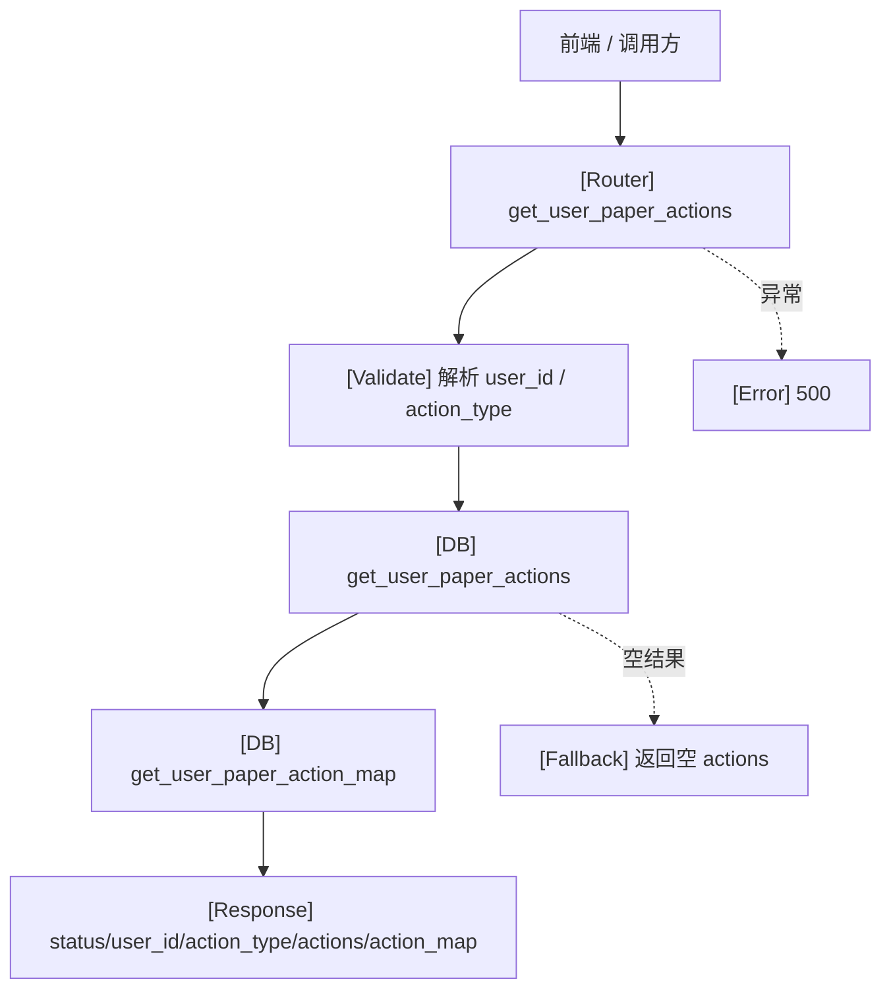
```mermaid
flowchart TD
    A["前端 / 调用方"] --> B["[Router] get_user_paper_actions"]
    B --> C["[Validate] 解析 user_id / action_type"]
    C --> D["[DB] get_user_paper_actions"]
    D --> E["[DB] get_user_paper_action_map"]
    E --> F["[Response] status/user_id/action_type/actions/action_map"]
    D -. 空结果 .-> G["[Fallback] 返回空 actions"]
    B -. 异常 .-> H["[Error] 500"]
```

### 关键调用链

`get_user_paper_actions() -> DatabaseService.get_user_paper_actions() -> DatabaseService.get_user_paper_action_map()`

### 输入

- Path：
  - `user_id`
- Query：
  - `action_type`

### 输出

- `status`
- `user_id`
- `action_type`
- `actions`
- `action_map`

### 副作用

- 是否创建用户：否
- 是否更新用户信息：否
- 是否写入 like / dislike / collect：否
- 是否更新用户兴趣画像：否
- 是否更新 memory：否
- 是否实时计算推荐：否
- 是否读取缓存推荐：否
- 是否调用 embedding：否
- 是否访问 vector store：否
- 是否写数据库：否

### 异常 / fallback

- 空结果时直接返回空列表/空 map
- 其他异常返回 `500`

## 接口：GET `/user/research-profile/{user_id}`

### 职责

读取用户长期研究画像。

### 处理流程图

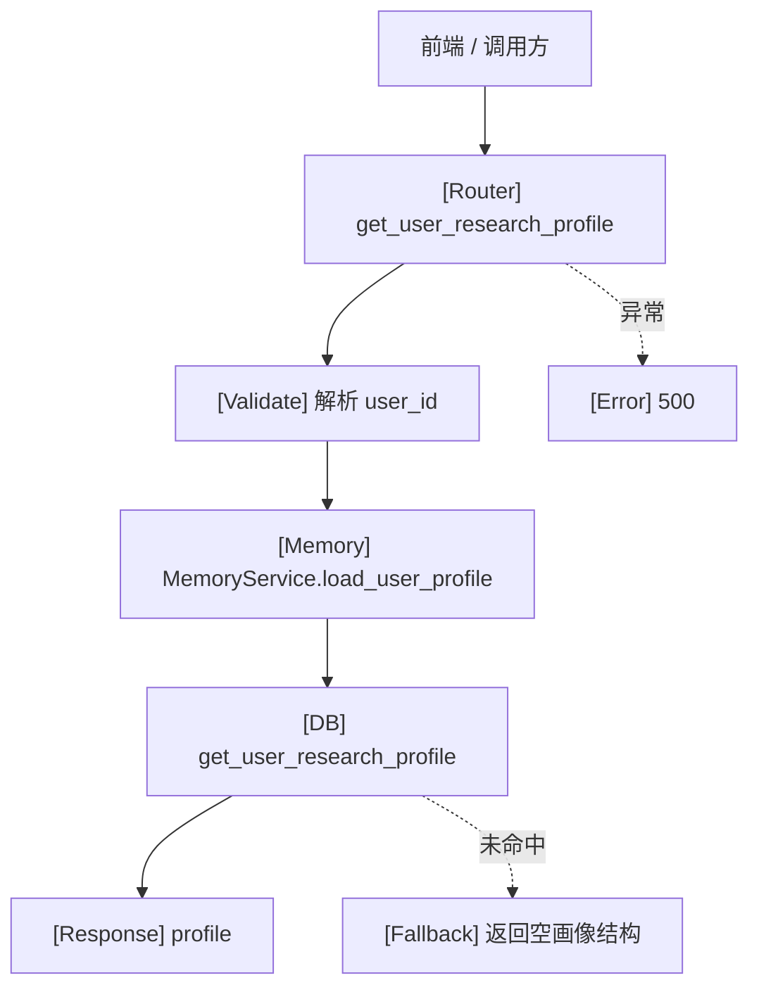
```mermaid
flowchart TD
    A["前端 / 调用方"] --> B["[Router] get_user_research_profile"]
    B --> C["[Validate] 解析 user_id"]
    C --> D["[Memory] MemoryService.load_user_profile"]
    D --> E["[DB] get_user_research_profile"]
    E --> F["[Response] profile"]
    E -. 未命中 .-> G["[Fallback] 返回空画像结构"]
    B -. 异常 .-> H["[Error] 500"]
```

### 关键调用链

`get_user_research_profile() -> MemoryService.load_user_profile() -> DatabaseService.get_user_research_profile()`

### 输入

- Path：
  - `user_id`

### 输出

- `user_id`
- `positive_topics`
- `negative_topics`
- `recent_topics`
- `preferred_categories`
- `preferred_answer_style`
- `common_question_types`
- `representative_papers`
- `created_at`
- `updated_at`

### 副作用

- 是否创建用户：否
- 是否更新用户信息：否
- 是否写入 like / dislike / collect：否
- 是否更新用户兴趣画像：否
- 是否更新 memory：否
- 是否实时计算推荐：否
- 是否读取缓存推荐：否
- 是否调用 embedding：否
- 是否访问 vector store：否
- 是否写数据库：否

### 异常 / fallback

- 画像不存在时返回空画像结构
- 其他异常返回 `500`

## 接口：PUT `/user/research-profile`

### 职责

以“整体更新 / 补全”的语义写入研究画像，未传字段不会被写成 `null`，而是由 `manual_upsert` 语义接管。

### 处理流程图

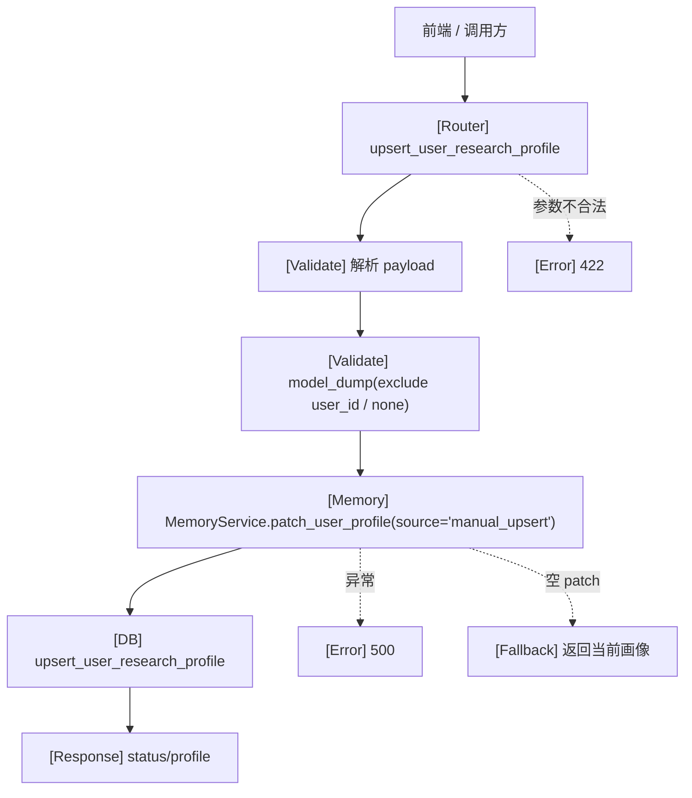
```mermaid
flowchart TD
    A["前端 / 调用方"] --> B["[Router] upsert_user_research_profile"]
    B --> C["[Validate] 解析 payload"]
    C --> D["[Validate] model_dump(exclude user_id / none)"]
    D --> E["[Memory] MemoryService.patch_user_profile(source='manual_upsert')"]
    E --> F["[DB] upsert_user_research_profile"]
    F --> G["[Response] status/profile"]
    B -. 参数不合法 .-> H["[Error] 422"]
    E -. 异常 .-> I["[Error] 500"]
    E -. 空 patch .-> J["[Fallback] 返回当前画像"]
```

### 关键调用链

`upsert_user_research_profile() -> MemoryService.patch_user_profile(source='manual_upsert') -> DatabaseService.upsert_user_research_profile()`

### 输入

- Body：
  - `user_id`
  - `positive_topics`
  - `negative_topics`
  - `recent_topics`
  - `preferred_categories`
  - `preferred_answer_style`
  - `common_question_types`
  - `representative_papers`

### 输出

- `status`
- `profile`

### 副作用

- 是否创建用户：否，未发现独立 users 表
- 是否更新用户信息：是
- 是否写入 like / dislike / collect：否
- 是否更新用户兴趣画像：是，更新研究画像表
- 是否更新 memory：是，通过 `MemoryService`
- 是否实时计算推荐：否
- 是否读取缓存推荐：否
- 是否调用 embedding：否
- 是否访问 vector store：否
- 是否写数据库：是

### 异常 / fallback

- 参数不合法会返回 `422`
- 空 patch 时会回退返回当前画像
- 其他异常返回 `500`

## 接口：PATCH `/user/research-profile`

### 职责

以局部 patch 的语义更新研究画像。

### 处理流程图

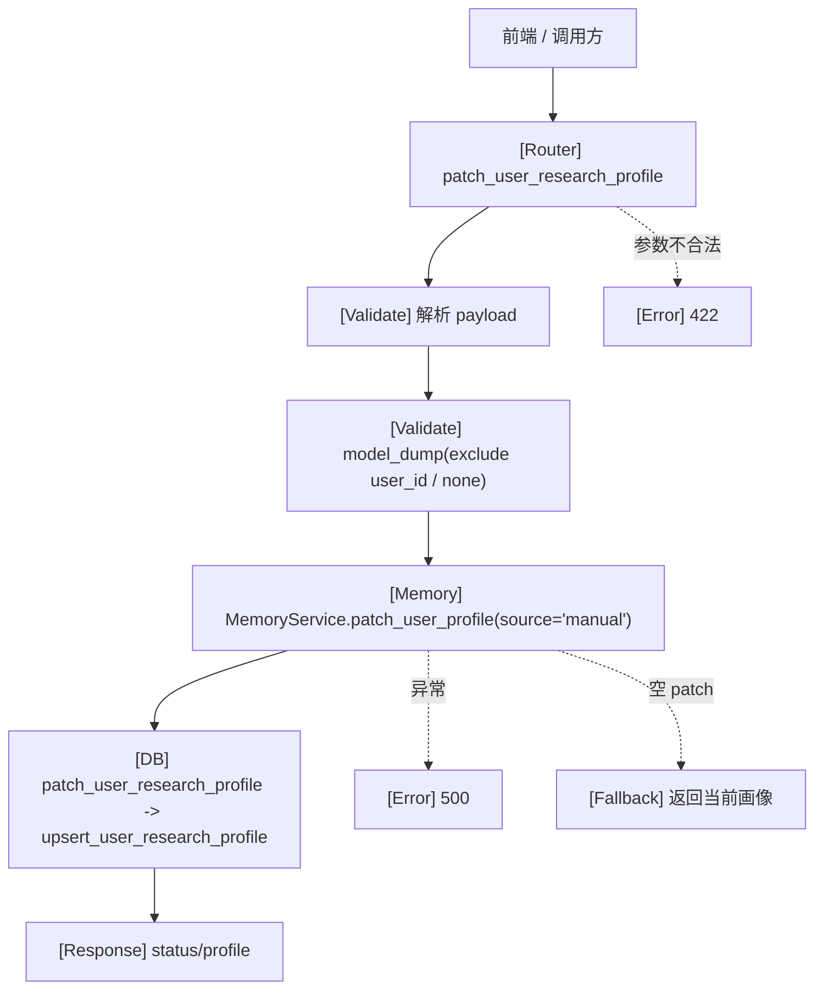
```mermaid
flowchart TD
    A["前端 / 调用方"] --> B["[Router] patch_user_research_profile"]
    B --> C["[Validate] 解析 payload"]
    C --> D["[Validate] model_dump(exclude user_id / none)"]
    D --> E["[Memory] MemoryService.patch_user_profile(source='manual')"]
    E --> F["[DB] patch_user_research_profile -> upsert_user_research_profile"]
    F --> G["[Response] status/profile"]
    B -. 参数不合法 .-> H["[Error] 422"]
    E -. 异常 .-> I["[Error] 500"]
    E -. 空 patch .-> J["[Fallback] 返回当前画像"]
```

### 关键调用链

`patch_user_research_profile() -> MemoryService.patch_user_profile(source='manual') -> DatabaseService.patch_user_research_profile() -> DatabaseService.upsert_user_research_profile()`

### 输入

- Body：
  - `user_id`
  - `positive_topics`
  - `negative_topics`
  - `recent_topics`
  - `preferred_categories`
  - `preferred_answer_style`
  - `common_question_types`
  - `representative_papers`

### 输出

- `status`
- `profile`

### 副作用

- 是否创建用户：否
- 是否更新用户信息：是
- 是否写入 like / dislike / collect：否
- 是否更新用户兴趣画像：是
- 是否更新 memory：是
- 是否实时计算推荐：否
- 是否读取缓存推荐：否
- 是否调用 embedding：否
- 是否访问 vector store：否
- 是否写数据库：是

### 异常 / fallback

- 参数不合法返回 `422`
- 空 patch 时回退到当前画像
- 其他异常返回 `500`

## 接口：DELETE `/user/like-paper`

### 职责

撤销用户对某篇论文的 liked 强偏好记录，并停用对应画像证据；通用 action 表不是点赞状态来源。

### 处理流程图

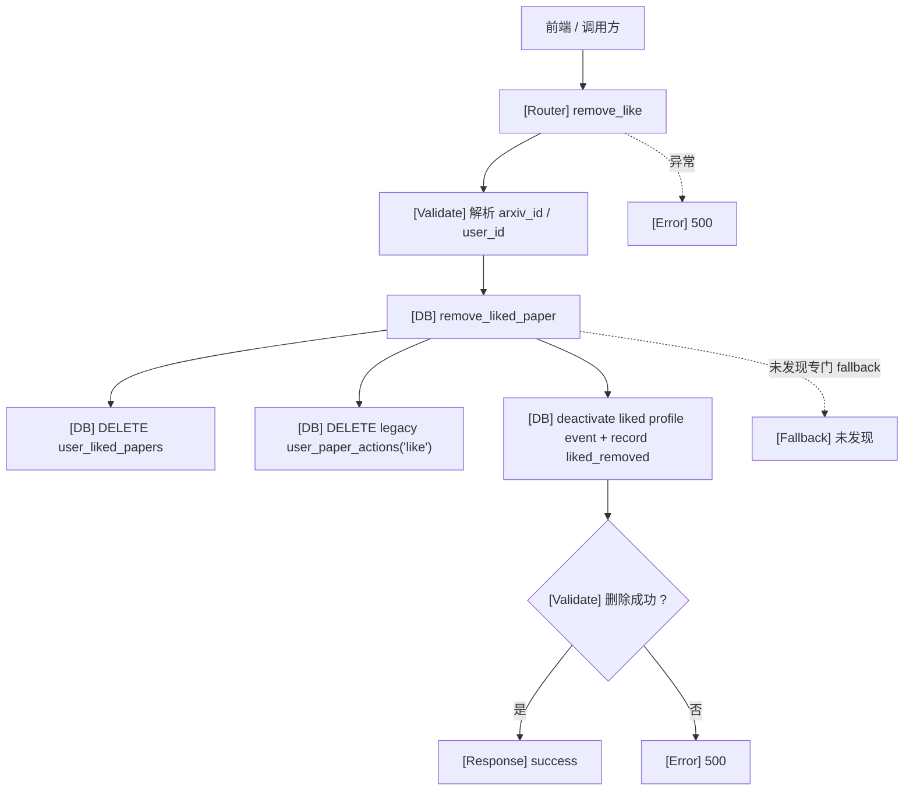
```mermaid
flowchart TD
    A["前端 / 调用方"] --> B["[Router] remove_like"]
    B --> C["[Validate] 解析 arxiv_id / user_id"]
    C --> D["[DB] remove_liked_paper"]
    D --> E["[DB] DELETE user_liked_papers"]
    D --> F["[DB] DELETE legacy user_paper_actions('like')"]
    D --> F1["[DB] deactivate liked profile event + record liked_removed"]
    F1 --> G{"[Validate] 删除成功 ?"}
    G -->|是| H["[Response] success"]
    G -->|否| I["[Error] 500"]
    B -. 异常 .-> J["[Error] 500"]
    D -. 未发现专门 fallback .-> K["[Fallback] 未发现"]
```

### 关键调用链

`remove_like() -> DatabaseService.remove_liked_paper() -> DatabaseService._deactivate_profile_events_for_paper() -> DatabaseService.record_user_profile_event('liked_removed')`

### 输入

- Body：
  - `arxiv_id`
  - `user_id`

### 输出

- `status`
- `message`

### 副作用

- 是否创建用户：否
- 是否更新用户信息：否
- 是否写入 like / dislike / collect：是，删除 liked 强偏好表记录；仅清理历史遗留 `like` action
- 是否更新用户兴趣画像：是，停用 liked profile event，并写入 `liked_removed` 触发后续重建
- 是否更新 memory：否，不同步直接改画像
- 是否实时计算推荐：否
- 是否读取缓存推荐：否
- 是否调用 embedding：否
- 是否访问 vector store：否
- 是否写数据库：是

### 异常 / fallback

- 删除失败时直接返回 `500`
- 未发现专门区分“不存在记录”和“数据库异常”的异常处理

## 接口：DELETE `/user/dislike-paper`

### 职责

撤销用户对某篇论文的 disliked 强偏好记录，并停用对应画像证据；通用 action 表不是点踩状态来源。

### 处理流程图

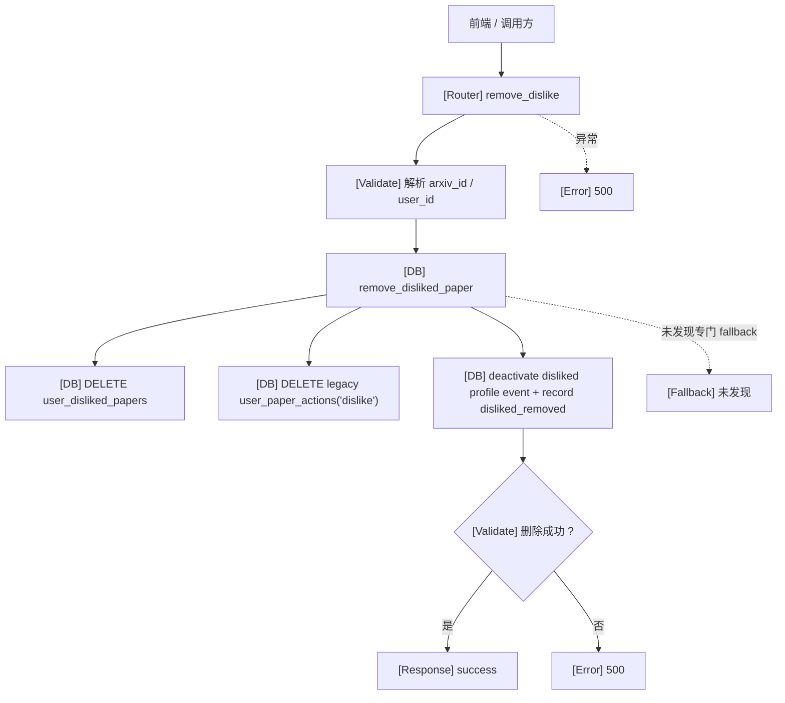
```mermaid
flowchart TD
    A["前端 / 调用方"] --> B["[Router] remove_dislike"]
    B --> C["[Validate] 解析 arxiv_id / user_id"]
    C --> D["[DB] remove_disliked_paper"]
    D --> E["[DB] DELETE user_disliked_papers"]
    D --> F["[DB] DELETE legacy user_paper_actions('dislike')"]
    D --> F1["[DB] deactivate disliked profile event + record disliked_removed"]
    F1 --> G{"[Validate] 删除成功 ?"}
    G -->|是| H["[Response] success"]
    G -->|否| I["[Error] 500"]
    B -. 异常 .-> J["[Error] 500"]
    D -. 未发现专门 fallback .-> K["[Fallback] 未发现"]
```

### 关键调用链

`remove_dislike() -> DatabaseService.remove_disliked_paper() -> DatabaseService._deactivate_profile_events_for_paper() -> DatabaseService.record_user_profile_event('disliked_removed')`

### 输入

- Body：
  - `arxiv_id`
  - `user_id`

### 输出

- `status`
- `message`

### 副作用

- 是否创建用户：否
- 是否更新用户信息：否
- 是否写入 like / dislike / collect：是，删除 disliked 强偏好表记录；仅清理历史遗留 `dislike` action
- 是否更新用户兴趣画像：是，停用 disliked profile event，并写入 `disliked_removed` 触发后续重建
- 是否更新 memory：否，不同步直接改画像
- 是否实时计算推荐：否
- 是否读取缓存推荐：否
- 是否调用 embedding：否
- 是否访问 vector store：否
- 是否写数据库：是

### 异常 / fallback

- 删除失败时返回 `500`
- 未发现明确 fallback

## 接口：POST `/user/generate-interest-vector`

### 职责

根据用户 liked 历史生成主正向兴趣向量，并在 liked 数量足够时尝试进行兴趣簇聚类；disliked 历史只作为独立负向反馈保存到 `user_interest_vectors`。

### 处理流程图

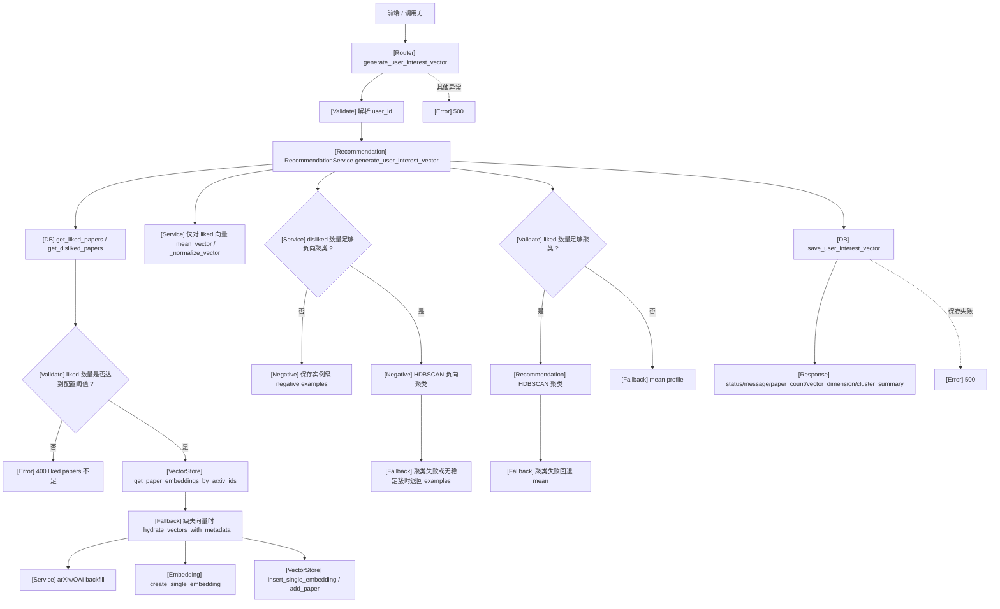
```mermaid
flowchart TD
    A["前端 / 调用方"] --> B["[Router] generate_user_interest_vector"]
    B --> C["[Validate] 解析 user_id"]
    C --> D["[Recommendation] RecommendationService.generate_user_interest_vector"]
    D --> E["[DB] get_liked_papers / get_disliked_papers"]
    E --> F{"[Validate] liked 数量是否达到配置阈值 ?"}
    F -->|否| G["[Error] 400 liked papers 不足"]
    F -->|是| H["[VectorStore] get_paper_embeddings_by_arxiv_ids"]
    H --> I["[Fallback] 缺失向量时 _hydrate_vectors_with_metadata"]
    I --> I1["[Service] arXiv/OAI backfill"]
    I --> I2["[Embedding] create_single_embedding"]
    I --> I3["[VectorStore] insert_single_embedding / add_paper"]
    D --> J["[Service] 仅对 liked 向量 _mean_vector / _normalize_vector"]
    D --> J1{"[Service] disliked 数量足够负向聚类 ?"}
    J1 -->|否| J2["[Negative] 保存实例级 negative examples"]
    J1 -->|是| J3["[Negative] HDBSCAN 负向聚类"]
    J3 --> J4["[Fallback] 聚类失败或无稳定簇时退回 examples"]
    D --> K{"[Validate] liked 数量足够聚类 ?"}
    K -->|是| L["[Recommendation] HDBSCAN 聚类"]
    K -->|否| M["[Fallback] mean profile"]
    L --> N["[Fallback] 聚类失败回退 mean"]
    D --> O["[DB] save_user_interest_vector"]
    O --> P["[Response] status/message/paper_count/vector_dimension/cluster_summary"]
    O -. 保存失败 .-> Q["[Error] 500"]
    B -. 其他异常 .-> R["[Error] 500"]
```

### 关键调用链

`generate_user_interest_vector() -> RecommendationService.generate_user_interest_vector() -> DatabaseService.get_liked_papers()/get_disliked_papers() -> VectorStoreService.get_paper_embeddings_by_arxiv_ids() -> _hydrate_vectors_with_metadata() -> DatabaseService.save_user_interest_vector()`

### 输入

- Body：
  - `user_id`

### 输出

- `status`
- `message`
- `paper_count`
- `used_count`
- `milvus_used_count`
- `fallback_used_count`
- `unresolved_count`
- `liked_count`
- `disliked_count`
- `vector_dimension`
- `embedding_model`
- `cluster_count`
- `profile_mode`
- `weak_interest_pool`
- `weak_interest_pool_count`
- `cluster_summary`
- `negative_feedback_stats`
- `disliked_paper_examples`
- `negative_feedback_profile`
- `negative_clusters`
- `negative_cluster_count`
- `disliked_vector_available`

### 副作用

- 是否创建用户：否
- 是否更新用户信息：否
- 是否写入 like / dislike / collect：否
- 是否更新用户兴趣画像：是，更新 `user_interest_vectors`
- 是否更新 memory：否，未直接调用 `MemoryService`
- 是否实时计算推荐：否
- 是否读取缓存推荐：否
- 是否调用 embedding：是，缺失向量时会调用
- 是否访问 vector store：是
- 是否写数据库：是

### 异常 / fallback

- 没有 liked papers 时返回 `400`
- 没有可复用 liked embeddings 时返回 `500`
- 缺失向量时会尝试：
  - 从 arXiv / OAI 回填并写库
  - 再退化为基于本地论文文本重建 embedding
- 聚类失败时回退为 mean 向量
- 保存兴趣向量失败时返回 `500`

## 接口：GET `/user/interest-vector`

### 职责

读取已保存的用户兴趣向量。

### 处理流程图

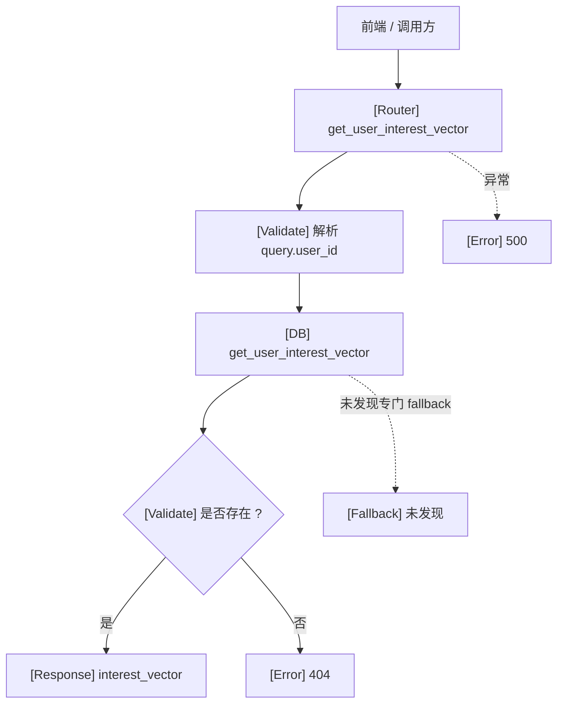
```mermaid
flowchart TD
    A["前端 / 调用方"] --> B["[Router] get_user_interest_vector"]
    B --> C["[Validate] 解析 query.user_id"]
    C --> D["[DB] get_user_interest_vector"]
    D --> E{"[Validate] 是否存在 ?"}
    E -->|是| F["[Response] interest_vector"]
    E -->|否| G["[Error] 404"]
    B -. 异常 .-> H["[Error] 500"]
    D -. 未发现专门 fallback .-> I["[Fallback] 未发现"]
```

### 关键调用链

`get_user_interest_vector() -> DatabaseService.get_user_interest_vector()`

### 输入

- Query：
  - `user_id`

### 输出

- `user_id`
- `vector_data`
- `paper_count`
- `embedding_model`
- `vector_dimension`
- `cluster_count`
- `profile_mode`
- `interest_clusters`
- `weak_interest_pool`
- `disliked_vector_data`
- `disliked_paper_examples`
- `negative_feedback_stats`
- `negative_feedback_profile`
- `created_at`
- `updated_at`

### 副作用

- 是否创建用户：否
- 是否更新用户信息：否
- 是否写入 like / dislike / collect：否
- 是否更新用户兴趣画像：否
- 是否更新 memory：否
- 是否实时计算推荐：否
- 是否读取缓存推荐：否
- 是否调用 embedding：否
- 是否访问 vector store：否
- 是否写数据库：否

### 异常 / fallback

- 兴趣向量不存在时返回 `404`
- 其他异常返回 `500`
- 未发现明确 fallback

## 接口：POST `/user/recommend-papers`

### 职责

根据用户兴趣向量、liked/disliked、研究画像、近期论文池和向量召回结果，实时生成个性化推荐结果。

### 处理流程图

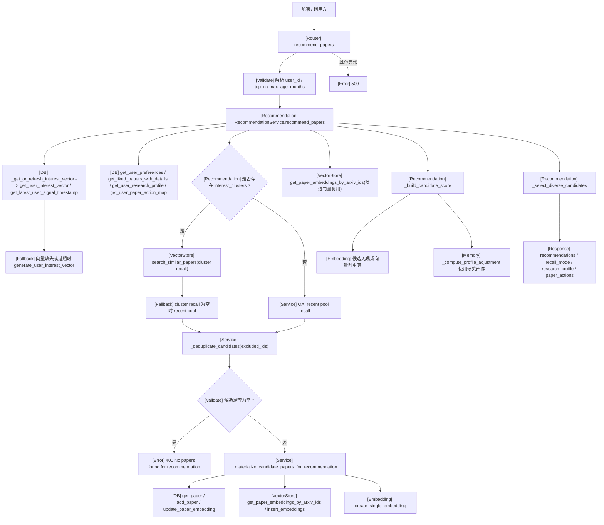
```mermaid
flowchart TD
    A["前端 / 调用方"] --> B["[Router] recommend_papers"]
    B --> C["[Validate] 解析 user_id / top_n / max_age_months"]
    C --> D["[Recommendation] RecommendationService.recommend_papers"]
    D --> E["[DB] _get_or_refresh_interest_vector -> get_user_interest_vector / get_latest_user_signal_timestamp"]
    E --> F["[Fallback] 向量缺失或过期时 generate_user_interest_vector"]
    D --> G["[DB] get_user_preferences / get_liked_papers_with_details / get_user_research_profile / get_user_paper_action_map"]
    D --> H{"[Recommendation] 是否存在 interest_clusters ?"}
    H -->|是| I["[VectorStore] search_similar_papers(cluster recall)"]
    H -->|否| J["[Service] OAI recent pool recall"]
    I --> K["[Fallback] cluster recall 为空时 recent pool"]
    J --> L["[Service] _deduplicate_candidates(excluded_ids)"]
    K --> L
    L --> M{"[Validate] 候选是否为空 ?"}
    M -->|是| N["[Error] 400 No papers found for recommendation"]
    M -->|否| O["[Service] _materialize_candidate_papers_for_recommendation"]
    O --> O1["[DB] get_paper / add_paper / update_paper_embedding"]
    O --> O2["[VectorStore] get_paper_embeddings_by_arxiv_ids / insert_embeddings"]
    O --> O3["[Embedding] create_single_embedding"]
    D --> P["[VectorStore] get_paper_embeddings_by_arxiv_ids(候选向量复用)"]
    D --> Q["[Recommendation] _build_candidate_score"]
    Q --> Q1["[Embedding] 候选无现成向量时重算"]
    Q --> Q2["[Memory] _compute_profile_adjustment 使用研究画像"]
    D --> R["[Recommendation] _select_diverse_candidates"]
    R --> S["[Response] recommendations / recall_mode / research_profile / paper_actions"]
    B -. 其他异常 .-> T["[Error] 500"]
```

### 关键调用链

`recommend_papers() -> RecommendationService.recommend_papers() -> _get_or_refresh_interest_vector() -> DatabaseService.get_user_interest_vector()/get_latest_user_signal_timestamp()`

`recommend_papers() -> DatabaseService.get_user_preferences() -> get_liked_papers_with_details() -> _build_profile_signal_bundle()`

`recommend_papers() -> _fetch_cluster_recall_candidates() -> VectorStoreService.search_similar_papers()`

`recommend_papers() -> _fetch_recent_db_candidates() -> ArxivOaiDatabaseService.get_recent_papers()`

`recommend_papers() -> _materialize_candidate_papers_for_recommendation() -> DatabaseService.get_paper()/add_paper()/update_paper_embedding() -> VectorStoreService.get_paper_embeddings_by_arxiv_ids()/insert_embeddings() -> EmbeddingService.create_single_embedding()`

`recommend_papers() -> _build_candidate_score() -> _compute_profile_adjustment() -> _select_diverse_candidates()`

### 输入

- Body：
  - `user_id`
  - `top_n`
  - `max_age_months`

### 输出

- `status`
- `message`
- `total_found`
- `interest_profile_mode`
- `interest_cluster_count`
- `research_profile`
- `paper_actions`
- `recall_mode`
- `recommendations`

### 副作用

- 是否创建用户：否
- 是否更新用户信息：否
- 是否写入 like / dislike / collect：否
- 是否更新用户兴趣画像：可能，兴趣向量缺失或过期时会重建并写 `user_interest_vectors`
- 是否更新 memory：未直接调用 `MemoryService`，但会读取研究画像信号
- 是否实时计算推荐：是
- 是否读取缓存推荐：未发现
- 是否调用 embedding：是
- 是否访问 vector store：是
- 是否写数据库：可能，会补写 `arxiv_papers`、更新 `embedding_id`、重建 `user_interest_vectors`

### 异常 / fallback

- 用户兴趣向量缺失或过期时，自动重建
- cluster recall 为空时，回退到 recent paper pool
- 候选去重后为空时返回 `400`
- 候选物化时若缺少现成向量，会重新 embedding 或批量插入向量库
- 个别候选个性化打分失败时，会 warning 并退化为普通查询排序逻辑
- router 兜底返回 `500`

## 5. 推荐链路分析

1. 推荐是实时计算，还是读取预计算结果？
   - 基于真实代码判断，当前推荐是实时计算。
   - `POST /user/recommend-papers` 直接调用 `RecommendationService.recommend_papers()`，内部实时做兴趣向量读取/重建、候选召回、候选物化、打分与多样性选择。
   - 未发现单独的推荐结果缓存表或“读取已保存推荐结果”的逻辑。

2. 是否读取用户 liked papers？
   - 是。
   - 读取路径包括 `DatabaseService.get_liked_papers()`、`DatabaseService.get_liked_papers_with_details()`。

3. 是否使用用户 dislike 信息？
   - 是。
   - `generate_user_interest_vector()` 会读取 disliked papers，并生成独立的 `negative_feedback_profile`，其中包含实例级 `examples`、可选 `negative clusters`、`hard_exclude_ids` 和统计信息。
   - disliked 数量不足时使用实例级负反馈；达到阈值时尝试负向聚类；聚类失败或无稳定簇时按配置退回实例级样本。
   - `recommend_papers()` / Agent 推荐会把 disliked IDs 纳入 `excluded_ids`；搜索重排也会 hard exclude disliked IDs。
   - 打分阶段统一读取 `negative_feedback_profile`，先计算 `negative_score`，再按配置的相似度阈值、margin、置信度和最大扣分得到最终 `negative_penalty`。
   - 可选 hard filter 只在 `RECOMMENDATION_RANKING_NEGATIVE_ENABLE_HARD_FILTER` 开启且超过 hard filter 阈值时生效，默认关闭以避免误伤。

4. 是否使用 collect 信息？
   - 未发现名为 `collect` 的独立表或独立逻辑。
   - 但发现通用 `user_paper_actions` 表，支持 `favorite`、`later`、`archived`、`read`、`note_saved` 等行为。
   - 如果前端把 collect 语义映射为 `favorite` 或 `later`，则这些行为会参与画像修正；代码里未发现 `collect` 这个 action_type。

5. 是否使用 embedding？
   - 是。
   - 用户兴趣向量生成、候选物化、候选打分都可能调用 `EmbeddingService.create_single_embedding()`。

6. 是否访问 vector store？
   - 是。
   - 主要通过 `VectorStoreService.get_paper_embeddings_by_arxiv_ids()`、`insert_single_embedding()`、`insert_embeddings()`、`search_similar_papers()`。

7. 是否使用 `MemoryService`？
   - 是，但不是在推荐主循环里做复杂会话记忆。
   - 主要用于：
     - profile event 驱动的长期研究画像重建
     - research profile 读写
   - `recommend_papers()` 本身不直接调用 `MemoryService`，而是通过数据库读取 `user_research_profiles`。

8. 用户兴趣向量是如何生成的？
   - 先读取 liked / disliked 论文 ID。
   - 优先从 Milvus 读取对应论文向量。
   - 缺失时尝试：
     - 从 arXiv / OAI 回填论文并写入向量库
     - 再退化为基于本地论文文本重建 embedding
   - 对 liked 向量取均值并归一化，保存为主正向兴趣向量；
   - disliked 向量不再参与 `vector_data` 生成；少量 disliked 保存为带向量的实例级 examples，数量达到阈值时尝试生成 negative clusters。
   - 负向聚类失败或没有稳定簇时，按配置退回实例级 examples；这些负向信号只供排序阶段降权、过滤或解释。
   - 当 liked 数量足够时，还会用 HDBSCAN 构建多兴趣簇，并保存 `interest_clusters` 与 `weak_interest_pool`。

9. 推荐结果是否保存到数据库？
   - 未发现。
   - 当前会保存的是用户兴趣向量、偏好、行为和研究画像，不会把最终推荐列表落库。

10. 是否存在冷启动处理？
   - 有，但比较有限。
   - 如果没有兴趣簇，会退化为 recent paper pool。
   - 如果兴趣向量缺失或过期，会自动重建。
   - 但如果用户根本没有 liked papers，`generate_user_interest_vector()` 会直接返回 `400`，因此严格意义上的“零偏好冷启动个性化推荐”未完全实现。

## 6. 设计观察

1. `user_router.py` 的职责整体比较清晰，确实聚焦在“用户偏好、画像、行为、推荐入口”这一组能力。
2. 用户管理、偏好管理、推荐逻辑在接口层是混在一起的，但这种混合更多是“入口聚合”而不是“逻辑杂糅”。真正复杂的推荐逻辑主要下沉在 `RecommendationService`。
3. Router 本身业务逻辑不算重，基本是参数解析和 service 转发。相对明显的逻辑只有：
   - `research-profile` 的 `model_dump(exclude_none=True)` 处理
   - `remove_paper_action` 的 404/500 区分
4. 推荐相关副作用不完全直观，尤其是：
   - like/dislike 是强偏好表的权威状态，同时写 profile event，但不再写 `user_paper_actions`
   - like/dislike / paper-action 可能触发论文物化、embedding、向量库写入
   - 推荐主流程虽然不保存推荐结果，但可能补写论文表、向量映射和兴趣向量
5. 对后续个性化推荐系统的影响：
   - 当前链路已经具备“显式偏好 + 长期画像 + 向量召回 + 多样性重排”的雏形；
   - 但推荐结果未持久化，后续如果要做推荐解释、曝光反馈、A/B 或离线评估，可能需要额外的数据记录能力；
   - 当前没有独立 `users` 表，也没有真正的冷启动个性化兜底，这会影响后续更精细的人群建模与新用户体验。

## 7. 检查结论

- 文档文件已生成到 `docs/architecture/routers/user_router_flow.md`
- `user_router.py` 中全部 15 个接口已覆盖
- 每个接口都包含单独 Mermaid 流程图
- 使用的文件名、函数名、类名均来自真实代码
- 未发现凭空编造的推荐、memory、embedding、vector store 逻辑
- 未确认或未实现的点已明确标注为“未发现”
