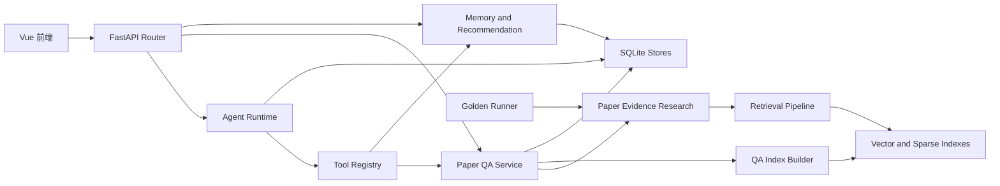

# 系统架构

## 目标与边界

系统把论文发现、单篇论文 QA、研究画像与推荐组织为同一个后端应用。维护时应把它理解为四层：HTTP 接入层只做协议适配，Agent 和业务服务承载领域流程，工具层提供可执行能力，存储和外部模型提供基础设施。

本页说明当前模块责任和状态边界，不列举完整 API 参数或启动配置。

## 应用装配

[`backend/main.py`](../../backend/main.py) 的 `create_app()` 是 FastAPI 装配真源：

1. 创建带 lifespan 的应用，在启动时执行上下文生命周期清理；`preload` 模式才主动预热服务。
2. 注册 `arxiv`、`agent`、`user`、`paper`、`qa` 五个业务 Router，统一挂在 `/api` 下。
3. 根据 `get_debug_routes_runtime_config()` 决定是否注册 chunk 调试 Router。该 Router 会暴露本地解析产物，只能视为受开关保护的内部能力。
4. 将 `AppError`、`HTTPException` 和 `RequestValidationError` 收敛成稳定错误响应；Router 不应自行构造与此冲突的错误格式。

[`backend/dependencies.py`](../../backend/dependencies.py) 是服务组合根。它负责构造 `StorageContainer`、模型服务、检索服务、QA 服务、推荐服务和 Agent 所需的 checkpoint store。业务模块应请求具体依赖，例如 `get_paper_qa_service()`，而不是接收一个万能数据库对象。

`get_paper_evidence_research_service()` 为生产 QA 与 golden runner 共用的研究引擎装配正式检索、生成和独立主张校验适配器。模型原始客户端不能直接充当研究图依赖；实际接口、预算和活动索引快照由这条装配链统一提供。

## 模块职责

| 层 | 责任 | 主要位置 | 维护约束 |
| --- | --- | --- | --- |
| 前端 | 交互、请求发起、流式事件消费和展示状态 | [`new_frontend/src/`](../../new_frontend/src/) | 不把后端执行真源复制为可驱动业务的前端状态。 |
| Router | 参数校验、依赖注入、响应序列化和协议错误转换 | [`backend/routers/`](../../backend/routers/) | 不编排检索、画像或 Agent 状态机。 |
| Agent Runtime | 将研究请求转换成受校验计划，并完成执行、观察和恢复 | [`backend/agents/arxiv_search_agent/`](../../backend/agents/arxiv_search_agent/) | 计划和运行状态必须使用统一 schema。 |
| Tools | 以明确输入 schema 调用搜索、QA、推荐和偏好能力 | [`backend/tools/`](../../backend/tools/) | 工具注册表是可执行能力的唯一清单。 |
| 业务服务 | 论文处理、QA、检索、记忆、推荐和存储编排 | [`backend/services/`](../../backend/services/) | 服务边界按业务能力而非 Router 划分。 |
| 存储与模型 | SQLite、向量库、文档资产、LLM/Embedding/Rerank 提供者 | [`backend/services/storage/`](../../backend/services/storage/)、[`backend/services/embedding/`](../../backend/services/embedding/)、[`backend/services/llm/`](../../backend/services/llm/) | 失败必须在调用层转化为可解释的降级或错误。 |

## 请求与能力流

Agent 和直接 QA 入口会在不同位置进入系统，但都复用同一组论文、检索、记忆和存储能力。不要为 Agent 单独复制 QA 或推荐的业务实现。

## 关键数据和状态边界

### Agent 执行现场

[`AgentState`](../../backend/agents/arxiv_search_agent/state.py) 是 LangGraph 中的共享状态模型，但字段分为不同用途：

- `goal`、`execution_plan`、`plan_runtime` 是执行真源；当前 step、工具输出、observation、确认请求和最终答案都以 `plan_runtime` 为准。
- `runtime_state` 是 `plan_runtime` 的可序列化 checkpoint 投影，用于恢复，不能与 `plan_runtime` 并列写入业务判断。
- `pending_action`、`papers`、`answer`、`paper_qa_result`、`preference_action_result` 是出站展示投影，前端回传它们不能改变执行现场。
- 旧的单步工具字段只服务兼容路径，新增主流程不得依赖它们。

详细状态机见 [Agent Runtime](../capabilities/agent-runtime.md)。

### 论文 QA 资产

[`PaperQAIndexBuilder`](../../backend/services/paper_qa/paper_qa_index_builder.py) 负责从论文元数据和 PDF 生成 chunk、检索索引、Embedding 与向量库记录。`PaperQAIndexStore` 记录索引版本和构建任务，不能仅凭文件是否存在判断论文可问答。

[`IndexJobManager`](../../backend/services/paper_qa/index_job_manager.py) 将异步构建任务的提交、占用和状态更新收敛到一个边界。Router 只轮询和序列化 job，不应绕过它直接修改任务状态。

### 用户画像

研究画像存储区分人工层、生成层和 effective 投影。人工偏好与显式编辑不应被自动生成结果覆盖；推荐只能消费由存储层合成的 effective profile。具体约束见 [研究画像与推荐](../capabilities/research-profile-and-recommendations.md)。

### 研究结果与评测

研究状态中的需求、候选和校验结果驱动 completed/partial/abstained；技术故障单独记录为运行失败。追加式 trace 只供审计和评测，不能反向驱动业务终态。生产同步和 SSE 共用一次执行，公开进度与私有完整轨迹分别投影。

[`EvaluationRecord`](../../backend/services/evaluation/contracts.py) 将答案、引用、逐稿校验、实际配置和成本统一落盘，以支持离线重新评分。默认记录和报告路径固定在 `backend/06-evaluation-result/`，写入失败不破坏问答；会话保存失败仍需向调用方返回统一错误。详细口径见 [生成效果评测](../capabilities/evaluation.md)。

### 本地持久化路径

[`backend/utils/storage_paths.py`](../../backend/utils/storage_paths.py) 是 SQLite 数据库、Paper QA 建库缓存与后端本地产物目录的路径真源。默认推荐数据库、OAI 索引库和 QA 缓存均位于 `backend/06-database`；`SQLITE_DATABASE_PATH`、`OAI_SQLITE_DATABASE_PATH` 与 `PAPER_QA_BUILD_CACHE_DIR` 的相对值也始终相对 `backend` 解析，不依赖服务从哪个目录启动。

这些配置可以使用仓库外的绝对路径，以支持部署时挂载独立持久卷；但不能指向仓库根目录 `06-database`，该目录会在配置加载阶段明确报错。`SqliteConnectionProvider`、`ArxivOaiDatabaseService` 和 `PaperQABuildCache` 对直接注入的路径复用相同规则，新增调用方不得自行按当前工作目录解释路径。

加载后的文档、Embedding 结果、向量库本地资产、LLM 生成结果和每日 arXiv 下载产物分别固定在 `backend/01-loaded-docs`、`backend/02-embedded-docs`、`backend/03-vector-store`、`backend/05-generation-results` 与 `backend/06-daily-arxiv-paper`。服务代码应通过 `resolve_backend_artifact_path()` 获取这些目录，不能再直接 `os.makedirs("01-loaded-docs")` 或按当前工作目录拼接路径。

[`scripts/doctor.py`](../../scripts/doctor.py) 发现根目录遗留 `06-database`、`01-loaded-docs`、`02-embedded-docs`、`03-vector-store`、`05-generation-results` 或 `06-daily-arxiv-paper` 时只报告清理警告，不阻塞已修复的服务；显式配置到根目录 `06-database` 则是失败项。自动化测试必须使用临时 SQLite 文件，不能复用任何项目持久化库。

## 常用维护定位

| 现象 | 优先检查 |
| --- | --- |
| 所有请求的错误格式异常 | [`backend/main.py`](../../backend/main.py) 的异常处理器和对应 Router 是否重复包装。 |
| 同一服务在不同入口表现不一致 | [`backend/dependencies.py`](../../backend/dependencies.py) 是否为两个入口注入了不同实现或不同 store。 |
| 调试页面在普通环境仍能读取 chunk | `create_app()` 的 debug Router 开关及前端是否仍调用内部路径。 |
| 业务状态在重启后丢失或重复 | 对照具体 store 和对应的 checkpoint/job 状态，不要只检查内存对象。 |

涉及 Router 或依赖装配的变更，必须同步更新本页和 [维护与质量](../operations/maintenance-quality.md)。
