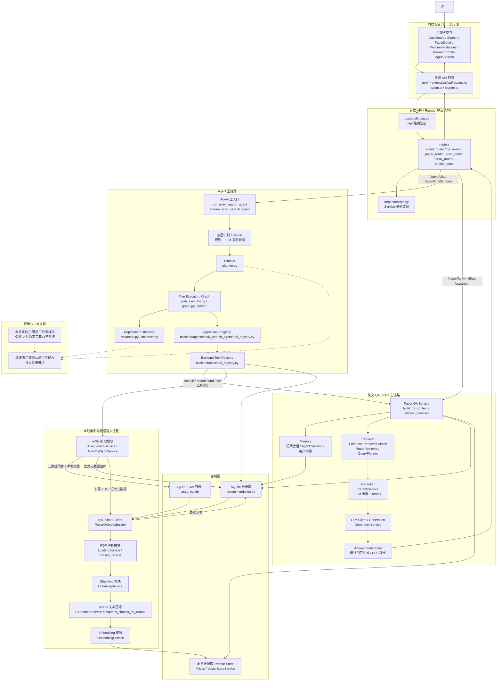

# 系统总览图

本文基于当前仓库代码的静态阅读整理，只描述代码中已经能确认的系统级模块与主流程，不修改任何业务代码。

## Mermaid 总览图

## 图中模块与代码对应

- 前端页面 / UI
  - `new_frontend/src/router/index.ts`
  - `new_frontend/src/views/Dashboard.vue`
  - `new_frontend/src/views/Search.vue`
  - `new_frontend/src/views/PaperDetail.vue`
  - `new_frontend/src/views/Recommendations.vue`
  - `new_frontend/src/views/ResearchProfile.vue`
  - `new_frontend/src/views/AgentSearch.vue`
  - `new_frontend/src/composables/usePaperRagChat.ts`
  - `new_frontend/src/composables/useAgentSearchChat.ts`

- 后端 API / routes
  - `backend/main.py` 负责注册 `/api` 前缀下的各路由
  - `backend/routers/agent_router.py`
  - `backend/routers/qa_router.py`
  - `backend/routers/paper_router.py`
  - `backend/routers/user_router.py`
  - `backend/routers/arxiv_router.py`
  - `backend/routers/chunk_router.py`

- Agent 主入口
  - `backend/agents/arxiv_search_agent/service.py`
  - 入口函数是 `run_arxiv_search_agent()` 和 `stream_arxiv_search_agent()`

- 意图识别 / Router
  - Agent 链路中的意图判断散落在：
  - `backend/agents/arxiv_search_agent/node/parse_node.py`
  - `backend/agents/arxiv_search_agent/node/intent_support.py`
  - `backend/services/intent/intent_service.py`
  - QA 检索链路也会使用 `IntentService` 做问题意图特征抽取，见 `backend/services/retrieval/enhanced_retrieval_service.py`

- Planner
  - `backend/agents/arxiv_search_agent/planner.py`
  - `backend/agents/arxiv_search_agent/plan_validator.py`
  - `backend/agents/arxiv_search_agent/node/plan_node.py`
  - 这是已确认存在的独立模块

- Tool Registry
  - Agent 侧工具注册表：`backend/agents/arxiv_search_agent/tool_registry.py`
  - 后端统一工具注册表：`backend/tools/tool_registry.py`
  - 实际工具实现位于：
  - `backend/tools/arxiv_tools.py`
  - `backend/tools/paper_qa_tools.py`
  - `backend/tools/recommendation_tools.py`

- Retriever
  - `backend/services/retrieval/enhanced_retrieval_service.py`
  - `backend/services/retrieval/route_retriever.py`
  - `backend/services/retrieval/query_planner.py`
  - 在论文 QA 主链路里由 `PaperQAService.build_qa_context()` 调用 `enhanced_retrieve()`

- Reranker
  - `backend/services/retrieval/rerank_service.py`
  - `backend/services/llm/generation_service.py` 中还承担了 `compress_chunks_for_rerank()`，用于索引前的 rerank 文本压缩

- Memory
  - `backend/services/memory/memory_service.py`
  - `backend/services/memory/memory_models.py`
  - 代码中已确认有三类职责：
  - 论文 QA 短期会话上下文
  - Agent Session Memory
  - 用户研究画像 / 偏好摘要

- LLM Client
  - `backend/services/llm/generation_service.py`
  - 在当前代码里它既承担问答生成，也承担部分压缩、改写、流式输出

- SQLite 数据库
  - 主业务库：`backend/services/storage/database_service.py`
  - OAI 镜像库：`backend/services/arxiv/arxiv_oai_service.py` 中的 `ArxivOaiDatabaseService`
  - 当前已确认的业务表包括论文元数据、用户偏好、兴趣向量、QA 索引状态、QA 会话、笔记、Agent Session 等

- 向量数据库 / Vector Store
  - `backend/services/storage/vector_store_service.py`
  - 代码中已明确使用 Milvus 客户端

- PDF 解析模块
  - `backend/services/document/loading_service.py`
  - `backend/services/document/parsing_service.py`
  - `PaperQAIndexBuilder.load_pdf_document()` 会进入这层

- Chunking 模块
  - `backend/services/document/chunking_service.py`
  - 已确认同时支持 `chunk_docling()` 与 `chunk_pymupdf()`

- Embedding 模块
  - `backend/services/embedding/embedding_service.py`
  - 在 `PaperQAIndexBuilder.create_chunk_embeddings()` 中被调用

- arXiv 抓取模块
  - 在线搜索：`backend/services/arxiv/arxiv_search_service.py`
  - 本地镜像搜索：`backend/services/arxiv/local_arxiv_service.py`
  - OAI 同步：`backend/services/arxiv/arxiv_oai_service.py` 中的 `ArxivOaiSyncService`
  - 命令入口：`backend/07-arxiv-tools/sync_arxiv_oai.py`

- Answer Generation / LLM 生成回答模块
  - 论文 QA：`backend/services/paper_qa/paper_qa_service.py`
  - 最终生成由 `GenerationService.generate()` 或 `stream_qwen_responses()` 完成
  - Agent 回复聚合在 `backend/agents/arxiv_search_agent/service.py` 的 `_state_to_response()`

## 主流程说明

### 1. 用户请求主线

用户从前端页面发起请求后，会先走 `new_frontend/src/api/agent.ts` 或 `new_frontend/src/api/papers.ts`，统一进入 `/api/...`。后端在 `backend/main.py` 注册的各类 router 中分发：

- Agent 类请求进入 `agent_router.py`，再进入 `backend/agents/arxiv_search_agent/service.py`
- 单篇论文问答进入 `qa_router.py`，再进入 `PaperQAService`
- 推荐、偏好、论文元数据等请求则分别进入 `user_router.py`、`paper_router.py`、`arxiv_router.py`

如果是论文 QA，请求主线是：

`qa_router.py -> PaperQAService.build_qa_context() -> EnhancedRetrievalService.enhanced_retrieve() -> RerankService / GenerationService -> GenerationService.generate() 或 stream_qwen_responses() -> 返回 answer / sources / retrieval_debug`

如果是 Agent 请求，请求主线是：

`agent_router.py -> run_arxiv_search_agent() / stream_arxiv_search_agent() -> graph.py + planner.py + node/* -> agent tool registry -> backend tool registry -> arxiv / recommendation / paper_qa 等 service -> 汇总响应`

### 2. 离线索引主线

代码中已确认单篇论文 QA 索引的离线链路由 `PaperQAIndexBuilder.build_qa_index()` 负责编排，顺序大致是：

`加载论文元数据 -> 下载 PDF -> PDF 解析 -> chunk 切分 -> rerank 文本压缩 -> embedding 生成 -> 写入 Milvus -> 更新 SQLite 中的 QA 索引状态`

对应主要方法位于：

- `backend/services/paper_qa/paper_qa_index_builder.py`
  - `load_paper_metadata()`
  - `download_pdf()`
  - `load_pdf_document()`
  - `chunk_document()`
  - `compress_chunks_for_rerank()`
  - `create_chunk_embeddings()`
  - `index_embeddings_to_vector_store()`

### 3. arXiv / OAI 数据进入系统的路径

代码中已确认存在两条路径：

- 在线搜索路径
  - `ArxivSearchService` 直接请求 arXiv 接口
- 本地镜像路径
  - `ArxivOaiSyncService.sync()` 把 OAI-PMH 元数据同步到本地 `arxiv_oai.db`
  - `LocalArxivService` 和 `ArxivOaiDatabaseService` 基于本地镜像做检索和补数

这意味着系统不是“纯在线现查”，而是“在线搜索 + 本地镜像 + 单篇 PDF 索引”混合结构。

## 需要确认 / 未发现

- `Planner` 是已确认存在的模块，不需要标成“未发现”。
- `Router` 这个词在仓库里有两层含义：
  - HTTP 路由层明确存在
  - Agent / Retrieval 内部的“意图路由、检索路由”也存在，但不是一个单独统一的 `Router` 类总控，所以图里按“意图识别 / Router”做了聚合表达。
- `Memory` 是已确认存在的系统模块，但更偏“会话与画像服务”，不是独立的向量记忆系统。
- `Answer Generation` 不是独立目录，而是由 `PaperQAService + GenerationService` 共同完成，所以图中单独画出职责节点，但说明里明确它不是单独 package。
- 未发现单独命名为 `workflow engine` 的通用编排框架；当前最接近这一角色的是 Agent 侧的 LangGraph 执行图与 `PaperQAIndexBuilder` 这样的显式流程编排类。

## 初步观察：当前系统更像 workflow 还是 agent

初步看，这个系统整体更像“以 workflow 为主、局部带 agent 能力”的混合架构。

- 论文 QA、索引构建、推荐、大部分数据流都是明确的后端 workflow，入口稳定、步骤固定、依赖关系清晰。
- `backend/agents/arxiv_search_agent` 则是真正带有 agent 特征的一层：有意图判断、planner、plan executor、replanner、tool registry、流式步骤事件和中断恢复。
- 因此如果做系统总览，建议把它理解成：
  - 底座是 RAG / 检索 / 索引 workflow
  - 上层额外挂了一条面向多意图自然语言交互的 Agent 编排链路

这也是为什么图里要把“论文 QA 主链路”和“Agent 主链路”并列画出，而不是把所有模块都塞进一个统一 Agent 框里。
