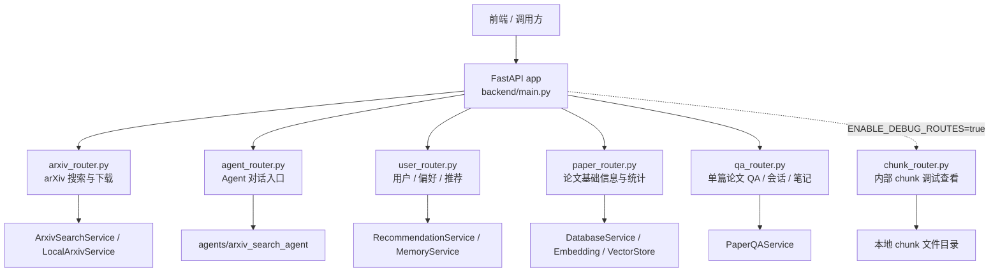

# 后端请求入口与 Router 映射关系

## 1. 总体结论

当前后端 HTTP 入口统一从 [backend/main.py](/D:/极客时间大模型RAG进阶实战营/rag-project01-framework/backend/main.py) 进入。`FastAPI` 应用在 `create_app()` 中创建，所有对外 API 都先挂到同一个 `app` 上，然后通过 `app.include_router(..., prefix="/api")` 统一加上全局前缀 `/api`。

也就是说，前端请求进入后端后，并不是先进入某个 service，而是先进入 `FastAPI app`，随后由 URL 路径匹配到对应 router。当前默认注册的正式入口 router 有 5 个：

- `arxiv_router.py`：arXiv 搜索、字段、分类、下载、搜索并保存
- `agent_router.py`：Agent 对话、流式对话、Graph 导出
- `user_router.py`：用户偏好、行为、画像、兴趣向量、推荐
- `paper_router.py`：论文基础信息、统计、同步状态
- `qa_router.py`：论文 QA、索引、会话、笔记、trace
- `chunk_router.py`：本地 chunk 调试查看，仅在 `ENABLE_DEBUG_ROUTES=true` 时作为内部调试接口注册

如果只回答“一个请求最先会进入哪个 router”，答案是：

1. 先进入 `backend/main.py` 创建的 `FastAPI app`
2. 再根据完整路径 `/api/...` 命中某个已注册 router
3. 再进入该 router 中匹配到的 endpoint 函数
4. 最后才调用具体 service 或 agent

## 2. FastAPI 入口分析

### 2.1 FastAPI app 在哪里创建

`FastAPI` 应用在 [backend/main.py](/D:/极客时间大模型RAG进阶实战营/rag-project01-framework/backend/main.py) 的 `create_app(load_mode: str | None = None)` 中创建：

- `resolved_load_mode = normalize_service_load_mode(load_mode)` 先解析服务加载模式
- `app = FastAPI(lifespan=lifespan)` 创建应用
- 文件底部的 `app = create_app()` 生成默认应用实例
- 如果直接运行该文件，则通过 `uvicorn.run(create_app(...))` 启动服务，监听 `0.0.0.0:8001`

### 2.2 注册到了 app 上的 router

在 `create_app()` 中，router 按如下顺序注册到 `app`：

| 注册顺序 | Router 变量 | 来源文件 | include_router 前缀 | Router 自身前缀 | 实际路径前缀 | Tags |
|---|---|---|---|---|---|---|
| 1 | `arxiv_router` | `backend/routers/arxiv_router.py` | `/api` | `/arxiv` | `/api/arxiv` | `["arxiv"]` |
| 2 | `agent_router` | `backend/routers/agent_router.py` | `/api` | `/agent` | `/api/agent` | `["agent"]` |
| 3 | `user_router` | `backend/routers/user_router.py` | `/api` | `/user` | `/api/user` | `["user"]` |
| 4 | `paper_router` | `backend/routers/paper_router.py` | `/api` | 无 | `/api` | `["paper"]` |
| 5 | `qa_router` | `backend/routers/qa_router.py` | `/api` | `/paper/{arxiv_id}` | `/api/paper/{arxiv_id}` | `["paper-qa"]` |
| 条件注册 | `chunk_debug_router` | `backend/routers/chunk_router.py` | `/api` | `/debug/chunks` | `/api/debug/chunks` | `["debug-chunks"]` |

这里有两个容易误判的点：

- `paper_router.py` 没有声明 router 级别 `prefix`，所以它的接口会直接落在 `/api/stats`、`/api/paper/{arxiv_id}`、`/api/papers` 这类路径上。
- `qa_router.py` 的 router 级别前缀是 `/paper/{arxiv_id}`，因此它本质上是“挂在单篇论文下面的一组子资源”，比如 `/api/paper/{arxiv_id}/qa`、`/api/paper/{arxiv_id}/notes`。
- `chunk_router.py` 默认不注册；只有本地排查时显式开启 `ENABLE_DEBUG_ROUTES=true`，才会出现在 `/api/debug/chunks/*`。

### 2.3 全局入口逻辑

`backend/main.py` 里存在的全局入口逻辑主要有以下几类：

#### 1. 生命周期函数 `lifespan`

`create_app()` 内部定义了异步上下文管理器 `lifespan(app)`，用于服务启动阶段的预热逻辑。

当 `resolved_load_mode == "preload"` 时，会执行：

- `warm_up_services(resolved_load_mode)`：预热依赖层里缓存的单例 service
- `get_tool_registry()`：初始化后端工具注册表
- `get_valid_arxiv_categories()`：初始化 Agent 使用的合法 arXiv 分类集合
- `get_default_agent_arxiv_categories()`：初始化 Agent 默认 arXiv 分类范围

这说明启动阶段不仅会预热普通 service，还会顺带把 Agent 所依赖的一部分工具与分类元数据先准备好。

#### 2. 全局中间件

注册了一个全局 `CORSMiddleware`：

- `allow_origins=["*"]`
- `allow_credentials=True`
- `allow_methods=["*"]`
- `allow_headers=["*"]`

这意味着当前后端对跨域来源限制较宽，前端请求不需要按域名做额外白名单匹配。

#### 3. 日志初始化

文件顶部通过 `logging.basicConfig(...)` 初始化了全局日志格式和级别。

#### 4. 异常处理

`main.py` 当前已经注册了全局异常处理器，包括：

- `@app.exception_handler(AppError)`：统一返回项目约定的错误契约；
- `@app.exception_handler(HTTPException)`：把 FastAPI/业务层抛出的 `HTTPException` 映射到统一错误结构；
- `@app.exception_handler(RequestValidationError)`：把请求参数校验失败收敛为稳定的 422 错误响应。

因此，router 内部仍然可能存在局部 `try/except`，但后端并不是“没有全局异常处理器”。

#### 5. 启动事件 / 中间件 / 依赖注入边界

- 没有使用旧式 `@app.on_event("startup")`
- 没有看到自定义全局 HTTP 中间件
- 依赖注入主要集中在 [backend/dependencies.py](/D:/极客时间大模型RAG进阶实战营/rag-project01-framework/backend/dependencies.py)，router 通过 `Depends(...)` 获取 service 单例

## 3. Router 总览表

| Router 文件 | Prefix | Tags | 主要职责 |
|---|---|---|---|
| `agent_router.py` | `/agent` | `["agent"]` | 暴露 arXiv Agent 的同步对话、流式对话、图结构导出入口 |
| `arxiv_router.py` | `/arxiv` | `["arxiv"]` | 暴露 arXiv 搜索、字段、分类、PDF 下载、搜索并保存能力 |
| `user_router.py` | `/user` | `["user"]` | 用户偏好、论文行为、研究画像、兴趣向量、个性化推荐 |
| `paper_router.py` | 无 | `["paper"]` | 首页统计、同步状态、论文基础信息增删查 |
| `qa_router.py` | `/paper/{arxiv_id}` | `["paper-qa"]` | 单篇论文 QA、索引构建、QA trace、会话、笔记 |
| `chunk_router.py` | `/debug/chunks` | `["debug-chunks"]` | 条件注册的本地 chunk 调试产物查看，不属于默认正式 API |

## 4. Router 逐个分析

### 4.1 `backend/routers/agent_router.py`

- Router prefix：`/agent`
- Tags：`["agent"]`
- 主要职责：把 `agents/arxiv_search_agent` 暴露成 HTTP 接口，供前端或调试工具直接调用

#### Endpoints

1. `POST /api/agent/chat`
   - Endpoint：`agent_chat_endpoint()`
   - 输入参数：`ArxivSearchRequest`
   - 关键字段：
     - `user_id`
     - `session_id`
     - `message`
     - `context`
     - `resume`
   - 主要调用对象：`run_arxiv_search_agent()`
   - 业务功能：同步执行一次 Agent 对话，返回聚合后的 `ArxivSearchResponse`

2. `POST /api/agent/chat/stream`
   - Endpoint：`agent_chat_stream_endpoint()`
   - 输入参数：`ArxivSearchRequest`
   - 主要调用对象：`stream_arxiv_search_agent()`
   - 业务功能：以 `StreamingResponse` / SSE 方式流式执行 Agent

3. `GET /api/agent/graph`
   - Endpoint：`agent_graph_endpoint()`
   - 输入参数：无
   - 主要调用对象：`export_arxiv_search_graph_mermaid()`
   - 业务功能：导出 Agent 当前 `LangGraph` 主图的 Mermaid 描述

### 4.2 `backend/routers/arxiv_router.py`

- Router prefix：`/arxiv`
- Tags：`["arxiv"]`
- 主要职责：把 arXiv 搜索与下载相关能力封装成标准 HTTP API

#### Endpoints

1. `POST /api/arxiv/search`
   - Endpoint：`arxiv_search()`
   - 输入参数：
     - `search_query`
     - `id_list`
     - `title`
     - `author`
     - `abstract`
     - `category`
     - `comment`
     - `journal_ref`
     - `report_number`
     - `operator`
     - `max_results`
     - `start`
     - `sort_by`
     - `sort_order`
     - `submitted_days_ago`
   - 主要调用对象：`get_arxiv_service()` 返回的 `ArxivSearchService` 或 `LocalArxivService`
   - 辅助逻辑：
     - `build_arxiv_query_from_structured_params()`
     - `build_arxiv_raw_query()`
     - `validate_arxiv_search_request()`
   - 业务功能：执行在线或本地 arXiv 搜索

2. `GET /api/arxiv/fields`
   - Endpoint：`arxiv_get_fields()`
   - 输入参数：无
   - 主要调用对象：`arxiv_service.get_available_fields()`
   - 业务功能：返回支持的 arXiv 查询字段

3. `GET /api/arxiv/categories`
   - Endpoint：`arxiv_get_categories()`
   - 输入参数：无
   - 主要调用对象：`arxiv_service.get_subject_categories()`
   - 业务功能：返回支持的 arXiv 学科分类

4. `POST /api/arxiv/download`
   - Endpoint：`arxiv_download()`
   - 输入参数：
     - `arxiv_id`
     - `pdf_url`
   - 主要调用对象：`ArxivSearchService.download_pdf()`
   - 业务功能：下载指定 arXiv 论文 PDF 到本地

5. `POST /api/arxiv/search-and-save`
   - Endpoint：`arxiv_search_and_save()`
   - 输入参数：
     - `search_query`
     - `id_list`
     - `max_results`
     - `download_pdfs`
     - 以及其他透传到 service 的扩展参数 `**kwargs`
   - 主要调用对象：`ArxivSearchService.search_and_save()`
   - 业务功能：搜索 arXiv，保存搜索结果，按需下载 PDF

### 4.3 `backend/routers/paper_router.py`

- Router prefix：无
- Tags：`["paper"]`
- 主要职责：管理论文基础信息，以及首页统计、同步状态这类面板数据

#### Endpoints

1. `GET /api/stats`
   - Endpoint：`get_dashboard_stats()`
   - 输入参数：
     - Query：`user_id`
   - 主要调用对象：
     - `DatabaseService`
     - `ArxivOaiDatabaseService`
   - 业务功能：返回首页统计数据，如论文总数、已标注数、同步状态

2. `GET /api/sync-status`
   - Endpoint：`get_sync_status()`
   - 输入参数：无
   - 主要调用对象：本地状态文件读取逻辑 `_get_sync_status_payload()`
   - 业务功能：读取最近一次 arXiv 增量同步状态

3. `POST /api/paper`
   - Endpoint：`add_paper()`
   - 输入参数：
     - `arxiv_id`
     - `title`
     - `authors`
     - `abstract`
     - `categories`
     - `published_date`
     - `url`
     - `collection_name`
   - 主要调用对象：
     - `EmbeddingService`
     - `VectorStoreService`
     - `DatabaseService`
   - 业务功能：新增论文，并为摘要生成 embedding 后写入向量库与数据库

4. `GET /api/paper/{arxiv_id}`
   - Endpoint：`get_paper()`
   - 输入参数：
     - Path：`arxiv_id`
   - 主要调用对象：
     - `DatabaseService`
     - `RecommendationService`
   - 业务功能：查询单篇论文详情；本地不存在时尝试通过推荐服务回源 arXiv 并物化

5. `DELETE /api/paper/{arxiv_id}`
   - Endpoint：`delete_paper()`
   - 输入参数：
     - Path：`arxiv_id`
   - 主要调用对象：`DatabaseService.delete_paper()`
   - 业务功能：删除论文数据库记录

6. `GET /api/papers`
   - Endpoint：`get_all_papers()`
   - 输入参数：无
   - 主要调用对象：`DatabaseService.get_all_papers()`
   - 业务功能：查询所有论文

7. `GET /api/papers/category/{category}`
   - Endpoint：`search_papers_by_category()`
   - 输入参数：
     - Path：`category`
   - 主要调用对象：`DatabaseService.search_papers_by_category()`
   - 业务功能：按 arXiv 分类查询论文

### 4.4 `backend/routers/qa_router.py`

- Router prefix：`/paper/{arxiv_id}`
- Tags：`["paper-qa"]`
- 主要职责：围绕“单篇论文”提供 QA 能力，包括索引、诊断、trace、会话、笔记、同步问答、流式问答

#### Endpoints

1. `GET /api/paper/{arxiv_id}/qa-status`
   - Endpoint：`get_paper_qa_status()`
   - 输入参数：Path `arxiv_id`
   - 主要调用对象：`PaperQAService.get_qa_status()`
   - 业务功能：查看该论文是否已具备 QA 索引能力

2. `GET /api/paper/{arxiv_id}/qa-diagnose`
   - Endpoint：`diagnose_paper_qa()`
   - 输入参数：
     - Path：`arxiv_id`
     - Query：`sample_limit`
   - 主要调用对象：
     - `build_qa_diagnostic()`
     - `DatabaseService`
     - `VectorStoreService`
   - 业务功能：诊断 QA 索引与向量库状态

3. `GET /api/paper/{arxiv_id}/qa-trace/latest`
   - Endpoint：`download_latest_qa_trace()`
   - 输入参数：
     - Path：`arxiv_id`
     - Query：`format`
     - Query：`trace_name`
   - 主要调用对象：
     - `EnhancedRetrievalService.trace_export_dir`
     - `get_latest_retrieval_trace()`
   - 业务功能：下载最近一次或指定名称的 retrieval trace

4. `POST /api/paper/{arxiv_id}/create-qa-index`
   - Endpoint：`create_paper_qa_index()`
   - 输入参数：
     - Path：`arxiv_id`
     - Query：`loading_method`
     - Query：`sync`
   - 主要调用对象：
     - `PaperQAService.build_qa_index()`
     - `IndexJobManager.submit_job()`
   - 业务功能：为单篇论文构建 QA 索引，可同步执行，也可提交异步任务

5. `GET /api/paper/{arxiv_id}/qa-index-jobs/latest`
   - Endpoint：`get_latest_paper_qa_index_job()`
   - 输入参数：Path `arxiv_id`
   - 主要调用对象：`DatabaseService.get_latest_paper_index_job()`
   - 业务功能：查看该论文最近一次 QA 索引任务

6. `GET /api/paper/{arxiv_id}/qa-index-jobs/{job_id}`
   - Endpoint：`get_paper_qa_index_job()`
   - 输入参数：
     - Path：`arxiv_id`
     - Path：`job_id`
   - 主要调用对象：`DatabaseService.get_paper_index_job()`
   - 业务功能：查看指定 QA 索引任务详情

7. `GET /api/paper/{arxiv_id}/chat-sessions`
   - Endpoint：`list_paper_chat_sessions()`
   - 输入参数：
     - Path：`arxiv_id`
     - Query：`user_id`
     - Query：`limit`
   - 主要调用对象：`DatabaseService.list_paper_chat_sessions()`
   - 业务功能：列出某篇论文下的 QA 会话列表

8. `GET /api/paper/{arxiv_id}/chat-sessions/recent`
   - Endpoint：`get_recent_paper_chat_session()`
   - 输入参数：
     - Path：`arxiv_id`
     - Query：`user_id`
   - 主要调用对象：`DatabaseService.get_recent_paper_chat_session()`
   - 业务功能：获取最近一次 QA 会话

9. `POST /api/paper/{arxiv_id}/chat-sessions`
   - Endpoint：`create_paper_chat_session()`
   - 输入参数：
     - Path：`arxiv_id`
     - Body：`CreatePaperChatSessionRequest`
       - `user_id`
       - `title`
   - 主要调用对象：`DatabaseService.create_paper_chat_session()`
   - 业务功能：创建论文 QA 会话

10. `GET /api/paper/{arxiv_id}/chat-sessions/{session_id}`
   - Endpoint：`get_paper_chat_session()`
   - 输入参数：
     - Path：`arxiv_id`
     - Path：`session_id`
     - Query：`user_id`
   - 主要调用对象：`DatabaseService.get_paper_chat_session()`
   - 业务功能：查询单个 QA 会话详情

11. `GET /api/paper/{arxiv_id}/chat-sessions/{session_id}/messages`
   - Endpoint：`get_paper_chat_messages()`
   - 输入参数：
     - Path：`arxiv_id`
     - Path：`session_id`
     - Query：`user_id`
   - 主要调用对象：
     - `DatabaseService.get_paper_chat_session()`
     - `DatabaseService.list_paper_chat_messages()`
   - 业务功能：查询会话消息列表

12. `POST /api/paper/{arxiv_id}/chat-sessions/{session_id}/clear`
   - Endpoint：`clear_paper_chat_session()`
   - 输入参数：
     - Path：`arxiv_id`
     - Path：`session_id`
     - Body：可选 `user_id`
   - 主要调用对象：
     - `DatabaseService.clear_paper_chat_session()`
   - 业务功能：清空会话消息但保留会话本身

13. `DELETE /api/paper/{arxiv_id}/chat-sessions/{session_id}`
   - Endpoint：`delete_paper_chat_session()`
   - 输入参数：
     - Path：`arxiv_id`
     - Path：`session_id`
     - Query：`user_id`
   - 主要调用对象：`DatabaseService.delete_paper_chat_session()`
   - 业务功能：删除整个 QA 会话

14. `GET /api/paper/{arxiv_id}/notes`
   - Endpoint：`list_paper_notes()`
   - 输入参数：
     - Path：`arxiv_id`
     - Query：`user_id`
     - Query：`note_type`
   - 主要调用对象：`DatabaseService.list_paper_notes()`
   - 业务功能：列出某篇论文下的笔记

15. `POST /api/paper/{arxiv_id}/notes`
   - Endpoint：`create_paper_note()`
   - 输入参数：
     - Path：`arxiv_id`
     - Body：`PaperNoteRequest`
       - `user_id`
       - `session_id`
       - `source_message_id`
       - `source_turn_id`
       - `title`
       - `content`
       - `note_type`
       - `source_chunk_ids`
       - `tags`
       - `include_in_profile`
   - 主要调用对象：
     - `DatabaseService.create_paper_note()`
     - `MemoryService.update_profile_from_note()`
   - 业务功能：创建论文笔记，并可选同步到用户画像

16. `PATCH /api/paper/{arxiv_id}/notes/{note_id}`
   - Endpoint：`update_paper_note()`
   - 输入参数：
     - Path：`arxiv_id`
     - Path：`note_id`
     - Body：`UpdatePaperNoteRequest`
       - `user_id`
       - `title`
       - `content`
       - `note_type`
       - `source_chunk_ids`
       - `tags`
       - `include_in_profile`
   - 主要调用对象：
     - `DatabaseService.update_paper_note()`
     - `MemoryService.update_profile_from_note()`
   - 业务功能：更新论文笔记，并在需要时重同步用户画像

17. `DELETE /api/paper/{arxiv_id}/notes/{note_id}`
   - Endpoint：`delete_paper_note()`
   - 输入参数：
     - Path：`arxiv_id`
     - Path：`note_id`
     - Query：`user_id`
   - 主要调用对象：`DatabaseService.delete_paper_note()`
   - 业务功能：删除论文笔记

18. `GET /api/paper/{arxiv_id}/notes/export`
   - Endpoint：`export_paper_notes_markdown()`
   - 输入参数：
     - Path：`arxiv_id`
     - Query：`user_id`
   - 主要调用对象：
     - `DatabaseService.list_paper_notes()`
     - `_build_notes_markdown()`
   - 业务功能：将某篇论文的笔记导出为 Markdown 下载

19. `POST /api/paper/{arxiv_id}/qa`
   - Endpoint：`qa_paper()`
   - 输入参数：
     - Path：`arxiv_id`
     - Body：`QaRequest`
       - `question`
       - `user_id`
       - `session_id`
       - `top_k`
       - `enable_query_rewrite`
       - `enable_hyde`
       - `enable_keyword_search`
       - `enable_llm_rerank`
       - `debug`
       - `conversation_context`
   - 主要调用对象：`PaperQAService.answer_question()`
   - 业务功能：同步执行论文问答

20. `POST /api/paper/{arxiv_id}/qa/stream`
   - Endpoint：`qa_paper_stream()`
   - 输入参数：
     - Path：`arxiv_id`
     - Body：`QaRequest`
   - 主要调用对象：
     - `PaperQAService.build_qa_context()`
     - `GenerationService.stream_qwen_responses()`
     - `PaperQAService.persist_completed_turn()`
   - 业务功能：流式执行论文问答并通过 SSE 返回增量内容

### 4.5 `backend/routers/user_router.py`

- Router prefix：`/user`
- Tags：`["user"]`
- 主要职责：用户偏好、论文反馈、通用行为、研究画像、兴趣向量与推荐

#### Endpoints

1. `GET /api/user/preferences/{user_id}`
   - Endpoint：`get_user_preferences()`
   - 输入参数：Path `user_id`
   - 主要调用对象：`DatabaseService.get_user_preferences()`
   - 业务功能：读取用户偏好

2. `POST /api/user/like-paper`
   - Endpoint：`like_paper()`
   - 输入参数：
     - `arxiv_id`
     - `user_id`
     - `paper`
   - 主要调用对象：`RecommendationService.record_user_paper_preference(liked=True)`
   - 业务功能：记录“喜欢论文”强偏好，并触发论文物化与画像事件写入；不写通用 paper-action

3. `POST /api/user/dislike-paper`
   - Endpoint：`dislike_paper()`
   - 输入参数：
     - `arxiv_id`
     - `user_id`
     - `paper`
   - 主要调用对象：`RecommendationService.record_user_paper_preference(liked=False)`
   - 业务功能：记录“不喜欢论文”强偏好，并触发论文物化与画像事件写入；不写通用 paper-action

4. `POST /api/user/paper-action`
   - Endpoint：`record_paper_action()`
   - 输入参数：`PaperActionRequest`
     - `user_id`
     - `arxiv_id`
     - `action_type`
     - `paper`
     - `metadata`
   - 主要调用对象：`RecommendationService.record_user_paper_action()`
   - 业务功能：记录弱论文行为事件；拒绝 `like/dislike` 及其等价表达

5. `DELETE /api/user/paper-action`
   - Endpoint：`remove_paper_action()`
   - 输入参数：
     - `arxiv_id`
     - `action_type`
     - `user_id`
   - 主要调用对象：`DatabaseService.remove_user_paper_action()`
   - 业务功能：删除一条弱论文行为记录；取消喜欢/不喜欢必须走强偏好专用 DELETE

6. `GET /api/user/paper-actions/{user_id}`
   - Endpoint：`get_user_paper_actions()`
   - 输入参数：
     - Path：`user_id`
     - Query：`action_type`
   - 主要调用对象：
     - `DatabaseService.get_user_paper_actions()`
     - `DatabaseService.get_user_paper_action_map()`
   - 业务功能：查询用户论文行为明细与映射

7. `GET /api/user/research-profile/{user_id}`
   - Endpoint：`get_user_research_profile()`
   - 输入参数：Path `user_id`
   - 主要调用对象：`MemoryService.load_user_profile()`
   - 业务功能：读取用户研究画像

8. `PUT /api/user/research-profile`
   - Endpoint：`upsert_user_research_profile()`
   - 输入参数：`ResearchProfileRequest`
     - `user_id`
     - `positive_topics`
     - `negative_topics`
     - `recent_topics`
     - `preferred_categories`
     - `preferred_answer_style`
     - `common_question_types`
     - `representative_papers`
   - 主要调用对象：`MemoryService.patch_user_profile(source="manual_upsert")`
   - 业务功能：整体式更新/补全研究画像

9. `PATCH /api/user/research-profile`
   - Endpoint：`patch_user_research_profile()`
   - 输入参数：`ResearchProfileRequest`
   - 主要调用对象：`MemoryService.patch_user_profile(source="manual")`
   - 业务功能：局部补丁式更新研究画像

10. `DELETE /api/user/like-paper`
   - Endpoint：`remove_like()`
   - 输入参数：
     - `arxiv_id`
     - `user_id`
   - 主要调用对象：`DatabaseService.remove_liked_paper()`
   - 业务功能：撤销喜欢记录

11. `DELETE /api/user/dislike-paper`
   - Endpoint：`remove_dislike()`
   - 输入参数：
     - `arxiv_id`
     - `user_id`
   - 主要调用对象：`DatabaseService.remove_disliked_paper()`
   - 业务功能：撤销不喜欢记录

12. `POST /api/user/generate-interest-vector`
   - Endpoint：`generate_user_interest_vector()`
   - 输入参数：
     - Body：`user_id`
   - 主要调用对象：`RecommendationService.generate_user_interest_vector()`
   - 业务功能：根据偏好与行为重建用户兴趣向量

13. `GET /api/user/interest-vector`
   - Endpoint：`get_user_interest_vector()`
   - 输入参数：
     - Query：`user_id`
   - 主要调用对象：`DatabaseService.get_user_interest_vector()`
   - 业务功能：读取用户当前兴趣向量

14. `POST /api/user/recommend-papers`
   - Endpoint：`recommend_papers()`
   - 输入参数：
     - `user_id`
     - `top_n`
     - `max_age_months`
   - 主要调用对象：`RecommendationService.recommend_papers()`
   - 业务功能：生成个性化论文推荐

### 4.6 `backend/routers/chunk_router.py`

- Router prefix：`/debug/chunks`
- Tags：`["debug-chunks"]`
- 注册条件：`ENABLE_DEBUG_ROUTES=true`
- 主要职责：查看本地 chunk 调试产物，仅用于开发排查；默认生产/演示模式不会注册到 OpenAPI

#### Endpoints

1. `GET /api/debug/chunks/files`
   - Endpoint：`list_chunk_files()`
   - 输入参数：无
   - 主要调用对象：本地文件系统 `backend/01-loaded-docs`
   - 业务功能：列出本地 chunk JSON 文件，只返回文件名、大小和修改时间，不返回绝对路径

2. `GET /api/debug/chunks/file/{filename}`
   - Endpoint：`get_chunk_file()`
   - 输入参数：Path `filename`
   - 主要调用对象：本地文件系统 `backend/01-loaded-docs`
   - 业务功能：读取指定 chunk JSON 的裁剪调试视图，移除本地路径、原始页面全文和 embedding 向量

## 5. API Endpoint 映射表

| 请求路径 | HTTP 方法 | Router | Endpoint 函数 | 主要调用对象 | 功能说明 |
|---|---|---|---|---|---|
| `/api/agent/chat` | POST | `agent_router.py` | `agent_chat_endpoint()` | `run_arxiv_search_agent` | 同步执行 Agent 对话 |
| `/api/agent/chat/stream` | POST | `agent_router.py` | `agent_chat_stream_endpoint()` | `stream_arxiv_search_agent` | 流式执行 Agent 对话 |
| `/api/agent/graph` | GET | `agent_router.py` | `agent_graph_endpoint()` | `export_arxiv_search_graph_mermaid` | 导出 Agent 图结构 |
| `/api/arxiv/search` | POST | `arxiv_router.py` | `arxiv_search()` | `ArxivSearchService` / `LocalArxivService` | 执行 arXiv 搜索 |
| `/api/arxiv/fields` | GET | `arxiv_router.py` | `arxiv_get_fields()` | `arxiv_service.get_available_fields` | 查询可用搜索字段 |
| `/api/arxiv/categories` | GET | `arxiv_router.py` | `arxiv_get_categories()` | `arxiv_service.get_subject_categories` | 查询可用分类 |
| `/api/arxiv/download` | POST | `arxiv_router.py` | `arxiv_download()` | `ArxivSearchService.download_pdf` | 下载 arXiv PDF |
| `/api/arxiv/search-and-save` | POST | `arxiv_router.py` | `arxiv_search_and_save()` | `ArxivSearchService.search_and_save` | 搜索并保存结果，可选下载 PDF |
| `/api/stats` | GET | `paper_router.py` | `get_dashboard_stats()` | `DatabaseService` + `ArxivOaiDatabaseService` | 首页统计与同步概览 |
| `/api/sync-status` | GET | `paper_router.py` | `get_sync_status()` | `_get_sync_status_payload` | 读取最近同步状态 |
| `/api/paper` | POST | `paper_router.py` | `add_paper()` | `EmbeddingService` + `VectorStoreService` + `DatabaseService` | 新增论文并写入 embedding |
| `/api/paper/{arxiv_id}` | GET | `paper_router.py` | `get_paper()` | `DatabaseService` / `RecommendationService` | 查询论文详情，本地缺失时回源并物化 |
| `/api/paper/{arxiv_id}` | DELETE | `paper_router.py` | `delete_paper()` | `DatabaseService` | 删除论文记录 |
| `/api/papers` | GET | `paper_router.py` | `get_all_papers()` | `DatabaseService` | 查询全部论文 |
| `/api/papers/category/{category}` | GET | `paper_router.py` | `search_papers_by_category()` | `DatabaseService` | 按分类查询论文 |
| `/api/paper/{arxiv_id}/qa-status` | GET | `qa_router.py` | `get_paper_qa_status()` | `PaperQAService` | 查看 QA 索引状态 |
| `/api/paper/{arxiv_id}/qa-diagnose` | GET | `qa_router.py` | `diagnose_paper_qa()` | `build_qa_diagnostic` | 诊断 QA 索引与向量库 |
| `/api/paper/{arxiv_id}/qa-trace/latest` | GET | `qa_router.py` | `download_latest_qa_trace()` | `EnhancedRetrievalService` | 下载 retrieval trace |
| `/api/paper/{arxiv_id}/create-qa-index` | POST | `qa_router.py` | `create_paper_qa_index()` | `PaperQAService` / `IndexJobManager` | 构建 QA 索引，同步或异步 |
| `/api/paper/{arxiv_id}/qa-index-jobs/latest` | GET | `qa_router.py` | `get_latest_paper_qa_index_job()` | `DatabaseService` | 查询最近 QA 索引任务 |
| `/api/paper/{arxiv_id}/qa-index-jobs/{job_id}` | GET | `qa_router.py` | `get_paper_qa_index_job()` | `DatabaseService` | 查询指定 QA 索引任务 |
| `/api/paper/{arxiv_id}/chat-sessions` | GET | `qa_router.py` | `list_paper_chat_sessions()` | `DatabaseService` | 列出论文 QA 会话 |
| `/api/paper/{arxiv_id}/chat-sessions/recent` | GET | `qa_router.py` | `get_recent_paper_chat_session()` | `DatabaseService` | 获取最近 QA 会话 |
| `/api/paper/{arxiv_id}/chat-sessions` | POST | `qa_router.py` | `create_paper_chat_session()` | `DatabaseService` | 创建 QA 会话 |
| `/api/paper/{arxiv_id}/chat-sessions/{session_id}` | GET | `qa_router.py` | `get_paper_chat_session()` | `DatabaseService` | 查询 QA 会话详情 |
| `/api/paper/{arxiv_id}/chat-sessions/{session_id}/messages` | GET | `qa_router.py` | `get_paper_chat_messages()` | `DatabaseService` | 查询 QA 会话消息 |
| `/api/paper/{arxiv_id}/chat-sessions/{session_id}/clear` | POST | `qa_router.py` | `clear_paper_chat_session()` | `DatabaseService` | 清空 QA 会话消息 |
| `/api/paper/{arxiv_id}/chat-sessions/{session_id}` | DELETE | `qa_router.py` | `delete_paper_chat_session()` | `DatabaseService` | 删除 QA 会话 |
| `/api/paper/{arxiv_id}/notes` | GET | `qa_router.py` | `list_paper_notes()` | `DatabaseService` | 列出论文笔记 |
| `/api/paper/{arxiv_id}/notes` | POST | `qa_router.py` | `create_paper_note()` | `DatabaseService` / `MemoryService` | 创建笔记，可同步画像 |
| `/api/paper/{arxiv_id}/notes/{note_id}` | PATCH | `qa_router.py` | `update_paper_note()` | `DatabaseService` / `MemoryService` | 更新笔记，可重同步画像 |
| `/api/paper/{arxiv_id}/notes/{note_id}` | DELETE | `qa_router.py` | `delete_paper_note()` | `DatabaseService` | 删除笔记 |
| `/api/paper/{arxiv_id}/notes/export` | GET | `qa_router.py` | `export_paper_notes_markdown()` | `DatabaseService` | 导出论文笔记 Markdown |
| `/api/paper/{arxiv_id}/qa` | POST | `qa_router.py` | `qa_paper()` | `PaperQAService.answer_question` | 同步论文问答 |
| `/api/paper/{arxiv_id}/qa/stream` | POST | `qa_router.py` | `qa_paper_stream()` | `PaperQAService` + `GenerationService` | 流式论文问答 |
| `/api/user/preferences/{user_id}` | GET | `user_router.py` | `get_user_preferences()` | `DatabaseService` | 读取用户偏好 |
| `/api/user/like-paper` | POST | `user_router.py` | `like_paper()` | `RecommendationService.record_user_paper_preference` | 记录喜欢论文强偏好 |
| `/api/user/dislike-paper` | POST | `user_router.py` | `dislike_paper()` | `RecommendationService.record_user_paper_preference` | 记录不喜欢论文强偏好 |
| `/api/user/paper-action` | POST | `user_router.py` | `record_paper_action()` | `RecommendationService.record_user_paper_action` | 记录弱论文行为，拒绝 like/dislike |
| `/api/user/paper-action` | DELETE | `user_router.py` | `remove_paper_action()` | `DatabaseService` | 删除弱论文行为记录 |
| `/api/user/paper-actions/{user_id}` | GET | `user_router.py` | `get_user_paper_actions()` | `DatabaseService` | 查询论文行为明细与映射 |
| `/api/user/research-profile/{user_id}` | GET | `user_router.py` | `get_user_research_profile()` | `MemoryService` | 读取研究画像 |
| `/api/user/research-profile` | PUT | `user_router.py` | `upsert_user_research_profile()` | `MemoryService.patch_user_profile` | 整体更新研究画像 |
| `/api/user/research-profile` | PATCH | `user_router.py` | `patch_user_research_profile()` | `MemoryService.patch_user_profile` | 局部更新研究画像 |
| `/api/user/like-paper` | DELETE | `user_router.py` | `remove_like()` | `DatabaseService` | 撤销喜欢记录 |
| `/api/user/dislike-paper` | DELETE | `user_router.py` | `remove_dislike()` | `DatabaseService` | 撤销不喜欢记录 |
| `/api/user/generate-interest-vector` | POST | `user_router.py` | `generate_user_interest_vector()` | `RecommendationService.generate_user_interest_vector` | 重建兴趣向量 |
| `/api/user/interest-vector` | GET | `user_router.py` | `get_user_interest_vector()` | `DatabaseService` | 查询兴趣向量 |
| `/api/user/recommend-papers` | POST | `user_router.py` | `recommend_papers()` | `RecommendationService.recommend_papers` | 生成个性化推荐 |
| `/api/debug/chunks/files` | GET | `chunk_router.py` | `list_chunk_files()` | 本地 chunk 文件目录 | Debug only；列出 chunk JSON 文件 |
| `/api/debug/chunks/file/{filename}` | GET | `chunk_router.py` | `get_chunk_file()` | 本地 chunk 文件目录 | Debug only；读取裁剪后的 chunk 文件视图 |

## 6. 按业务功能归类

### 6.1 Agent 相关请求

相关入口：

- `POST /api/agent/chat`
- `POST /api/agent/chat/stream`
- `GET /api/agent/graph`

实际调用链路：

- router 层进入 `run_arxiv_search_agent()` 或 `stream_arxiv_search_agent()`
- service 层调用 `build_arxiv_search_graph()`
- Graph 定义在 `backend/agents/arxiv_search_agent/graph.py`
- 当前主图很清晰：`parse_search_request -> run_agent_turn -> END`
- `run_agent_turn` 内部会继续走：
  - planner
  - `PlanValidator`
  - `PlanExecutor`
  - replanner
  - planner tool registry
- 图执行框架是 `LangGraph`
- Graph 的 checkpoint 默认用 `InMemorySaver`

是否会进入 `agents/arxiv_search_agent`：

- 会，`agent_router.py` 是这一整条 Agent 链路的直接 HTTP 入口

是否经过 planner / graph / plan_executor：

- 会
- `graph.py` 负责主图拓扑
- `plan_executor.py` 负责执行计划
- `planner.py` 负责根据意图与目标生成可执行计划

是否会使用 tool registry：

- 会
- 启动预热阶段会调用 `tools.tool_registry.get_tool_registry()`
- Agent 内部还有自己的 `backend/agents/arxiv_search_agent/tool_registry.py`
- `plan_executor.py` 执行时也会校验和调用 planner 可见工具

需要注意：

- Agent router 并不只做“arXiv 搜索”
- 从 `ArxivSearchResponse.intent` 定义来看，它还能落到：
  - `arxiv_search`
  - `paper_detail`
  - `paper_summary`
  - `paper_qa`
  - `recommendation`
  - `preference_action`
- 所以它实际上是一个多意图入口，而不是单一搜索接口

### 6.2 论文 QA 相关请求

核心入口：

- `POST /api/paper/{arxiv_id}/qa`
- `POST /api/paper/{arxiv_id}/qa/stream`
- `POST /api/paper/{arxiv_id}/create-qa-index`
- 以及 `qa-status`、`qa-diagnose`、`qa-trace/latest`、`qa-index-jobs/*`

是否进入 `PaperQAService`：

- 会
- `qa_paper()` 直接调用 `PaperQAService.answer_question()`
- `qa_paper_stream()` 会先调用 `PaperQAService.build_qa_context()`，再调用 `GenerationService.stream_qwen_responses()`

是否触发 retrieval / rerank / generation：

- 会
- `PaperQAService.build_qa_context()` 内部会调用 `EnhancedRetrievalService.enhanced_retrieve(...)`，该入口再委托 `RetrievalPipeline.retrieve(...)`
- `RetrievalOptions` 中可控制：
  - `enable_query_rewrite`
  - `enable_hyde`
  - `enable_keyword_search`
  - `enable_llm_rerank`
- `answer_question()` 最终会调用 `GenerationService.generate(...)`
- `qa_paper_stream()` 会调用 `GenerationService.stream_qwen_responses(...)`

是否依赖 Milvus / SQLite / LLM：

- 从代码职责看，至少依赖以下几类底层能力：
  - `DatabaseService`：存 QA index、会话、消息、笔记、任务状态
  - `VectorStoreService`：检索 chunk 向量
  - `GenerationService`：最终答案生成、流式生成
  - `EnhancedRetrievalService`：检索 facade 与 trace 目录配置
  - `RetrievalPipeline` / `QueryPlanner` / `RouteRetriever` / `ResultFusionService` / `RerankService`：检索编排、query planning、route 召回、融合与 rerank
  - `MemoryService`：短期记忆、会话上下文、用户画像联动
- 具体向量库实现细节没有在 router 层直接暴露，但从项目命名与服务分层看，底层向量检索走的是 `VectorStoreService`

索引构建相关：

- `create-qa-index` 最终走 `PaperQAService.build_qa_index()` 或 `IndexJobManager.submit_job()`
- `PaperQAIndexBuilder` 会参与文档加载、切分、embedding、压缩 rerank 文本等流程

### 6.3 论文管理相关请求

核心入口：

- `POST /api/paper`
- `GET /api/paper/{arxiv_id}`
- `DELETE /api/paper/{arxiv_id}`
- `GET /api/papers`
- `GET /api/papers/category/{category}`
- `GET /api/stats`
- `GET /api/sync-status`

负责的功能：

- 添加论文：`POST /api/paper`
- 查询论文详情：`GET /api/paper/{arxiv_id}`
- 删除论文：`DELETE /api/paper/{arxiv_id}`
- 查询全部论文：`GET /api/papers`
- 按分类查询论文：`GET /api/papers/category/{category}`
- 首页统计：`GET /api/stats`
- 同步状态：`GET /api/sync-status`

需要注意：

- `GET /api/paper/{arxiv_id}` 虽然在 `paper_router.py`，但它不只是数据库读操作
- 当本地查不到论文时，会通过 `RecommendationService._fetch_paper_from_arxiv_with_rate_limit()` 回源 arXiv，再用 `_materialize_paper_from_source()` 物化到本地
- 这意味着它已经跨到了“推荐服务里的论文补全职责”

### 6.4 arXiv 相关请求

核心入口：

- `POST /api/arxiv/search`
- `GET /api/arxiv/fields`
- `GET /api/arxiv/categories`
- `POST /api/arxiv/download`
- `POST /api/arxiv/search-and-save`

负责的功能：

- 在线搜索 arXiv：`POST /api/arxiv/search`
- 查询支持字段：`GET /api/arxiv/fields`
- 查询支持分类：`GET /api/arxiv/categories`
- 下载论文 PDF：`POST /api/arxiv/download`
- 搜索并保存结果：`POST /api/arxiv/search-and-save`

关于“同步 arXiv OAI 数据 / 查询本地 arXiv 数据 / 触发索引构建”的判断：

- 当前 `routers/` 下没有看到专门的 “OAI 同步触发” router endpoint
- `paper_router.py` 里只有读取同步状态的接口，没有直接发起同步的 HTTP 入口
- `GET /api/stats` 会通过 `ArxivOaiDatabaseService.get_total_paper_count()` 读取本地 OAI 库统计
- `POST /api/arxiv/search` 依赖 `get_arxiv_service()`，它会根据 `DATA_SOURCE` 决定使用：
  - `ArxivSearchService`：API 搜索
  - `LocalArxivService`：本地搜索
- QA 索引构建属于论文 QA 链路，而不是 arXiv router 自己的职责

因此如果严格按当前代码说：

- “在线搜索 arXiv” 有明确 router 入口
- “查询本地 arXiv 数据” 取决于 `get_arxiv_service()` 配置，但同样走 `/api/arxiv/search`
- “同步 arXiv OAI 数据” 当前在 router 层没有直接触发入口，至少本轮阅读中未发现
- “触发索引构建” 不是 arXiv router，而是 `qa_router.py` 的 `create-qa-index`

### 6.5 用户 / 记忆 / 推荐相关请求

核心入口：

- `/api/user/preferences*`
- `/api/user/like-paper`
- `/api/user/dislike-paper`
- `/api/user/paper-action`
- `/api/user/paper-actions/{user_id}`
- `/api/user/research-profile*`
- `/api/user/generate-interest-vector`
- `/api/user/interest-vector`
- `/api/user/recommend-papers`
- 以及 QA router 中带有笔记入画像能力的 `/api/paper/{arxiv_id}/notes*`

负责的功能：

- 用户偏好：`preferences` 相关接口
- liked / disliked paper：`like-paper`、`dislike-paper`、对应 `DELETE`，这是显式强偏好的唯一权威入口
- 弱论文行为：`paper-action`，只用于 `favorite`、`read`、`later`、`archived`、`note_saved`、`not_interested` 等弱信号；`like/dislike` 及等价表达会被拒绝
- 用户画像：`research-profile` 的 `GET/PUT/PATCH`
- 推荐结果：`POST /api/user/recommend-papers`
- memory 更新或读取：
  - `GET /api/user/research-profile/{user_id}` 读取画像
  - `PUT/PATCH /api/user/research-profile` 更新画像
  - `POST/PATCH /api/paper/{arxiv_id}/notes` 可触发 `MemoryService.update_profile_from_note()`
  - QA 过程中会用 `MemoryService` 处理短期会话记忆
  - Agent 过程中会通过 `MemoryService` 加载和持久化 `session memory`

是否会进入推荐服务：

- 会
- `like-paper` / `dislike-paper` / `paper-action` / `generate-interest-vector` / `recommend-papers` 都直接进入 `RecommendationService`

推荐链路大致包含：

- 用户兴趣向量读取或重建
- 用户画像信号合并
- 候选论文召回
- 候选论文物化
- 排序与多样性筛选

需要注意：

- `RecommendationService` 不是纯“排序器”
- 它还承担了论文物化、回源 arXiv、画像联动等职责
- 因此 `user_router.py` 实际上既连到了推荐，也连到了记忆，还间接连到了论文落库

## 7. Mermaid 请求入口图

## 8. 阅读代码后的补充观察

### 8.1 哪些边界比较清晰

- `agent_router.py` 的职责边界相对清晰，基本只做 Agent HTTP 封装
- `arxiv_router.py` 的职责也比较清晰，主要围绕 arXiv 查询与下载
- `chunk_router.py` 已从默认正式 API 中剥离，只有开启 `ENABLE_DEBUG_ROUTES` 时才作为内部调试接口出现

### 8.2 哪些 router 的职责边界有些混合

#### 1. `paper_router.py`

它表面上是“论文基础信息管理”，但实际已经混入了：

- 首页 dashboard 统计
- 同步状态展示
- 回源 arXiv 并物化论文

也就是说，它不只是 CRUD router，而是混合了“看板数据”和“论文补全”职责。

#### 2. `qa_router.py`

它虽然都挂在 `/paper/{arxiv_id}` 下，但内部其实包含了多条子域：

- QA 索引管理
- QA 诊断 / trace
- QA 对话会话管理
- 论文笔记管理
- 论文问答本身

从“第一次读代码的人”的理解成本来看，这个 router 已经是一个聚合型入口，而不是单一功能入口。

#### 3. `user_router.py`

它同时承载：

- 偏好读写
- 行为埋点
- 研究画像
- 兴趣向量
- 推荐结果

并且其中多条链路都会反向触发论文物化或 memory 更新，所以它本质上是“用户域聚合 router”。

### 8.3 是否存在 endpoint 命名不直观的问题

有几处值得注意：

- 用户偏好读取统一走 `GET /api/user/preferences/{user_id}`，真正写入偏好走 like/dislike/paper-action 等写接口
- `paper_router.py` 没有 router 级 prefix，导致它的接口分布在 `/api/stats`、`/api/sync-status`、`/api/paper/...`、`/api/papers/...`，第一次读代码时不太容易一眼看出它们属于同一个 router
- `qa_router.py` 的 prefix 是 `/paper/{arxiv_id}`，这很合理，但也容易让人误以为所有 `/paper/...` 都在 `paper_router.py`，实际上 QA 子路径已经切到另一个 router 了

### 8.4 是否有 router 调用了不完全属于自己职责范围的 service

有，主要体现在：

- `paper_router.py` 的 `get_paper()` 调用了 `RecommendationService` 做远程回源与物化
- `qa_router.py` 的笔记接口会调用 `MemoryService` 更新用户画像
- `user_router.py` 的偏好和行为接口会借助 `RecommendationService` 做论文物化与画像更新

这不一定是错，但说明“router 名称”和“实际调用 service 的职责”并不是一一严格对齐的。

### 8.5 后续继续梳理时，下一步建议看哪些 service

如果你接下来想继续回答“请求进入 router 之后，真正怎么跑起来”，建议优先继续读下面这些 service：

1. [backend/services/paper_qa/paper_qa_service.py](/D:/极客时间大模型RAG进阶实战营/rag-project01-framework/backend/services/paper_qa/paper_qa_service.py)
   - 这是论文 QA 主入口

2. [backend/services/retrieval/retrieval_pipeline.py](/D:/极客时间大模型RAG进阶实战营/rag-project01-framework/backend/services/retrieval/retrieval_pipeline.py)
   - 这是 retrieval workflow 的关键编排实现

3. [backend/services/retrieval/enhanced_retrieval_service.py](/D:/极客时间大模型RAG进阶实战营/rag-project01-framework/backend/services/retrieval/enhanced_retrieval_service.py)
   - 这是检索依赖装配与 public facade，主逻辑不在这里扩展

4. [backend/services/recommendation/recommendation_service.py](/D:/极客时间大模型RAG进阶实战营/rag-project01-framework/backend/services/recommendation/recommendation_service.py)
   - 这是推荐链路主入口

4. [backend/services/recommendation/candidate_materializer.py](/D:/极客时间大模型RAG进阶实战营/rag-project01-framework/backend/services/recommendation/candidate_materializer.py)
   - 这里藏着论文物化、回源 arXiv、偏好动作落地等关键逻辑

5. [backend/agents/arxiv_search_agent/service.py](/D:/极客时间大模型RAG进阶实战营/rag-project01-framework/backend/agents/arxiv_search_agent/service.py)
   - 这是 Agent 的运行时入口

6. [backend/agents/arxiv_search_agent/graph.py](/D:/极客时间大模型RAG进阶实战营/rag-project01-framework/backend/agents/arxiv_search_agent/graph.py)
   - 这是 Agent graph 主图入口

### 8.6 本轮阅读里的“待确认”点

本轮“请求入口与 router 映射关系”已经可以明确，但下面这些问题若要继续深挖，还需要再读 service 内部实现：

- `DatabaseService` 底层具体表结构与持久化边界
- `VectorStoreService` 底层具体连接的向量库实现
- `ArxivOaiDatabaseService` 的本地 OAI 数据组织方式
- Agent planner 每种 intent 到具体工具的完整映射细节

如果后续你要继续梳理，我建议下一步可以直接做第二份文档：`router -> service -> storage/LLM/tool` 的调用链图。
