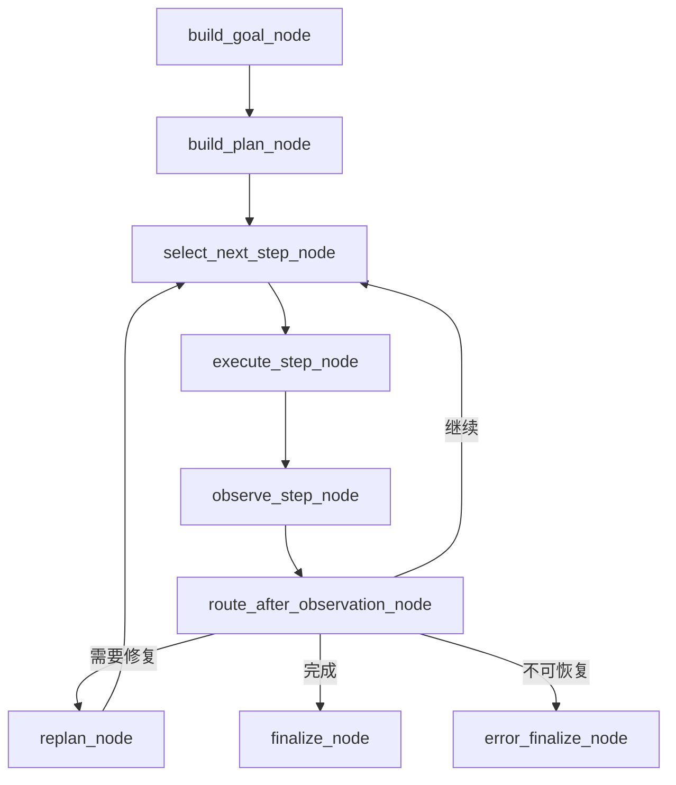

# Agent Runtime

## 责任与入口

Agent 将研究请求变成受约束的执行计划，再把工具结果组织成同步响应或 SSE 事件。外部运行入口是 [`service.py`](../../backend/agents/arxiv_search_agent/service.py) 的 `run_arxiv_search_agent()` 与 `stream_arxiv_search_agent()`；它们完成请求规范化、记忆注入、图构造、checkpoint 持久化和响应投影。

图定义位于 [`graph.py`](../../backend/agents/arxiv_search_agent/graph.py)。服务层负责运行图，图节点负责状态转换，工具层负责业务动作，三者不能互相替代。

## 主状态机

`build_arxiv_search_graph()` 将以上节点和条件路由编译为 LangGraph。对节点顺序、终态或边的改动是运行时契约变更，必须同时更新本页、相应测试和前端事件处理。

## 计划与工具边界

### 规划职责

[`planner.py`](../../backend/agents/arxiv_search_agent/planner.py)、[`tool_aware_planner.py`](../../backend/agents/arxiv_search_agent/tool_aware_planner.py) 和 [`planner_context.py`](../../backend/agents/arxiv_search_agent/planner_context.py) 产出目标、上下文和 `ExecutablePlan`。LLM 可以提出结构化计划草案，但草案不能直接驱动工具。

[`plan_validator.py`](../../backend/agents/arxiv_search_agent/plan_validator.py) 必须在执行前校验：工具是否存在、参数是否符合 schema、步骤依赖是否闭合、动作风险是否允许，以及计划是否超过运行上限。规划失败时由规则型路径或最小安全回复兜底，不能把未验证的模型文本传给 `invoke_tool()`。

### 工具职责

[`backend/tools/tool_registry.py`](../../backend/tools/tool_registry.py) 的 `get_tool_registry()`、`resolve_tool_name()` 和 `invoke_tool()` 是主路径的工具边界。新增能力至少需要同步定义：

1. 工具名、输入 Pydantic schema、输出归一化和别名策略。
2. `ToolSpec` 中的副作用、风险和恢复元数据。
3. Planner 可见性、PlanValidator 校验、Observer 解释和测试覆盖。

禁止在 Router 或 Planner 中直接调用某个业务服务来绕开工具注册表，否则计划、trace、确认和恢复语义会分叉。

## 执行、观察与有界恢复

[`PlanExecutor`](../../backend/agents/arxiv_search_agent/plan_executor.py) 负责按依赖选择下一步、绑定输入、执行工具、记录结果并交给 Observer。它不应该承担意图解析或最终文案组织。

[`observer.py`](../../backend/agents/arxiv_search_agent/observer.py) 把工具原始输出转换为可被恢复策略消费的 observation。`failure_classifier.py`、`recovery_diagnosis.py`、`recovery_policy.py`、`recovery_chooser.py` 和 `recovery_safety.py` 分别负责分类、候选动作、选择与安全过滤；[`replanner.py`](../../backend/agents/arxiv_search_agent/replanner.py) 只对当前计划实施受限补丁。

恢复必须有上限：单步重试、单原因修复和整轮 replan 都不能无限循环。无法恢复时通过 `error_finalize_node()` 形成结构化终态，而不是吞掉错误后继续选择同一 step。

## 确认与恢复

需要用户决定或可能产生副作用的步骤由 `plan_runtime.pending_confirmation` 进入 LangGraph interrupt。确认状态的真源不是前端显示对象：

| 数据 | 责任 | 不能做什么 |
| --- | --- | --- |
| `plan_runtime.pending_confirmation` | 当前执行现场中的确认真源 | 不能被展示字段覆盖。 |
| `runtime_state` | 执行现场的可序列化投影 | 不能与 `plan_runtime` 双写。 |
| `pending_action` | 返回前端的展示镜像 | 不能作为恢复依据。 |
| `AgentRuntimeCheckpointStore` | 校验 user、session、thread、待确认动作和生命周期 | 不能替代 LangGraph 图状态。 |
| `LangGraphCheckpointStore` | 保存可 resume 的图执行现场 | 不能代替业务确认生命周期校验。 |

恢复前，`_ensure_resume_checkpoint()` 必须同时验证业务 checkpoint 与 LangGraph checkpoint。两者都存在后，`AgentRuntimeCheckpointManager.consume_pending_confirmation()` 原子消费待确认动作，再执行 `Command(resume=...)`。这个顺序用于阻止图现场丢失时错误消费确认，以及快速重复点击导致重复副作用。

## 响应、流和可观测性

`_state_to_response()` 将 `AgentState` 投影为 `ArxivSearchResponse`；论文列表、QA 结果和偏好动作都从 runtime 输出投影，不能反向改变执行状态。流式入口根据图更新生成 `AgentStreamEvent`，并在确认恢复前从 checkpoint 预告正在执行的耗时工具，避免前端误判为卡死。

`RequestTrace` 的落盘失败是可降级故障：它应记录警告但不阻断实际响应。面向用户的 `warnings` 与面向排障的 `debug` 必须分开，后者不能默认泄露给普通调用方。

## 修改检查表

- 修改图节点或条件路由：检查终态、SSE 事件和 `AgentState` 投影。
- 修改计划或工具 schema：检查 Tool Registry、PlanValidator、Planner、Observer 和恢复策略。
- 修改确认行为：检查两层 checkpoint 校验、一次性消费和拒绝确认后的终态。
- 修改补救策略：检查触发条件、次数上限、失败原因和最终用户可理解的结果。
- 修改 trace/debug：检查正常响应不会包含内部路径、原始 prompt 或敏感执行上下文。

相关自动化验证要求见 [维护与质量](../operations/maintenance-quality.md)。
