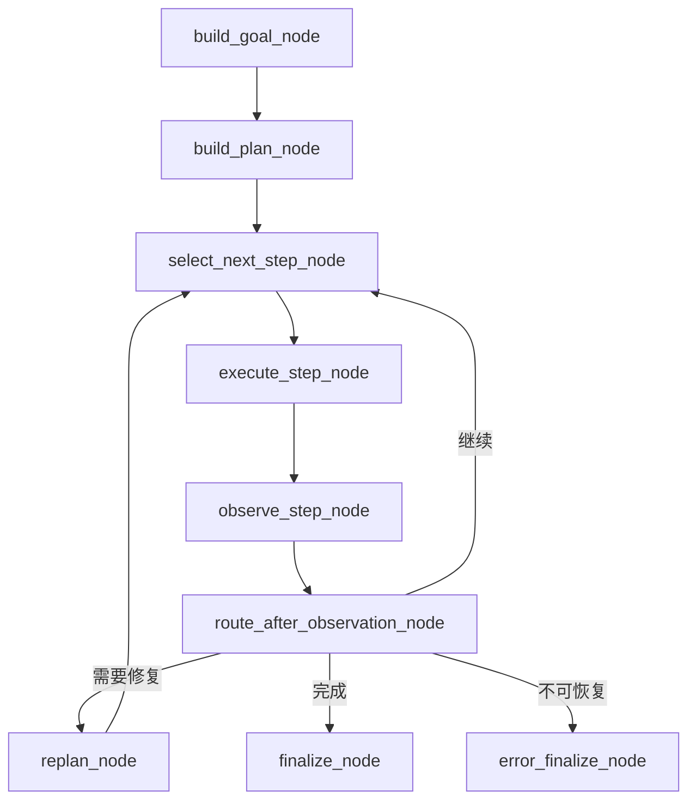

# Agent Runtime

## 责任与入口

Agent 将研究请求变成受约束的执行计划，再把工具结果组织成同步响应或 SSE 事件。外部运行入口是 [`service.py`](../../backend/agents/arxiv_search_agent/service.py) 的 `run_arxiv_search_agent()` 与 `stream_arxiv_search_agent()`；它们完成请求规范化、记忆注入、图构造、checkpoint 持久化和响应投影。

图定义位于 [`graph.py`](../../backend/agents/arxiv_search_agent/graph.py)。服务层负责运行图，图节点负责状态转换，工具层负责业务动作，三者不能互相替代。

## 主状态机


```mermaid
flowchart TD
    A[build_goal_node] --> B[build_plan_node]
    B --> C[select_next_step_node]
    C --> D[execute_step_node]
    D --> E[observe_step_node]
    E --> F[route_after_observation_node]
    F -->|继续| C
    F -->|需要修复| G[replan_node]
    G --> C
    F -->|完成| H[finalize_node]
    F -->|不可恢复| I[error_finalize_node]
```

`build_arxiv_search_graph()` 将以上节点和条件路由编译为 LangGraph。对节点顺序、终态或边的改动是运行时契约变更，必须同时更新本页、相应测试和前端事件处理。

## 计划与工具边界

### 规划职责

[`planner.py`](../../backend/agents/arxiv_search_agent/planner.py)、[`tool_aware_planner.py`](../../backend/agents/arxiv_search_agent/tool_aware_planner.py) 和 [`planner_context.py`](../../backend/agents/arxiv_search_agent/planner_context.py) 产出目标、上下文和 `ExecutablePlan`。LLM 可以提出结构化计划草案，但草案不能直接驱动工具。

[`plan_validator.py`](../../backend/agents/arxiv_search_agent/plan_validator.py) 必须在执行前校验：工具是否存在、参数是否符合 schema、步骤依赖是否闭合、动作风险是否允许，以及计划是否超过运行上限。规划失败时由规则型路径或最小安全回复兜底，不能把未验证的模型文本传给 `invoke_tool()`。

### 工具职责

[`backend/tools/tool_registry.py`](../../backend/tools/tool_registry.py) 的 `get_tool_registry()`、`resolve_tool_name()` 和 `invoke_tool()` 是主路径的工具边界。新增能力至少需要同步定义：

1. 工具名、输入 Pydantic schema、输出归一化和别名策略。
2. `ToolSpec` 中的副作用、风险和恢复元数据。
3. Planner 可见性、PlanValidator 校验、Observer 解释和测试覆盖。

禁止在 Router 或 Planner 中直接调用某个业务服务来绕开工具注册表，否则计划、trace、确认和恢复语义会分叉。

## 执行、观察与有界恢复

[`PlanExecutor`](../../backend/agents/arxiv_search_agent/plan_executor.py) 负责按依赖选择下一步、绑定输入、执行工具、记录结果并交给 Observer。它不应该承担意图解析或最终文案组织。

[`observer.py`](../../backend/agents/arxiv_search_agent/observer.py) 把工具原始输出转换为可被恢复策略消费的 observation。`failure_classifier.py`、`recovery_diagnosis.py`、`recovery_policy.py`、`recovery_chooser.py` 和 `recovery_safety.py` 分别负责分类、候选动作、选择与安全过滤；[`replanner.py`](../../backend/agents/arxiv_search_agent/replanner.py) 只对当前计划实施受限补丁。

恢复必须有上限：单步重试、单原因修复和整轮 replan 都不能无限循环。无法恢复时通过 `error_finalize_node()` 形成结构化终态，而不是吞掉错误后继续选择同一 step。

论文 QA 工具消费研究引擎三态：completed 为完整回答，partial 为有可靠证据的有限回答，abstained 为正常证据拒答。[`paper_qa.py`](../../backend/agents/arxiv_search_agent/tool_adapters/paper_qa.py)、Observer、质量评估和最终投影必须保留这一含义。有引用不能把 partial 提升为完整通过，没有引用也不能使正常 abstained 进入修复循环；研究图已负责内部有界修复。执行失败即使携带残留 `outcome` 也不能被当作业务成功。

## 交互、授权与恢复

`PlanExecutor` 是薄编排门面，按“选择 step → 条件与输入绑定 → 执行守卫 → 工具调用 → observation → recovery 决策 → 状态投影”推进。子组件位于 [`execution/`](../../backend/agents/arxiv_search_agent/execution/)，只返回结构化结果；共享运行时状态只由 [`RuntimeStateProjector`](../../backend/agents/arxiv_search_agent/execution/state_projector.py) 写入，避免拆分后多个模块共同改 `PlanRuntime`、`AgentState` 而形成分布式的 God Object。

### 唯一交互协议

Agent 等待用户输入时，唯一的业务状态是 [`AgentInteraction`](../../backend/agents/arxiv_search_agent/execution/interactions.py)，分两类：

| kind | 解决的问题 | 是否授权副作用 |
| --- | --- | --- |
| `target_selection` | 论文指代有歧义时选定目标，只完成输入绑定 | 否 |
| `side_effect_approval` | 是否允许以最终参数执行某个副作用工具 | 是 |

选定论文不等于批准对它建索引，两者必须走不同的 interaction。恢复请求 `InteractionResumeRequest` 只携带 `interaction_id`、decision 与响应；前端提交的工具名、step ID 或完整参数都不是可信数据。确认是副作用 step 的执行前置守卫，不是计划中的独立步骤，因此计划里没有 bridge 确认 step。interaction 默认 10 分钟过期。

### 参数绑定的一次性授权

[`ExecutionGuard`](../../backend/agents/arxiv_search_agent/execution/execution_guard.py) 在输入绑定完成后计算最终参数指纹（`arguments_fingerprint()`，规范化 JSON 的 SHA-256）。只有找到与 plan、step、工具和指纹都精确匹配的 [`ApprovalGrant`](../../backend/agents/arxiv_search_agent/execution/approvals.py) 才放行，否则创建 `side_effect_approval`。replan 会生成新的 `plan_id`，旧 interaction 与未消费的 grant 随之失效，所以参数或计划变化后旧批准不能放行新操作。

授权在调用副作用工具**之前**消费：[`SideEffectInvocationService.prepare()`](../../backend/agents/arxiv_search_agent/execution/side_effects.py) 在同一事务中消费 grant 并创建 `prepared` invocation。invocation 状态为 `prepared → invoking → succeeded | failed | indeterminate`。外部操作可能已经成功而本地超时，所以结果未知时记为 `indeterminate`，通用执行器禁止自动重放。

### 双 checkpoint 分工

| 存储 | 负责 | 不负责 |
| --- | --- | --- |
| LangGraph checkpoint | 图执行位置与框架内部状态 | 用户归属、业务授权 |
| Agent runtime checkpoint | user/session/thread 归属、当前 interaction、业务生命周期 | 图内部现场 |
| `approval_grants` / invocation 表 | 授权与副作用调用事实 | 恢复位置 |

恢复前，[`_ensure_resume_checkpoint()`](../../backend/agents/arxiv_search_agent/service.py) 先确认 LangGraph 现场存在，再由 `InteractionRuntimeService.resolve()` 原子解析业务 interaction，最后执行 `Command(resume=...)`。这个顺序保证图现场丢失时不会误消费授权，快速重复点击也不会触发两次副作用。没有默认用户兜底，也不按 thread 模糊扫描；旧 schema 的未完成 checkpoint 直接拒绝，不做兼容迁移，因为旧数据无法证明一次批准对应哪组参数。

业务 checkpoint 的 `current_node` 只接收图调用方显式传入的节点名，未提供时保留为空，不从展示 debug 推测节点位置。

## 后台作业与续跑

耗时副作用（目前是 `parse_and_index_paper` 建 QA 索引）在 [`tool_registry.py`](../../backend/agents/arxiv_search_agent/tool_registry.py) 的 contract 上声明 `ExecutionPolicy(mode="background_job", handler="paper_qa_index")`。执行器只看 execution policy，不按工具名特判；Agent 建索引只走后台模式，故障时不会悄悄退回同步执行。

```text
side_effect_approval 被批准
  → handler.preflight：already_satisfied | active_job | missing | failed
      already_satisfied → 不产生副作用，直接投影 step 输出
      active_job / missing → 消费 grant + prepared invocation + 创建 continuation（同一短事务）
                            → 事务提交后 submit_or_attach 物理 job
  → runtime checkpoint 进入 waiting_background_job，Agent SSE 结束
  → 前端轮询 continuation（真实 job 阶段与百分比）
  → job 成功且索引后置条件通过 → continuation 变为 ready_to_resume
  → 用户恢复 → 唯一 AgentResumeRun → 精确恢复原 checkpoint → 投影 IndexBuildOutput → 继续回答原问题
```

| 组件 | 真源 | 不负责 |
| --- | --- | --- |
| `paper_index_jobs` / `paper_index_job_attempts` | 物理 job 的 lease、attempt、阶段、百分比、结果 | 用户问题与 checkpoint |
| `agent_work_continuations` 表与 `AgentWorkContinuationService`（[`continuations.py`](../../backend/agents/arxiv_search_agent/execution/continuations.py)） | 物理 job 与某个 Agent checkpoint 的恢复绑定 | job 阶段真值 |
| `agent_resume_runs` 表与 `AgentResumeRunManager` | 一次恢复执行及其完整最终响应 | 原始批准 |
| `agent_work_events` | 排障与审计时间线 | 任何恢复判断 |

关键约束：

- **批准一次覆盖两件事**：启动后台 job，以及 job 成功后继续原问题。恢复时只恢复原 LangGraph checkpoint，不把原问题当新消息重放，也不再次调用 `parse_and_index_paper`。
- **物理 job 可共享**：幂等键为 `arxiv_id + loading_method + recipe_version`，不含用户或会话；多个 continuation 可以挂到同一个 job，各自独立取消。用户取消只终止自己的 continuation，不取消共享 job。
- **成功判据**：builder 正常返回 build_id/index_version/collection_name/chunk_count，并且 `get_qa_status` 显示活动版本与本次构建一致、chunk 数大于零。只看 job status 不够；后置校验失败记 `completion_validation_failed`，禁止恢复。
- **崩溃恢复**：使用短事务、持久中间状态和幂等 reconciliation，不在 SQLite 写事务内启动线程或调用外部服务。worker 以数据库 lease 领取 job（默认 lease 90 秒、心跳 15 秒），lease 过期后重新领取，基础设施中断最多自动重试 `max_attempts`（默认 3）次；明确的业务失败直接 failed，重试需要新的授权。
- **进度**：百分比代表已进入的阶段里程碑，不预测剩余时间；没有数据时前端显示不确定进度，不编造数字。
- **continuation 状态**：活跃态为 `submitting → waiting_job → ready_to_resume → resuming`，终态为 `resumed | failed | cancelled | expired | indeterminate`。`waiting_job` 不受 interaction TTL 约束；`ready_to_resume` 默认保留 7 天。active 接口不返回 failed/indeterminate。
- **恢复**：`ready_to_resume → resuming` 用 CAS 迁移，并绑定唯一 `resume_run_id`；重复请求只返回已有 run。`AgentResumeRun` 一旦启动就执行到底，SSE 只负责传输；最终响应在发送 `final_response` 前持久化，断线后可通过 `/resume-runs/{id}` 取回。
- **页面范围**：页面只加载当前会话的活动 continuation，新对话不显示旧任务；多条 ready 时只自动恢复一条。

API 入口位于 [`agent_router.py`](../../backend/routers/agent_router.py)：`/work-continuations/active`、`/work-continuations/{id}`、`.../cancel`、`.../resume/stream` 与 `/resume-runs/{id}`。

## 响应、流和可观测性

`_state_to_response()` 将 `AgentState` 投影为 `ArxivSearchResponse`；论文列表、QA 结果和偏好动作都从 runtime 输出投影，不能反向改变执行状态。流式入口根据图更新生成 `AgentStreamEvent`，并在确认恢复前从 checkpoint 预告正在执行的耗时工具，避免前端误判为卡死。

`RequestTrace` 的落盘失败是可降级故障：它应记录警告但不阻断实际响应。面向用户的 `warnings` 与面向排障的 `debug` 必须分开，后者不能默认泄露给普通调用方。

## 修改检查表

- 修改图节点或条件路由：检查终态、SSE 事件和 `AgentState` 投影。
- 修改计划或工具 schema：检查 Tool Registry、PlanValidator、Planner、Observer 和恢复策略。
- 修改确认行为：检查两层 checkpoint 校验、一次性消费和拒绝确认后的终态。
- 修改补救策略：检查触发条件、次数上限、失败原因和最终用户可理解的结果。
- 修改 trace/debug：检查正常响应不会包含内部路径、原始 prompt 或敏感执行上下文。

相关自动化验证要求见 [维护与质量](../operations/maintenance-quality.md)。
