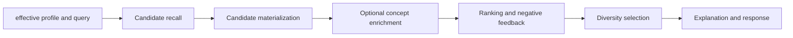

# 研究画像与推荐

## 目标

该能力将用户的显式偏好、论文行为、阅读笔记和已验证的论文证据转化为长期研究画像，再用画像、当前查询和负反馈对候选论文进行召回、排序与解释。它不能把一次点击或一次模型生成直接当成用户稳定偏好。

主服务是 [`MemoryService`](../../backend/services/memory/memory_service.py) 和 [`RecommendationService`](../../backend/services/recommendation/recommendation_service.py)，持久化真源在 [`backend/services/storage/sqlite/stores/`](../../backend/services/storage/sqlite/stores/)。

## 画像层次

研究画像的三个层次必须保持分离：

| 层次 | 存储/入口 | 语义 |
| --- | --- | --- |
| 人工层 | `ResearchProfileStore` 的 manual profile | 用户显式编辑的研究主题、类别和代表论文，优先级最高。 |
| 生成层 | `save_generated_profile_snapshot()` | 从可用行为和证据构建的可追溯快照，可以审核和激活。 |
| effective 层 | `_refresh_effective_profile()`、`get_user_profile_layers()` | 合并后供推荐和 Agent 读取的投影，不应被调用方直接篡改。 |

`MemoryService.load_user_profile_layers()` 用于检查层次，`build_user_memory_summary()` 用于给 Agent/QA 提供裁剪后的上下文。前端传入的画像或记忆仅是候选输入，必须与后端存储合并，不能覆盖服务端真源。

## 信号与重建

like/dislike、论文动作、阅读笔记和 QA 记录会写入偏好或 profile event store。`MemoryService` 负责收集事件、论文详情和证据卡，随后通过 `ResearchProfileGenerator` 生成候选画像。高成本或需要重新聚合历史信号的操作使用 `create_profile_rebuild_job()` 与 `run_profile_rebuild_job()`，不能在普通读请求中偷偷触发全量重建。

行为画像只消费满足最小论文数量等质量门槛的稳定兴趣簇。该约束用于避免单篇论文、短期噪声或未完成的聚类直接改变长期推荐；任何放宽门槛的改动都必须同时检查质量报告、debug 和回归样本。

删除或撤销偏好、笔记时，关联 profile event 必须失效或生成反向事件，否则下次生成画像仍会包含已撤销信号。

## 推荐流水线

`RecommendationService.recommend_papers_with_context()` 是整条链路入口：

1. 读取 effective profile、偏好摘要、兴趣向量和当前请求，形成上下文 bundle。
2. `CandidateRecallService` 从本地论文和兴趣簇/类别来源召回候选，并去重。
3. `CandidateMaterializer` 补齐候选论文所需字段；概念富化只作用于受限的顶部候选，失败可降级。
4. `RecommendationRanker` 合成查询匹配、画像匹配、类别、时效、负反馈和多样性分数。
5. `_select_diverse_candidates()` 在最终选择阶段保证跨簇/类别覆盖；内部 `cluster_0` 只是重编号标签，不表示特殊业务簇。
6. 输出匹配原因和调试溯源，解释应能回指真实信号而不是生成式猜测。

## 负反馈与安全边界

负向偏好必须与正向兴趣分开建模。`RecommendationRanker` 计算负反馈惩罚与置信度；它是候选排序的一部分，不能简单从召回结果中无条件删除所有相似论文。画像概念富化和外部服务失败时应 fail-open，并记录 debug 原因，保证推荐主流程仍返回可解释结果。

## 修改检查表

- 改画像字段：检查 manual/generated/effective 三层、快照激活、memory summary 和推荐消费方。
- 改行为事件：检查写入、撤销、去重、重建任务和历史数据迁移。
- 改召回或排序：检查候选来源、负反馈、稳定兴趣簇和多样性覆盖，而不是只看总分。
- 改概念富化：检查顶部候选限制、证据来源、失败降级和 debug 溯源。

Agent 如何消费画像见 [Agent Runtime](agent-runtime.md)，存储与应用边界见 [系统架构](../architecture/system-overview.md)。
