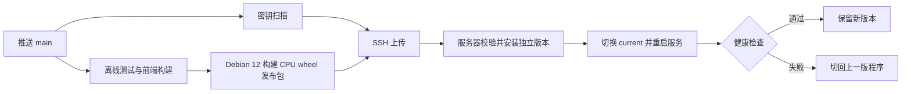

# Debian 12 首次部署与 GitHub CI/CD

适用环境：**Debian 12、x86_64、2 核 CPU / 2GB 内存、单台服务器**。使用 Debian 自带的 Python 3.11、Nginx、systemd、Redis 和 Milvus Lite。服务器不需要预装 Python，下面会安装；Node.js 和依赖编译放在 GitHub runner 上完成。

**自动部署默认关闭。** [release 工作流](../../.github/workflows/deploy.yml) 已串联质量门、密钥扫描、发布包和 SSH 部署。先完成服务器初始化、配置 GitHub Secrets，并确认首轮 Actions 的构建检查成功，再开启 `DEPLOY_ENABLED`；本地脚本检查不代表服务器已经上线。

## 发布流程与资源边界

日常发布流程：



GitHub 构建经过检查的确切提交，服务器安装同一个发布包。前端构建和 Python 原生依赖编译不会占用这台 2GB 服务器；服务器安装 wheel 时不访问 PyPI。依赖来自当前 `requirements.txt`，每次构建后会锁定完整版本和 wheel 哈希；完整依赖仍较大，建议为上传包、新旧依赖环境和论文数据预留至少 20GB 可用磁盘。

单 Gunicorn worker 配合云端 LLM/Embedding；这只是小规模使用的起点。Torch 导入、Docling 解析和建索引仍会消耗内存，2GB 的完整业务容量尚需实际测量。Swap 能缓解峰值，但不能代替足够的物理内存；首次应只处理一篇论文，观察内存后再提高并发。自动健康检查只验证进程、HTTP 存活和认证边界，不能证明模型、Redis 和向量索引都可用。

发布文件职责：

| 文件 | 职责 |
| --- | --- |
| [发布工作流](../../.github/workflows/deploy.yml) | main 推送/手动运行的总入口，全部检查通过且显式开启后才部署。 |
| [质量工作流](../../.github/workflows/quality-gate.yml) | 在 `python:3.11-bookworm` 中运行统一质量门，可生成离线发布包。 |
| [打包脚本](../../deploy/package_release.py) | 从确切 Git SHA 取源码，加入前端构建和带哈希的 CPU wheels。 |
| [SSH 发布入口](../../deploy/publish_ssh.sh) | 使用专用私钥与固定主机指纹上传并触发安装。 |
| [服务器发布脚本](../../deploy/apply_release.py) | 校验、安装、关联共享数据、切换版本和失败回退。 |
| [CI/CD systemd 模板](../../deploy/arxiv-agent-cicd.service) | 固定从 `current` 启动，并读取共享生产配置。 |
| [发布回归测试](../../tests/deploy/test_release.py) | 离线验证归档、依赖、状态流转和持久数据边界。 |

## 1. 确认服务器与域名

以下 Bash 命令在服务器上由有 sudo 权限的管理账号执行。若直接使用 root，去掉 `sudo` 即可；系统没有 sudo 时先以 root 安装它。

```bash
cat /etc/os-release
uname -m
free -h
df -h /opt
```

确认系统为 Debian 12、架构输出 `x86_64`。当前发布包不能直接装到 ARM64 或其他发行版。

本文沿用示例域名 `arxiv.001769.xyz`；换域名时同步替换 Nginx 的主机名/跳转地址/证书路径、初始化参数和 `ALLOWED_ORIGINS`。先将域名 A 记录指向服务器公网 IP，仅在 IPv6 确实可用时设置 AAAA。云防火墙放行 HTTPS 443、证书验证 80 和所用 SSH 端口；应用 8001、Redis 6379、向量库端口保持回环监听。SSH 入站策略必须允许 GitHub runner 连接；只允许固定管理 IP 的规则需要配合有固定出口的 runner 或网络通道。

## 2. 安装系统依赖

```bash
sudo apt-get update
sudo apt-get install -y python3 python3-venv python3-pip \
  git curl ca-certificates openssh-server nginx redis-server certbot nano \
  libgl1 libglib2.0-0 libmagic1 libgomp1 poppler-utils
python3 --version
```

Python 应显示 3.11.x。不要把项目依赖装进系统 Python；每次发布会建立独立 venv。

若没有 swap 且磁盘足够，可首次增加 2GB。先看 `swapon --show`；已有 `/swapfile` 时不要重复执行创建命令：

```bash
swapon --show
sudo fallocate -l 2G /swapfile
sudo chmod 600 /swapfile
sudo mkswap /swapfile
sudo swapon /swapfile
sudo sh -c 'echo "/swapfile none swap sw 0 0" >> /etc/fstab'
```

## 3. 建立发布账号与目录

以下初始化只用于全新服务器。若已存在同名用户或同名目录，先检查用途，不要覆盖已有部署。

```bash
sudo adduser --disabled-password --gecos '' arxiv
sudo install -d -o arxiv -g arxiv -m 755 /opt/arxiv-research-agent
sudo install -d -o arxiv -g arxiv -m 755 /opt/arxiv-research-agent/releases
sudo install -d -o arxiv -g arxiv -m 700 \
  /opt/arxiv-research-agent/shared \
  /opt/arxiv-research-agent/incoming \
  /opt/arxiv-research-agent/venvs
sudo install -d -o arxiv -g arxiv -m 700 \
  /opt/arxiv-research-agent/shared/backend/config \
  /opt/arxiv-research-agent/shared/backend/data/auth \
  /opt/arxiv-research-agent/shared/backend/06-database
sudo -u arxiv touch /opt/arxiv-research-agent/.cicd-layout

# bootstrap 仅用于取得初始化脚本和系统模板，不是正在运行的版本。
sudo -u arxiv git clone --depth 1 --branch main \
  https://github.com/PolarisSun729/arxiv-research-agent.git /home/arxiv/bootstrap
sudo chmod 700 /home/arxiv/bootstrap
```

先将本地 CI/CD 文件合入 GitHub，再执行 clone，确保能取得本文对应的脚本。私有仓库需额外提供只读的仓库访问方式；Actions 上传发布包后，服务器日常部署不再需要 GitHub 拉取凭据。

最终布局：

```text
/opt/arxiv-research-agent/
  shared/.env.production
  shared/backend/config/production.jwt-secret
  shared/backend/data/auth/production.sqlite3
  shared/backend/06-database/recommendation.db
  shared/...                       # 论文、索引、日志等运行数据
  releases/<sha>-<run>-<attempt>/   # 本次代码和前端
  venvs/...                        # 按依赖锁复用的完整环境
  incoming/...                     # 上传中的发布包
  current -> releases/当前版本
  previous -> releases/上一成功版本
```

Nginx 需要遍历 `releases` 读取前端，因此代码目录使用 0755；生产配置、数据库和用户数据在私有的 `shared` 内。

## 4. 生成并修改生产配置

```bash
sudo -u arxiv python3 /home/arxiv/bootstrap/scripts/init_security.py \
  --profile production --domain arxiv.001769.xyz
sudo -u arxiv mv /home/arxiv/bootstrap/.env.production \
  /opt/arxiv-research-agent/shared/.env.production
sudo -u arxiv mv /home/arxiv/bootstrap/backend/config/production.jwt-secret \
  /opt/arxiv-research-agent/shared/backend/config/production.jwt-secret
sudo -u arxiv nano /opt/arxiv-research-agent/shared/.env.production
```

保留脚本随机生成的 Redis 密码及匹配连接串，填写真实 `ALIYUN_API_KEY`。以下同名项应**修改原行**，其余缺失项补到末尾，不要保留多个不同的同名设置：

```dotenv
AUTH_MODE=jwt
JWT_SECRET_KEY=
JWT_SECRET_FILE=/opt/arxiv-research-agent/shared/backend/config/production.jwt-secret
AUTH_DATABASE_PATH=/opt/arxiv-research-agent/shared/backend/data/auth/production.sqlite3
ALLOWED_ORIGINS=https://arxiv.001769.xyz
ALLOW_PUBLIC_REGISTRATION=false
TRUSTED_PROXY_IPS=127.0.0.1,::1
AUDIT_LOG_FILE=-
BACKEND_SERVICE_LOAD_MODE=lazy
ENABLE_DEBUG_ROUTES=false
ARXIV_DATA_SOURCE=api
ARXIV_PROXY_URL=
EMBEDDING_PROVIDER=dashscope
EMBEDDING_MODEL=qwen3-vl-embedding
EMBEDDING_DIMENSION=2048
EMBEDDING_BATCH_SIZE=4
PAPER_QA_BUILD_LLM_MAX_WORKERS=1
PROFILE_EVIDENCE_MAX_WORKERS=1
RETRIEVAL_ROUTE_MAX_WORKERS=1
DOCLING_OCR_ENABLED=false
DOCLING_GENERATE_PAGE_IMAGES=false
DOCLING_GENERATE_PICTURE_IMAGES=true
DOCLING_ANNOTATED_PDF_EXPORT_ENABLED=false
DOCLING_IMAGES_SCALE=1.0
OMP_NUM_THREADS=1
MKL_NUM_THREADS=1
OPENBLAS_NUM_THREADS=1
TOKENIZERS_PARALLELISM=false
```

JWT 文件和认证库使用共享目录的绝对路径，避免每个新版本产生新账号库或读不到签名文件。Linux 默认 Milvus Lite，不要从 Windows 复制 `MILVUS_URI=http://localhost:19530`。上述低内存配置关闭 OCR，扫描版 PDF 的识别能力会降低；页面渲染和图像质量也降低，需根据实际问答效果与内存余量调整。

`qwen3-vl-embedding` 的 2048 维与既有兴趣向量保持一致。即使维度相同，也不能随意替换成另一模型并继续使用旧向量。

`.env.production` 由 systemd 注入，不应提交到 GitHub。密钥和私有文件继续保持 0600；不要 `source` 任意 dotenv，也不要将模型密钥写入前端 `VITE_` 配置。

## 5. 配置本机 Redis

Debian 原生 Redis 就足够，不必为这一步运行完整 Milvus/Docker 栈。创建 Redis 专用附加配置，将 `requirepass` 的占位值换成刚生成的 `.env.production` 中 `REDIS_PASSWORD` 的值：

```bash
sudo install -o root -g redis -m 640 /dev/null /etc/redis/arxiv-agent.conf
sudoedit /etc/redis/arxiv-agent.conf
```

文件内容：

```conf
bind 127.0.0.1 ::1
protected-mode yes
requirepass REPLACE_WITH_GENERATED_REDIS_PASSWORD
appendonly yes
appendfsync everysec
maxmemory 128mb
maxmemory-policy noeviction
```

用 `sudoedit /etc/redis/redis.conf` 在末尾追加一次：

```conf
include /etc/redis/arxiv-agent.conf
```

然后启动并验证：

```bash
sudo systemctl enable --now redis-server
sudo systemctl restart redis-server
redis-cli --askpass ping
```

在隐藏提示中输入相同密码，应返回 `PONG`。应用的 `RATE_LIMIT_STORAGE` 必须使用这个密码。`noeviction` 防止内存满时悄悄丢弃限额记录；容量不足会报错，需要检查日志和调整预算。

## 6. 安装 systemd 和最小 sudo 权限

```bash
sudo install -o root -g root -m 644 \
  /home/arxiv/bootstrap/deploy/arxiv-agent-cicd.service \
  /etc/systemd/system/arxiv-agent.service
sudo systemctl daemon-reload
sudo systemctl enable arxiv-agent.service
sudo visudo -f /etc/sudoers.d/arxiv-agent-deploy
```

sudoers 文件只放下面一行：

```sudoers
arxiv ALL=(root) NOPASSWD: /usr/bin/systemctl restart arxiv-agent.service, /usr/bin/systemctl stop arxiv-agent.service
```

```bash
sudo chmod 440 /etc/sudoers.d/arxiv-agent-deploy
sudo visudo -cf /etc/sudoers.d/arxiv-agent-deploy
```

此时还没有 `current`，**先不要 start 服务**。首次发布会自动创建版本、安装 venv 并启动。应用限制为一个 worker，内存软阈值 1.2GB、硬上限 1.5GB；超过上限可能被终止，需要处理真实业务内存峰值。

CI 账号只能无密码重启/停止这个服务。Nginx、systemd 模板和生产配置的更新由管理账号完成；普通代码更新由发布脚本完成。

## 7. 配置 GitHub 到服务器的 SSH

在本机 Windows PowerShell 创建仅用于这个项目的部署密钥。为非交互部署，密钥口令留空，私钥只存入 GitHub Environment Secret：

```powershell
ssh-keygen -t ed25519 -C "github-actions-arxiv" -f "$env:USERPROFILE\.ssh\arxiv_actions"
```

在服务器创建目录：

```bash
sudo install -d -o arxiv -g arxiv -m 700 /home/arxiv/.ssh
sudo -u arxiv nano /home/arxiv/.ssh/authorized_keys
sudo chmod 600 /home/arxiv/.ssh/authorized_keys
```

将本机 `arxiv_actions.pub` 的**公钥**放入 `authorized_keys`，行首加 `restrict `，形成 `restrict ssh-ed25519 AAAA... github-actions-arxiv`。这个选项禁止端口转发、代理转发和终端分配，不影响 SSH 命令及 scp 上传。

从云厂商可信控制台或已核验的管理 SSH 会话读取主机指纹：

```bash
sudo ssh-keygen -lf /etc/ssh/ssh_host_ed25519_key.pub
```

在本机采集相同主机的公钥并核对指纹。把下面 `YOUR_SERVER_IP` 和端口替换成真实值：

```powershell
ssh-keyscan -t ed25519 -p 22 YOUR_SERVER_IP | Set-Content -Encoding ascii "$env:USERPROFILE\.ssh\arxiv_known_hosts"
ssh-keygen -lf "$env:USERPROFILE\.ssh\arxiv_known_hosts"
```

确认 SHA256 指纹与可信控制台完全一致，再将 known_hosts 文件内容存入 GitHub。`DEPLOY_HOST` 必须和扫描使用的主机名/IP 一致；非 22 端口的记录通常是 `[主机]:端口`。不能在工作流里实时扫描后直接信任，也不能关闭主机验证。

## 8. GitHub 配置与首次发布

在仓库 Settings → Environments 创建 **production**，添加四个 Environment Secrets：

| Secret | 内容 |
| --- | --- |
| `DEPLOY_HOST` | 公网 IPv4 或服务器主机名，不含协议和端口。 |
| `DEPLOY_USER` | `arxiv`。 |
| `DEPLOY_SSH_KEY` | 本机 `arxiv_actions` 私钥完整内容，包含首尾行。 |
| `DEPLOY_KNOWN_HOSTS` | 上一步核验通过的完整 known_hosts 记录。 |

Settings → Secrets and variables → Actions → **Variables** 中配置仓库变量：

| Variable | 值 |
| --- | --- |
| `DEPLOY_ENABLED` | 首次准备好后设为 `true`；缺失或其他值保持关闭。 |
| `DEPLOY_PORT` | 可选，默认 `22`。 |

`DEPLOY_ENABLED` 应放在**仓库变量**中，工作流在进入 Environment 之前判断它。若希望全自动发布，不要为 production 添加每次都要人工点击的 required reviewers；可以仅允许 main 部署。

自动发布入口监听 main 的 push/手动运行，先通过复用质量门和密钥扫描；质量门以 `package_release: true` 上传当前 SHA 的 artifact；deploy 作业绑定 production，并从同一 run 下载 artifact 调用 SSH 脚本。发布串行执行，发送前检查当前 main 是否仍为本次 SHA，避免积压任务把已经淘汰的提交重新部署。所有第三方 Actions 固定到核验过的提交。

确认首次配置完成后，推送 main，或在 Actions → release → Run workflow 选择 main。查看质量检查、发布包、SSH 安装和健康检查各阶段。一次普通更新的安装失败不会切换 `current`；新进程检查失败会切回旧版本。首次失败时没有旧版本，服务会保持停止。

## 9. 创建管理员或迁移现有账号

首次发布成功后，如果使用全新数据，在服务器创建管理员：

```bash
sudo -u arxiv /opt/arxiv-research-agent/current/.venv/bin/python \
  /opt/arxiv-research-agent/current/scripts/manage_users.py create-admin \
  --username admin --email YOUR_EMAIL \
  --env-file /opt/arxiv-research-agent/shared/.env.production
```

密码通过隐藏输入填写。`YOUR_EMAIL` 换成自己的地址。

如果要保留本地 admin 已有的兴趣历史，**在首次对外服务前迁移匹配的认证库与业务库**，保留原来的用户 UUID：

| 本地一致性备份 | 服务器位置（相对 `shared`） |
| --- | --- |
| `backend/data/auth/auth.sqlite3` | `backend/data/auth/production.sqlite3` |
| `backend/06-database/recommendation.db` | `backend/06-database/recommendation.db` |

仅在服务器新建同名 admin 会生成不同 UUID，不能继承原有历史。先停写，或使用 SQLite backup API 取得一致快照；不要在程序运行时只复制 `.db` 而遗漏 WAL 中的数据。目标认证目录为 arxiv 所有、0700，认证库为 0600；生产签名材料保持独立并要求重新登录。需要保留笔记、文档和其他索引时，也要迁移对应共享资产。

Windows Milvus Standalone 的 collection 需要按 collection/schema 导出、导入 Milvus Lite，不能用复制 SQLite 来迁移向量库。只迁移推荐/认证库可以保留账号及兴趣状态，不代表所有论文检索资产都已经迁移。

## 10. Nginx 与 HTTPS

申请证书前可先用只提供 ACME 验证的 [HTTP 模板](../../deploy/nginx-bootstrap.conf)：

```bash
sudo install -d -m 755 /var/www/letsencrypt
sudo cp /home/arxiv/bootstrap/deploy/nginx-bootstrap.conf /etc/nginx/sites-available/arxiv-agent
sudoedit /etc/nginx/sites-available/arxiv-agent
sudo ln -s /etc/nginx/sites-available/arxiv-agent /etc/nginx/sites-enabled/arxiv-agent
sudo nginx -t
sudo systemctl reload nginx
sudo certbot certonly --webroot -w /var/www/letsencrypt -d arxiv.001769.xyz
```

先在模板中替换域名。已有 sites-enabled 链接时不要重复创建。证书成功后换成 [HTTPS 模板](../../deploy/nginx.conf)：

```bash
sudo cp /home/arxiv/bootstrap/deploy/nginx.conf /etc/nginx/sites-available/arxiv-agent
sudoedit /etc/nginx/sites-available/arxiv-agent
```

替换域名及证书路径，并把静态目录的 `root` 行改为：

```nginx
root /opt/arxiv-research-agent/current/new_frontend/dist;
```

保留原模板的 SSE 设置、认证头转发和可信代理规则。然后：

```bash
sudo nginx -t
sudo systemctl reload nginx
sudo certbot renew --dry-run
sudo install -d /etc/letsencrypt/renewal-hooks/deploy
printf '#!/bin/sh\nnginx -t && systemctl reload nginx\n' | sudo tee /etc/letsencrypt/renewal-hooks/deploy/reload-nginx.sh >/dev/null
sudo chmod 755 /etc/letsencrypt/renewal-hooks/deploy/reload-nginx.sh
sudo systemctl enable --now certbot.timer
```

前端已经以 `/api` 为地址构建，同域请求由 Nginx 转发。普通应用发布后 Nginx 会通过 `current` 读取新前端，不需要每次 reload。

## 11. 验收、排障与回退

```bash
sudo systemctl status arxiv-agent.service --no-pager
sudo journalctl -u arxiv-agent.service -n 100 --no-pager
curl -I http://arxiv.001769.xyz/
curl --fail https://arxiv.001769.xyz/health
curl -o /dev/null -s -w '%{http_code}\n' https://arxiv.001769.xyz/api/auth/me
readlink -f /opt/arxiv-research-agent/current
free -h
```

HTTP 首页应跳转 HTTPS，`/health` 成功，匿名 `/api/auth/me` 为 401。继续在浏览器登录、读写个人笔记、查看兴趣状态、执行一次受控的模型调用和论文建索引，并检查 Redis 持久性及资源用量。验证真实付费模型调用需要使用自己的供应商预算，不属于自动质量门。

SSH 失败先检查端口、公钥、known_hosts；安装失败查看 Actions 的 pip 输出及磁盘；启动失败查 journald。依赖哈希、环境或发布包有误时脚本会在切换前停止；当前支持环境是 Debian 12 / Python 3.11 / x86_64。

如果 Actions 打包时出现 `fatal: detected dubious ownership`，表示 Git 拒绝访问属主与容器运行用户不一致的工作区。[质量工作流](../../.github/workflows/quality-gate.yml) 在 Checkout 后通过 `git config --global --add safe.directory "$GITHUB_WORKSPACE"` 仅信任本次构建目录，并提前验证 HEAD。修复工作流后，应将修复合入 main 并触发新运行；旧运行的 Re-run 仍使用旧提交，不能取得这次修复。

手工切回上一版前，先把仓库 `DEPLOY_ENABLED` 改为 `false`，等待进行中的发布完成。下面复用同一套服务器锁和健康检查；没有 `previous` 时不能回退：

```bash
sudo -u arxiv python3 - <<'PY'
import fcntl
from pathlib import Path
import sys

root = Path('/opt/arxiv-research-agent')
sys.path.insert(0, str(root / 'current/deploy'))
from apply_release import activate_release, SystemdRuntime

# 同一把锁保护自动发布和手工回退，防止两个操作者同时改动 current。
with (root / '.deploy.lock').open('a') as lock:
    fcntl.flock(lock, fcntl.LOCK_EX | fcntl.LOCK_NB)
    previous = (root / 'previous').resolve(strict=True)
    if previous.parent != (root / 'releases').resolve() or not (previous / '.venv/bin/python').is_file():
        raise RuntimeError('上一版程序或依赖不完整，停止回退')
    activate_release(root, previous, SystemdRuntime(), 180)
    print('当前程序：', (root / 'current').resolve())
PY
```

回退会重启单实例服务，运行中的请求可能中断。它只恢复代码和对应 venv，数据库及用户写入继续保留。数据库 schema 改动必须在上线前制定备份和兼容迁移方案；不能假定旧代码能读取新 schema。`last-deployment.json` 记录最近自动发布成功的信息，手工回退后以 `current` 为实际版本依据。

失败的解压目录、未完成 venv 和旧版本会保留以便排障；成功后会删除本次上传归档和 release 内已安装的 wheel 副本。当前没有自动清理历史 venv 的机制，需定期检查磁盘。清理前核对 `current`、`previous` 以及它们的 `.venv` 真实目标，只删除不再被引用的旧代码/环境；不要删除 `shared`，也不要用 `git clean` 清理生产根目录。

## 本地验证范围

```bash
python scripts/check_quality.py deployment-tests docs
bash -n deploy/publish_ssh.sh
```

发布测试不读取真实 `.env`，不调用真实 pip/systemd，也不访问服务器。Windows 无符号链接权限时，真实链接用例明确跳过；跨平台状态流转用例继续运行。Debian CI 必须执行真实链接用例，首轮 Actions 成功及真实服务器验收仍是启用自动部署的必要步骤。
